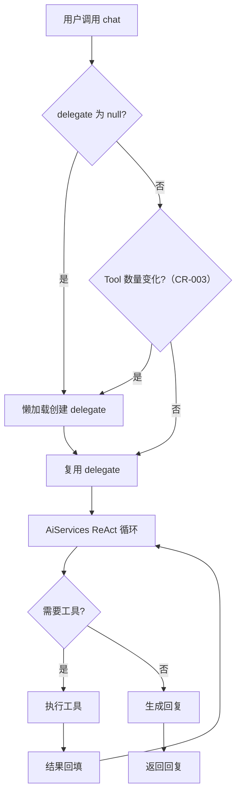

# Agent 编排模块 业务说明书

## 1. 模块概述

Agent 编排模块（agent-demo-agent）是 AI Agent 示例项目的核心能力模块，负责 Agent 对话入口与 ReAct 循环执行。模块基于 LangChain4j AiServices 实现声明式 Agent，通过动态代理自动处理 ReAct 循环（思考-行动-观察）、工具调用决策、会话记忆管理。当前已实现单 Agent（SimpleAgent），规划扩展多 Agent 协作与工作流编排。

## 2. 用户角色与权限

| 角色 | 权限范围 | 典型操作 |
|------|---------|---------|
| **学习者** | 调用 Agent 对话 API | 通过 `/api/agent/chat` 发起对话 |
| **开发者** | 扩展 Agent 实现 | 新增 BaseAgent 实现类、调整 AgentConfig |
| **API 调用方** | 调用对话接口 | 集成到外部应用 |
| **运维者** | 调优 Agent 参数 | 修改 `agent.*` 配置项 |

## 3. 业务功能点

### 3.1 同步对话

- **触发场景**：用户通过 API 发送消息，期望获得 Agent 回复。
- **操作步骤**：调用 `POST /api/agent/chat`，传入 sessionId（可选）+ message（必填）。
- **系统行为**：调用 `BaseAgent.chat(sessionId, message)`，经 ReAct 循环返回回复。
- **前置条件**：应用已启动，ARK_API_KEY 已配置。
- **后置结果**：返回 `Result<ChatResponse>`，含 sessionId/response/duration。

### 3.2 Agent 委托懒加载与 Tool 变化重建

- **触发场景**：SimpleAgent 首次被调用 chat() 时，或 Tool 数量发生变化时（CR-003 新增）。
- **操作步骤**：按 modelId 从 delegateCache 获取 AiServices 代理，未命中或 Tool 数量变化时经双重检查锁重建。
- **系统行为**：`AiServices.builder(BaseAgent.class)` 绑定 chatModel + streamingChatModel + memoryProvider + tools + systemMessageProvider。
- **delegate 缓存（v2.0 新增）**：`SimpleAgent` 的 delegate 缓存从单一 `volatile BaseAgent` 升级为 `ConcurrentHashMap<String, BaseAgent>`（`delegateCache`），按 modelId 隔离不同模型的 Agent 实例，新增 `getDelegate(String modelId)` 方法；modelId 为 null 时以 `"default"` 作为 cacheKey 使用默认模型（第一个可用 chat 模型）。对话时按 modelId 选择模型：`modelFactory.getChatModelByModelId(modelId)`/`getStreamingChatModelByModelId(modelId)`（有指定 modelId）或 `getDefaultChatModel()`/`getDefaultStreamingChatModel()`（modelId 为空）。
- **Tool 变化检测（CR-003 新增，v2.0 扩展）**：`SimpleAgent` 维护 `delegateToolCounts`（`ConcurrentHashMap<String, Integer>`），按 cacheKey 记录各 delegate 创建时的工具数量。每次 `getDelegate(modelId)` 调用时检测 `toolRegistry.getToolCount()` 是否变化。若 Tool 数量变化（如知识库创建/删除导致动态 Tool 增减），则重建该 cacheKey 的 delegate 绑定最新工具列表，确保新注册/注销的知识库 Tool 对 Agent 生效。
- **业务规则**：懒加载避免构造时调用 listTools() 触发循环依赖；Tool 变化重建确保动态 Tool 实时生效；delegate 按 modelId 隔离，不同模型使用独立实例（BR-AGT-003、BR-AGT-010）。

### 3.3 ReAct 循环执行

- **功能特色**：
  - LangChain4j 内置 ReAct 循环，无需手写
  - Agent 自主决策是否调用工具
  - 最大迭代次数保护（默认 10）
- **系统行为**：LLM 思考 -> 工具调用决策 -> 工具执行 -> 结果回填 -> 继续思考 -> 生成回复。

### 3.4 调用日志

- **触发场景**：`agent.enable-logging=true` 时。
- **系统行为**：记录 sessionId、消息内容、耗时、回复长度。

### 3.5 思考流式对话（CR-001 新增）

- **触发场景**：用户开启"深度思考"开关发送消息时。
- **操作步骤**：AgentController 根据 `enableThinking=true` 调用 `SimpleAgent.chatThinkingStream(sessionId, message)`（或带 modelId 的 `chatThinkingStream(sessionId, message, modelId)` 重载，v2.0 新增）替代 `chatStream`；ReAct 模式对应 `chatThinkingReActStream`（同样新增 modelId 重载）。
- **系统行为**：
  1. 调用 `buildMessagesWithMemory(sessionId, message)` 手动组装消息列表（系统提示词 + 历史消息 + 当前用户消息）
  2. 按 modelId 获取思考模型：`modelFactory.getThinkingStreamingChatModelByModelId(modelId)`（有指定 modelId 时）或 `getDefaultThinkingStreamingChatModel()`（modelId 为空时，v2.0 起替代原 `getThinkingStreamingChatModel()`），委托 `ArkThinkingStreamingChatModel` 直连方舟 API（stream=true, thinking.enabled）
  3. 通过 `ThinkingTokenStream` 回调暴露推理内容（onPartialThinking）与正式回复（onPartialResponse）
- **业务规则**：思考模式使用场景模板 "thinking"（声明"此模式不可调用工具"），通过 PromptTemplateLoader 组合提示词（BR-AGT-007）
- **前置条件**：ARK_API_KEY 已配置，方舟 Coding Plan 地址支持 thinking 参数。
- **后置结果**：SSE 流推送顺序为 reasoning（可选）-> token（多个）-> done。

## 4. 业务流程串联

```mermaid
flowchart TD
    A[用户调用 chat] --> B{delegate 为 null?}
    B -->|是| C[懒加载创建 delegate]
    B -->|否| E1{Tool 数量变化?（CR-003）}
    E1 -->|是| C
    E1 -->|否| D[复用 delegate]
    C --> D
    D --> E[AiServices ReAct 循环]
    E --> F{需要工具?}
    F -->|是| G[执行工具]
    G --> H[结果回填]
    H --> E
    F -->|否| I[生成回复]
    I --> J[返回回复]
```

**流程说明**：
1. SimpleAgent.chat() 首次调用时懒加载创建 AiServices 代理
2. CR-003 新增：每次调用检测 Tool 数量变化，变化时重建 delegate 绑定最新工具
3. AiServices 自动执行 ReAct 循环（思考-行动-观察）
4. LLM 决策是否调用工具，是则执行工具并回填结果
5. 无需工具时生成最终回复返回

## 5. 安全与合规

- **API Key 保护**：通过 ModelFactory 间接使用，禁止在 Agent 层直接引用 API Key。
- **会话隔离**：通过 `@MemoryId` 注解按 sessionId 隔离记忆，禁止跨会话读取。
- **迭代上限**：`agent.max-iterations=10` 防止无限循环消耗 Token。
- **日志脱敏**：调用日志记录消息内容，生产环境建议截断或脱敏。

## 6. 前端入口

本项目为纯后端，无前端页面。通过以下方式调用：

- **Swagger UI**：`http://localhost:8080/swagger-ui.html`
- **curl/Postman**：`POST http://localhost:8080/api/agent/chat`

## 7. 核心数据实体

- **BaseAgent**：Agent 抽象接口，定义 `chat(sessionId, message)` 和 `chatStream(sessionId, message)` 入口，使用 `@MemoryId` + `@UserMessage` 注解。
- **SimpleAgent**：单 Agent 实现，委托 AiServices 代理执行，懒加载 delegate。CR-001 新增 `chatThinkingStream(sessionId, message)` 方法，返回 `ThinkingTokenStream`。CR-003 新增 `lastToolCount` 字段检测 Tool 数量变化，Tool 增减时自动重建 delegate 绑定最新工具列表。v2.0 将 delegate 缓存升级为按 modelId 隔离的 `ConcurrentHashMap<String, BaseAgent>`（`delegateCache`），新增 `getDelegate(String modelId)`（null 时以 `"default"` 为 cacheKey）；`delegateToolCounts`（`ConcurrentHashMap<String, Integer>`）按 cacheKey 维护各 delegate 的工具数量；chat/chatStream/chatThinkingStream/chatThinkingReActStream 均新增带 modelId 重载方法（原方法保留，传 null 走默认模型）。
- **PlanAgent**：任务拆解 Agent（任务编排，非 BaseAgent 接口）。v2.0 新增 `chatTaskBreakdownStream(sessionId, message, enableThinking, modelId)` 重载方法（原三参方法保留，modelId 传 null），内部将 modelId 透传给 `TaskBreakdownStream`，按其选择各阶段思考流式模型。
- **TaskBreakdownStream**：三阶段任务编排流（规划 -> 执行 -> 总结）接口/实现，v2.0 新增 `modelId` 字段与构造器，各阶段通过 `getThinkingStreamingChatModelByModelId(modelId)`（有指定 modelId）或 `getDefaultThinkingStreamingChatModel()`（modelId 为空）获取思考模型。
- **ThinkingTokenStream**：思考流式接口（CR-001 新增），定义 `onPartialThinking`/`onPartialResponse`/`onComplete`/`onError` 四个回调 + `start()` 方法，区别于 LangChain4j TokenStream 仅回调 content。
- **AgentConfig**：配置属性绑定（`agent.*`），含 maxIterations/chatMemoryWindowSize/defaultRole/enableLogging/fileAllowedDir。`defaultRole` 指定默认角色模板（对应 `prompts/roles/` 目录文件名）。旧提示词字段（defaultSystemPrompt 等）保留为模板缺失时的最终回退。
- **PromptTemplateLoader**：提示词模板加载器，从 classpath 加载 `prompts/roles/{role}.txt` + `prompts/scenarios/{scenario}.txt`，组合为最终系统提示词（角色 + "\n\n" + 场景）。模板缺失时三级回退：指定角色 -> general 角色 -> AgentConfig 默认值。

## 8. API 接口清单

| 接口路径 | HTTP方法 | 功能说明 | 权限要求 |
|---------|---------|---------|---------|
| `/api/agent/chat` | POST | 同步对话 | 无（学习示例） |
| `/api/agent/chat/stream` | POST | 流式对话（SSE，含 enableThinking 分流，CR-001 扩展） | 无 |
| `/api/agent/session` | POST | 创建会话 | 无 |
| `/api/agent/session/{sessionId}` | GET | 查询会话是否存在 | 无 |
| `/api/agent/session/{sessionId}/memory` | DELETE | 清空会话记忆 | 无 |

## 9. 业务规则

| 规则编号 | 规则描述 | 级别 |
|---------|---------|------|
| BR-AGT-001 | 所有 Agent 实现必须实现 `BaseAgent` 接口 | 🔴 强制 |
| BR-AGT-002 | ReAct 循环最大迭代次数默认 10 | 🔴 强制 |
| BR-AGT-003 | Agent delegate 必须懒加载，避免构造时触发循环依赖；Tool 数量变化时必须重建 delegate 绑定最新工具列表（CR-003 新增） | 🔴 强制 |
| BR-AGT-004 | 会话记忆按 sessionId 隔离，禁止跨会话读取记忆 | 🔴 强制 |
| BR-AGT-005 | 系统提示词通过 `PromptTemplateLoader.composeSystemPrompt(role, scenario)` 动态组合（角色模板 + 场景模板） | 🔴 强制 |
| BR-AGT-006 | Agent 调用日志默认开启，记录 sessionId/耗时/回复长度 | ⚪ 可覆盖 |
| BR-AGT-007 | 思考模式使用场景模板 "thinking"（声明"此模式不可调用工具"）；正常模式使用场景模板 "chat"（含工具引导语） | 🔴 强制 |
| BR-THINK-002 | ReAct 模式使用场景模板 "react"（含 ReAct 格式引导 + {{tools}} 占位符），工具描述通过 `convertToDescriptionText()` 运行时替换占位符 | 🔴 强制 |
| BR-AGT-008 | 系统提示词外部化为模板文件（`prompts/roles/*.txt` + `prompts/scenarios/*.txt`），AgentConfig 旧提示词仅作回退 | 🔴 强制 |
| BR-AGT-009 | `{{tools}}` 占位符仅出现在 react 和 task-execute 场景模板中，由调用方运行时替换 | 🔴 强制 |
| BR-AGT-010 | Agent delegate 按 modelId 隔离缓存（ConcurrentHashMap），不同 modelId 使用独立 delegate；modelId 为空时使用默认模型（第一个可用 chat 模型）（v2.0 新增） | 🔴 强制 |

## 10. 异常处理

| 异常场景 | 错误码 | 提示信息 | 处理方式 |
|---------|-------|---------|---------|
| LLM 调用失败 | 5001 | LLM 调用失败 | 抛出 BusinessException |
| LLM 调用超时 | 5002 | LLM 调用超时 | 抛出 BusinessException |
| LLM 被限流 | 5003 | LLM 调用被限流 | 抛出 BusinessException |
| API Key 无效 | 5004 | LLM API Key 无效 | 抛出 BusinessException |
| 工具执行失败 | 5100 | 工具执行失败 | 抛出 BusinessException |

## 11. 性能要求

| 指标 | 要求 | 说明 |
|------|------|------|
| 首次调用响应时间 | < 5s | 含 delegate 懒加载初始化 |
| 后续调用响应时间 | < 60s | 受 LLM 响应时间影响 |
| ReAct 最大迭代 | 10 次 | 防止无限循环 |
| 并发支持 | 100 QPS | 受 LLM 限流约束 |

---

**文档维护**：
- 新增 Agent 实现时，补充到第 3 节业务功能点
- API 变更时，同步更新第 8 节接口清单
- 业务规则调整时，更新第 9 节业务规则
