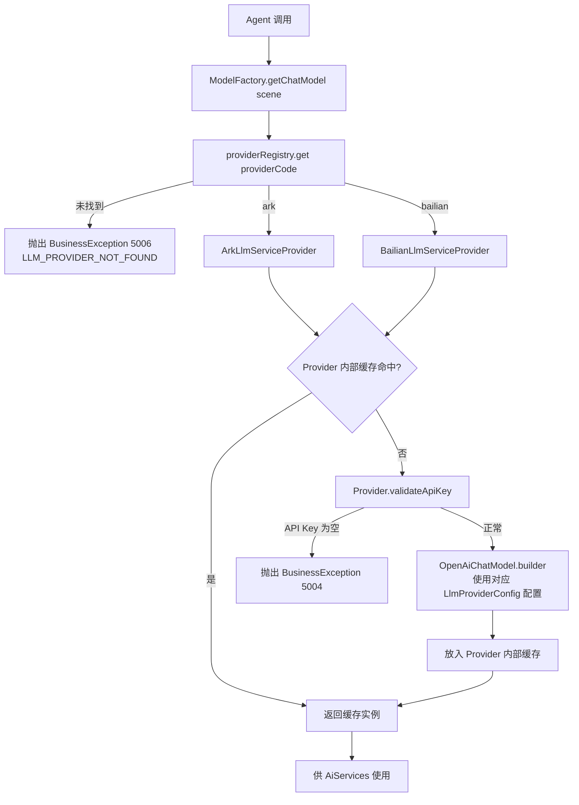

# LLM 接入模块 业务说明书

## 1. 模块概述

LLM 接入模块（agent-demo-llm）是 AI Agent 示例项目的 LLM 能力提供模块，负责**多 LLM 提供商**（火山引擎方舟 Coding Plan / 阿里百炼）的统一接入、模型实例管理与场景路由。模块通过 LangChain4j OpenAI 适配器对接各提供商 OpenAI 兼容协议，屏蔽底层差异，对上层提供 ChatModel / StreamingChatModel / EmbeddingModel / ThinkingStreamingChatModel / VisionChatModel 五类模型实例。支持按场景（chat/code/lite）路由到不同模型，并通过缓存复用避免重复创建。提供商通过配置项 `llm.provider` 切换（`ark` | `bailian`），默认使用火山引擎方舟。

**CR-002 重构后架构**：模块采用「能力矩阵 + 提供商策略 + 注册表」架构（方案 B+），新增 LLM 厂商仅需在 `provider/` 包新增 `@Component` 实现类，`ModelFactory` 核心代码零修改。能力接口按 ISP 原则拆分，`VisionChatModelProvider` 为可选能力接口，厂商按需实现，未实现的能力在运行时抛出 `UnsupportedCapabilityException`。

## 2. 用户角色与权限

| 角色 | 权限范围 | 典型操作 |
|------|---------|---------|
| **学习者** | 调用 Agent 间接受益 | 无需直接操作 LLM 模块 |
| **开发者** | 扩展模型接入 | 新增模型常量、新增 `LlmServiceProvider` 实现类接入新厂商、调整配置属性 |
| **运维者** | 管理 API Key 和提供商切换 | 配置环境变量 `ARK_API_KEY` / `BAILIAN_API_KEY`、修改 `llm.provider` 切换提供商 |

## 3. 业务功能点

### 3.1 同步对话模型获取

- **触发场景**：Agent 构建 AiServices 时调用 `ModelFactory.getChatModel(scene)`。
- **操作步骤**：ModelFactory 按 `providerCode` 从 `providerRegistry` 查找 Provider → 委托 `provider.getChatModel(scene)` → Provider 内部缓存命中则返回，否则创建。
- **系统行为**：基于 OpenAiChatModel.builder() 构建当前提供商的 ChatModel。
- **前置条件**：当前提供商对应的 API Key 已配置。
- **后置结果**：返回缓存的 ChatModel 实例。

### 3.2 流式对话模型获取

- **触发场景**：SSE 流式输出场景。
- **操作步骤**：ModelFactory 委托 `provider.getStreamingChatModel(scene)` → 查找 modelName → 缓存/创建。
- **系统行为**：基于 OpenAiStreamingChatModel.builder() 构建流式模型。
- **业务规则**：流式与非流式模型分别构建，独立缓存。

### 3.3 Embedding 模型获取

- **触发场景**：RAG 文档向量化、长期记忆向量化。
- **操作步骤**：ModelFactory 委托 `provider.getEmbeddingModel()` → Provider 内部双重检查锁创建单例。
- **系统行为**：基于 OpenAiEmbeddingModel.builder() 构建当前提供商的 Embedding 模型（ARK 使用豆包，BAILIAN 使用 text-embedding-v4）。
- **业务规则**：Embedding 模型跟随提供商切换（BR-LLM-013）。

### 3.4 场景路由

- **触发场景**：不同业务场景需要不同模型。
- **操作步骤**：`getChatModel("code")` → Provider 从对应配置源的 models Map 查找。
- **系统行为**：优先从当前提供商配置的 models Map 查找，未命中回退到对应提供商的 `defaultModel`。
- **业务规则**：场景标识为 chat/code/lite 等，路由逻辑与提供商无关。

### 3.5 API Key 校验

- **触发场景**：创建任何模型实例前。
- **系统行为**：CR-002 重构后由各 Provider 实现类内部校验（`ArkLlmServiceProvider.validateApiKey()` / `BailianLlmServiceProvider.validateApiKey()`），检查 apiKey 是否为空，为空抛出 BusinessException(5004)。
- **业务规则**：切换提供商后只校验当前提供商的 API Key（BR-LLM-010）。

### 3.6 思考流式模型获取（CR-001 新增，CR-002 重构为继承基类）

- **触发场景**：Agent 思考流式对话（enableThinking=true）时调用 `ModelFactory.getThinkingStreamingChatModel()`。
- **操作步骤**：ModelFactory 委托 `provider.getThinkingStreamingChatModel(scene)` → Provider 按 modelName 缓存复用，返回 `ArkThinkingStreamingChatModel` 或 `BailianThinkingStreamingChatModel` 实例。
- **系统行为**：
  1. 从对应厂商配置（`LlmProviderConfig` 实现）获取 baseUrl/apiKey/defaultModel/timeout
  2. 按 modelName 缓存复用，不同 modelName 返回不同实例
  3. 子类仅实现 `customizeRequestBody` 钩子（火山引擎添加 `thinking.type=enabled`，阿里百炼空实现）
  4. 通用 SSE 解析/HTTP 调用逻辑由 `AbstractThinkingStreamingChatModel` 基类提供
- **业务规则**：遵循 BR-LLM-004（缓存复用）、BR-LLM-007（不走 openai4j）、BR-LLM-016（代码重复率 ≤ 30%）。
- **前置条件**：对应厂商 API Key 已配置。
- **后置结果**：返回缓存的思考流式模型实例。

### 3.7 视觉对话模型获取（CR-002 新增能力检测）

- **触发场景**：PDF 图像描述、视觉理解场景调用 `ModelFactory.getVisionChatModel()`。
- **操作步骤**：ModelFactory 通过 `instanceof VisionChatModelProvider` 检测当前 Provider 是否实现视觉能力接口 → 实现则委托调用，未实现抛出 `UnsupportedCapabilityException`。
- **系统行为**：基于 OpenAiChatModel.builder() 构建视觉模型，modelName 来自 `LlmProviderConfig.getVisionModel()`。
- **业务规则**：遵循 BR-LLM-017（能力缺失明确报错，对应 AC-021）。

### 3.8 多厂商注册表路由（CR-002 核心重构）

- **触发场景**：任何模型获取请求。
- **操作步骤**：`ModelFactory` 构造时注入 `List<LlmServiceProvider>` → 转为 `Map<String, LlmServiceProvider> providerRegistry`（按 providerCode 索引）→ 运行时按 `llmProperties.getProviderCode()` 查找。
- **系统行为**：完全移除原 7 处 `if (provider == BAILIAN) {...} else {...}` 硬编码分支，改为注册表查找。
- **业务规则**：遵循 BR-LLM-014（新增厂商零核心改动）、BR-LLM-015（无厂商硬编码分支）。
- **扩展性验证**：通过 `MockLlmServiceProvider`（`getProviderCode()` 返回 `"mock"`）验证 ModelFactory.java 文件无任何修改即可路由到 Mock 厂商。

## 4. 业务流程串联

**流程说明**（CR-002 重构后）：
1. Agent 层通过 ModelFactory 获取模型实例
2. ModelFactory 按 `llmProperties.getProviderCode()` 从 `providerRegistry` 查找对应 Provider
3. 委托给 Provider 实例的对应能力方法（如 `provider.getChatModel(scene)`）
4. Provider 内部优先从缓存查找，命中则直接返回
5. 未命中时 Provider 校验对应 API Key，构建新实例并缓存
6. 返回模型实例供 AiServices 使用

## 5. 安全与合规

- **API Key 保护**：通过环境变量 `${ARK_API_KEY}` 或 `${BAILIAN_API_KEY}` 注入，禁止硬编码入库。
- **Coding Plan 地址**：使用 `/api/coding/v3` 按次计费，禁止使用 `/api/v3` 按 Token 计费。
- **阿里百炼协议地址**：必须使用 `/compatible-mode/v1` 路径（BR-LLM-011）。
- **模型名常量化**：所有模型名必须通过 `ModelConstants` 引用，禁止调用方硬编码。
- **日志脱敏**：API Key 禁止打印到日志。
- **API Key 隔离校验**：切换提供商后只校验当前提供商的 API Key，不校验另一个（BR-LLM-010）。
- **能力缺失显式报错**：厂商未实现的能力接口调用时必须抛出 `UnsupportedCapabilityException`，禁止隐式失败（BR-LLM-017）。

## 6. 前端入口

本模块为内部能力层，不直接对外暴露 API。通过 Agent 模块间接受益。

## 7. 核心数据实体

### 7.1 编排层（registry 包）

- **ModelFactory**：模型工厂，CR-002 重构后仅持有 `LlmProperties` 和 `Map<String, LlmServiceProvider> providerRegistry`，不再直接持有厂商配置类。公开方法签名保持不变（`getChatModel` / `getStreamingChatModel` / `getThinkingStreamingChatModel` / `getEmbeddingModel` / `getVisionChatModel`），向前兼容。

### 7.2 配置层（config 包）

- **LlmProviderConfig**：配置访问契约接口（CR-002 从 factory 迁入），统一 `getBaseUrl/getApiKey/getTimeout/getMaxRetries/getTemperature/getModelName(scene)/getEmbeddingModel/getVisionModel` 访问契约。
- **ArkProperties**：火山引擎配置属性绑定（`ark.coding-plan.*`），实现 `LlmProviderConfig` 接口。含 baseUrl/apiKey/defaultModel/models/timeout/maxRetries/temperature/thinkingDefaultEnabled（CR-001 新增）。
- **BailianProperties**：阿里百炼配置属性绑定（`bailian.*`），实现 `LlmProviderConfig` 接口。含 baseUrl/apiKey/defaultModel/models/timeout/maxRetries/temperature/embeddingModel/visionModel。
- **LlmProperties**：LLM 提供商选择配置（`llm.provider`），值为 `ark` | `bailian`，默认 `ark`。CR-002 新增 `getProviderCode()` 派生方法。
- **LlmProvider**：提供商枚举，CR-002 新增 `code` 字段（`ARK("ark")`、`BAILIAN("bailian")`），用于与 `LlmServiceProvider.getProviderCode()` 匹配。
- **LlmConfig**：LLM 配置类，启用配置属性绑定。

### 7.3 能力契约层（capability 包，CR-002 新增）

按 ISP 原则拆分的 5 个能力接口，厂商按需实现：

- **ChatModelProvider**：同步对话能力，声明 `getChatModel(String scene)`。
- **StreamingChatModelProvider**：流式对话能力，声明 `getStreamingChatModel(String scene)`。
- **ThinkingStreamingChatModelProvider**：思考流式能力，工厂方法模式声明 `getThinkingStreamingChatModel(String scene)`。
- **EmbeddingModelProvider**：向量化能力，声明 `getEmbeddingModel()`。
- **VisionChatModelProvider**：视觉对话能力（可选能力接口，ISP 拆出 `LlmServiceProvider` 聚合接口外），声明 `getVisionChatModel()`。

### 7.4 厂商策略层（provider 包，CR-002 新增）

- **LlmServiceProvider**：厂商策略聚合接口，继承 4 个核心能力接口（`ChatModelProvider`、`StreamingChatModelProvider`、`ThinkingStreamingChatModelProvider`、`EmbeddingModelProvider`）+ `getProviderCode()` 方法。`VisionChatModelProvider` 不在聚合接口中，由厂商显式 `implements`。
- **ArkLlmServiceProvider**：火山引擎厂商策略实现，实现 `LlmServiceProvider` + `VisionChatModelProvider`，`getProviderCode()` 返回 `"ark"`。内部持有 `ArkProperties`（即 `LlmProviderConfig`）和缓存 Map。
- **BailianLlmServiceProvider**：阿里百炼厂商策略实现，实现 `LlmServiceProvider` + `VisionChatModelProvider`，`getProviderCode()` 返回 `"bailian"`。

### 7.5 思考流式模型层（thinking 包，CR-002 抽取为独立子系统）

- **ThinkingStreamingChatModel**：思考流式核心接口（stream 方法契约）。
- **AbstractThinkingStreamingChatModel**：模板方法基类，上提 SSE 解析、HTTP 调用、回调分发、消息转换、tools 处理逻辑。子类仅实现 `customizeRequestBody(ObjectNode)` 钩子。
- **ArkThinkingStreamingChatModel**：火山引擎实现（CR-002 改造为继承基类，仅保留添加 `thinking.type=enabled` 字段的钩子，文件从 460 行降至 47 行）。
- **BailianThinkingStreamingChatModel**：阿里百炼实现（CR-002 改造为继承基类，钩子为空实现，模型名称自身触发思考能力，文件从 454 行降至 58 行）。
- **ThinkingStreamHandler**：思考流式回调接口（CR-001 新增），定义 onPartialThinking/onPartialResponse/onComplete/onError 四个回调方法。
- **ToolCall**：工具调用数据结构。

### 7.6 异常层（exception 包）

- **UnsupportedCapabilityException**：能力不支持异常（CR-002 新增），继承 `BusinessException`，错误码 `LLM_CAPABILITY_NOT_SUPPORTED(5007)`，携带 `providerCode` 和 `capabilityName` 字段。

## 8. API 接口清单

本模块为内部能力层，无直接对外 API。提供以下内部方法（CR-002 重构后签名保持不变，向前兼容）：

| 方法 | 功能说明 | 调用方 | CR-002 变更 |
|------|---------|--------|------------|
| `ModelFactory.getChatModel(scene)` | 按场景获取对话模型 | agent 层 | 委托给 Provider，无 |
| `ModelFactory.getDefaultChatModel()` | 获取默认对话模型 | agent 层 | 委托给 Provider，无 |
| `ModelFactory.getStreamingChatModel(scene)` | 按场景获取流式模型 | web 层（SSE） | 委托给 Provider，无 |
| `ModelFactory.getDefaultStreamingChatModel()` | 获取默认流式模型 | web 层 | 委托给 Provider，无 |
| `ModelFactory.getThinkingStreamingChatModel()` | 获取思考流式模型 | agent 层（chatThinkingStream） | 委托给 Provider，无 |
| `ModelFactory.getEmbeddingModel()` | 获取 Embedding 模型 | rag/memory 层 | 委托给 Provider，无 |
| `ModelFactory.getVisionChatModel()` | 获取视觉对话模型 | rag/splitter 层 | 新增 `instanceof` 能力检测，未实现抛 `UnsupportedCapabilityException` |

## 9. 业务规则

| 规则编号 | 规则描述 | 级别 |
|---------|---------|------|
| BR-LLM-001 | API Key 必须通过环境变量 `ARK_API_KEY` 或 `BAILIAN_API_KEY` 注入，禁止硬编码入库 | 🔴 强制 |
| BR-LLM-002 | 火山引擎必须使用 Coding Plan 专用地址 `/api/coding/v3` | 🔴 强制 |
| BR-LLM-003 | 模型名称必须通过 `ModelConstants` 常量类引用 | 🔴 强制 |
| BR-LLM-004 | 模型实例必须通过 `ModelFactory` 获取并缓存复用（CR-002 补充：缓存委托给 Provider 实例，持有者变更但语义不变） | 🔴 强制 |
| BR-LLM-005 | 调用超时时间默认 60s | ⚪ 可覆盖 |
| BR-LLM-006 | 最大重试次数默认 3 次 | ⚪ 可覆盖 |
| BR-LLM-007 | 思考模式（thinking.enabled）必须通过自定义 ArkThinkingStreamingChatModel 直连方舟 API，不走 LangChain4j openai4j（因 openai4j 不透传 reasoning_content）（CR-001 新增） | 🔴 强制 |
| BR-LLM-008 | LLM 提供商通过 `llm.provider` 配置项切换（`ark` / `bailian`），默认值为 `ark` | 🔴 强制 |
| BR-LLM-009 | 阿里百炼 API Key 必须通过环境变量 `BAILIAN_API_KEY` 注入，禁止硬编码入库 | 🔴 强制 |
| BR-LLM-010 | 切换提供商后只校验当前提供商的 API Key，未激活的提供商不校验 | 🔴 强制 |
| BR-LLM-011 | 阿里百炼必须使用 OpenAI 兼容协议地址 `/compatible-mode/v1` | 🔴 强制 |
| BR-LLM-012 | ~~阿里百炼模式暂不支持深度思考~~ **CR-002 已修正**：阿里百炼通过 `BailianThinkingStreamingChatModel` 支持深度思考（继承 AbstractThinkingStreamingChatModel，模型名称自身触发思考能力） | 🔴 强制 |
| BR-LLM-013 | Embedding 模型跟随提供商切换：ARK 使用 `doubao-embedding-vision`，BAILIAN 使用 `text-embedding-v4` | 🔴 强制 |
| BR-LLM-014 | 新增 LLM 厂商时 `ModelFactory` 核心代码必须零修改，仅通过新增 `LlmServiceProvider` 实现类（标注 `@Component`）+ `LlmProviderConfig` 实现类完成接入（CR-002 新增，对应 AC-018） | 🔴 强制 |
| BR-LLM-015 | `ModelFactory` 中禁止出现任何 `if (provider == XXX) {...} else {...}` 形式的厂商硬编码分支（CR-002 新增，对应 AC-019，静态扫描验证） | 🔴 强制 |
| BR-LLM-016 | `ArkThinkingStreamingChatModel` 与 `BailianThinkingStreamingChatModel` 代码重复率必须 ≤ 30%，通过继承 `AbstractThinkingStreamingChatModel` 实现（CR-002 新增，对应 AC-020，jscpd 检测） | 🔴 强制 |
| BR-LLM-017 | 厂商未实现的能力接口在运行时必须抛出 `UnsupportedCapabilityException`，禁止隐式失败（CR-002 新增，对应 AC-021） | 🔴 强制 |
| BR-LLM-018 | `LlmServiceProvider` 接口必须按 ISP 原则拆分为多能力接口（`ChatModelProvider`、`StreamingChatModelProvider`、`ThinkingStreamingChatModelProvider`、`EmbeddingModelProvider`、`VisionChatModelProvider`），`VisionChatModelProvider` 为可选能力接口不强制聚合，厂商按需 `implements`（CR-002 新增） | 🔴 强制 |

## 10. 异常处理

| 异常场景 | 错误码 | 提示信息 | 处理方式 |
|---------|-------|---------|---------|
| 火山引擎 API Key 未配置 | 5004 | ARK_API_KEY 未配置 | 抛出 BusinessException |
| 阿里百炼 API Key 未配置 | 5004 | BAILIAN_API_KEY 未配置 | 抛出 BusinessException |
| LLM 调用失败 | 5001 | LLM 调用失败 | 上层捕获并转换 |
| LLM 调用超时 | 5002 | LLM 调用超时 | 上层捕获并转换 |
| LLM 被限流 | 5003 | LLM 调用被限流 | 上层捕获并转换 |
| LLM 提供商未注册（CR-002 新增） | 5006 | 未找到 LLM 提供商: {code}，已注册: {keys} | 抛出 BusinessException，提示用户检查 `llm.provider` 配置与 `@Component` 注解 |
| LLM 能力不支持（CR-002 新增） | 5007 | LLM 厂商 [{providerCode}] 不支持能力 [{capabilityName}] | 抛出 UnsupportedCapabilityException，提示厂商实现类未实现对应能力接口 |

## 11. 性能要求

| 指标 | 要求 | 说明 |
|------|------|------|
| 模型创建耗时 | < 100ms | 仅首次创建，后续缓存复用 |
| 缓存命中率 | > 99% | 应用启动后稳定运行 |
| LLM 调用超时 | 60s | 可通过 `ark.coding-plan.timeout` 配置 |
| 重试次数 | 3 次 | 网络异常时自动重试 |

## 12. 支持的模型清单

### 火山引擎方舟模型

| 模型 | Model Name | 场景 | 状态 |
|------|-----------|------|------|
| 豆包 Seed 2.0 Code | `doubao-seed-2.0-code` | 编程任务（默认） | ✅ |
| 豆包 Seed 2.0 Pro | `doubao-seed-2.0-pro` | 通用旗舰对话 | ✅ |
| 豆包 Seed 2.0 Lite | `doubao-seed-2.0-lite` | 轻量快速场景 | ✅ |
| MiniMax M2.7 | `minimax-m2.7` | 全栈任务 | 🚧 常量已定义 |
| GLM 5.2 | `glm-5.2` | Agent 能力强 | 🚧 常量已定义 |
| Kimi K2.7 Code | `kimi-k2.7-code` | 前端任务 | 🚧 常量已定义 |
| DeepSeek V4 Pro | `deepseek-v4-pro` | 推理任务 | 🚧 常量已定义 |
| 自动模式 | `ark-code-latest` | 效果+速度智能选择 | 🚧 常量已定义 |
| 豆包 Embedding | `doubao-embedding-large-text-240915` | RAG 向量化 | ✅ |

### 阿里百炼模型

| 模型 | Model Name | 场景 | 状态 |
|------|-----------|------|------|
| DeepSeek V4 Flash | `deepseek-v4-flash` | 通用对话（默认） | ✅ |
| 阿里百炼 Embedding | `text-embedding-v4` | RAG 向量化 | ✅ |

---

## 附录：CR-002 重构效果汇总

| 指标 | 重构前 | 重构后 | 改善 |
|------|--------|--------|------|
| ModelFactory 代码行数 | 410 行 | 203 行（含 javadoc）/ 58 行（纯代码） | 减少 50%~86% |
| 厂商硬编码分支 | 7 处 | 0 处 | 完全消除 |
| 思考流式模型代码重复率 | 95% | 10.48%（jscpd 行级） | 降低 84.52 个百分点 |
| 新增厂商所需修改核心代码 | 7+ 处 | 0 处 | 零核心改动（仅新增 `@Component` 实现类） |
| 模块包结构 | 单一 `factory` 包（16 文件杂烩） | 6 个职责子包（config/capability/provider/thinking/registry/exception） | 职责清晰、依赖单向 |
| 测试覆盖（llm 模块） | - | 191 个测试 | 全部通过 |
| 测试覆盖（4 模块合计） | - | 377 个测试 | 全部通过，无回归 |

---

**文档维护**：
- 新增模型时，先在 `ModelConstants` 定义常量，再更新本清单
- 配置项调整时，更新 ArkProperties / BailianProperties 字段说明
- 安全策略变更时，更新第 5 节
- 新增 LLM 厂商时，参考 `provider/ArkLlmServiceProvider.java` 实现新的 `LlmServiceProvider` 实现类（CR-002 后无需修改 ModelFactory）
- 新增能力接口时，在 `capability/` 包新增接口，并更新 `LlmServiceProvider` 聚合接口或由厂商显式 `implements`

**变更日志**：
- v1.0（2026-07-20）：初始版本
- v1.1（2026-07-30）：补充阿里百炼接入、LlmProvider 枚举、多提供商路由
- v1.2（2026-07-31）：补充 CR-001 思考流式模型、ArkThinkingStreamingChatModel、ThinkingStreamHandler
- v2.0（2026-08-05）：CR-002 重构 — 模块按能力矩阵 + 提供商策略 + 注册表架构重组目录（config/capability/provider/thinking/registry/exception 6 个子包）；ModelFactory 改为注册表路由；新增 5 条业务规则（BR-LLM-014~018）；新增 2 个错误码（5006/5007）；修正 BR-LLM-012（阿里百炼已支持深度思考）；目录结构从单一 factory 包重构为 6 个职责子包
