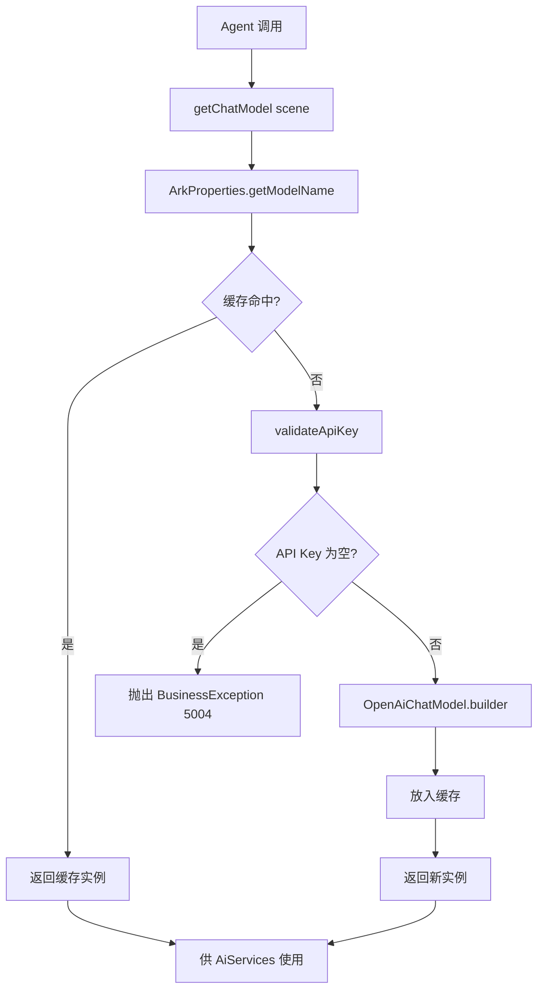

# LLM 接入模块 业务说明书

## 1. 模块概述

LLM 接入模块（agent-demo-llm）是 AI Agent 示例项目的 LLM 能力提供模块，负责火山引擎方舟 Coding Plan 的统一接入、模型实例管理与场景路由。模块通过 LangChain4j OpenAI 适配器对接火山引擎 OpenAI 兼容协议，屏蔽底层差异，对上层提供 ChatModel/StreamingChatModel/EmbeddingModel 三类模型实例。支持按场景（chat/code/lite）路由到不同模型，并通过缓存复用避免重复创建。

## 2. 用户角色与权限

| 角色 | 权限范围 | 典型操作 |
|------|---------|---------|
| **学习者** | 调用 Agent 间接受益 | 无需直接操作 LLM 模块 |
| **开发者** | 扩展模型接入 | 新增模型常量、调整 ArkProperties 配置 |
| **运维者** | 管理 API Key | 配置环境变量 `ARK_API_KEY`、切换模型 |

## 3. 业务功能点

### 3.1 同步对话模型获取

- **触发场景**：Agent 构建 AiServices 时调用 `ModelFactory.getDefaultChatModel()`。
- **操作步骤**：`getChatModel(scene)` -> 查找 modelName -> 缓存命中则返回，否则创建。
- **系统行为**：基于 OpenAiChatModel.builder() 构建火山引擎 ChatModel。
- **前置条件**：ARK_API_KEY 已配置。
- **后置结果**：返回缓存的 ChatModel 实例。

### 3.2 流式对话模型获取

- **触发场景**：SSE 流式输出场景（规划中）。
- **操作步骤**：`getStreamingChatModel(scene)` -> 查找 modelName -> 缓存/创建。
- **系统行为**：基于 OpenAiStreamingChatModel.builder() 构建流式模型。
- **业务规则**：流式与非流式模型分别构建，独立缓存。

### 3.3 Embedding 模型获取

- **触发场景**：RAG 文档向量化、长期记忆向量化。
- **操作步骤**：`getEmbeddingModel()` -> 双重检查锁创建单例。
- **系统行为**：基于 OpenAiEmbeddingModel.builder() 构建豆包 Embedding 模型。
- **业务规则**：使用 `ModelConstants.MODEL_DOUBAO_EMBEDDING` 常量。

### 3.4 场景路由

- **触发场景**：不同业务场景需要不同模型。
- **操作步骤**：`getChatModel("code")` -> 从 `ArkProperties.models` 查找。
- **系统行为**：优先从 models Map 查找，未命中回退到 `defaultModel`。
- **业务规则**：场景标识为 chat/code/lite 等。

### 3.5 API Key 校验

- **触发场景**：创建任何模型实例前。
- **系统行为**：`validateApiKey()` 检查 apiKey 是否为空，为空抛出 BusinessException(5004)。

### 3.6 思考流式模型获取（CR-001 新增）

- **触发场景**：Agent 思考流式对话（enableThinking=true）时调用 `ModelFactory.getThinkingStreamingChatModel()`。
- **操作步骤**：无需参数，直接返回缓存中的 ArkThinkingStreamingChatModel 实例。
- **系统行为**：
  1. 从 `ArkProperties` 获取 baseUrl/apiKey/defaultModel/timeout
  2. 按 modelName 缓存复用，不同 modelName 返回不同实例
  3. 返回 `ArkThinkingStreamingChatModel` 实例（自定义实现，直连方舟 API 解析 reasoning_content）
- **业务规则**：遵循 BR-LLM-004（缓存复用）和 BR-LLM-007（不走 openai4j）。
- **前置条件**：ARK_API_KEY 已配置。
- **后置结果**：返回缓存的 ArkThinkingStreamingChatModel 实例。

## 4. 业务流程串联

**流程说明**：
1. Agent 层通过 ModelFactory 获取模型实例
2. 优先从缓存查找，命中则直接返回
3. 未命中时校验 API Key，构建新实例并缓存
4. 返回模型实例供 AiServices 使用

## 5. 安全与合规

- **API Key 保护**：通过环境变量 `${ARK_API_KEY}` 注入，禁止硬编码入库。
- **Coding Plan 地址**：使用 `/api/coding/v3` 按次计费，禁止使用 `/api/v3` 按 Token 计费。
- **模型名常量化**：所有模型名必须通过 `ModelConstants` 引用，禁止调用方硬编码。
- **日志脱敏**：API Key 禁止打印到日志。

## 6. 前端入口

本模块为内部能力层，不直接对外暴露 API。通过 Agent 模块间接受益。

## 7. 核心数据实体

- **ModelFactory**：模型工厂，管理 ChatModel/StreamingChatModel/EmbeddingModel/ArkThinkingStreamingChatModel 四类实例的创建与缓存（CR-001 新增思考流式模型）。
- **ArkProperties**：火山引擎配置属性绑定（`ark.coding-plan.*`），含 baseUrl/apiKey/defaultModel/models/timeout/maxRetries/temperature/thinkingDefaultEnabled（CR-001 新增）。
- **LlmConfig**：LLM 配置类，启用配置属性绑定。
- **ArkThinkingStreamingChatModel**：自定义思考流式模型（CR-001 新增），HttpClient 直连方舟 Chat Completions API（stream=true, thinking.enabled），手动解析 SSE 流中的 delta.reasoning_content 和 delta.content。
- **ThinkingStreamHandler**：思考流式回调接口（CR-001 新增），定义 onPartialThinking/onPartialResponse/onComplete/onError 四个回调方法。

## 8. API 接口清单

本模块为内部能力层，无直接对外 API。提供以下内部方法：

| 方法 | 功能说明 | 调用方 |
|------|---------|--------|
| `ModelFactory.getChatModel(scene)` | 按场景获取对话模型 | agent 层 |
| `ModelFactory.getDefaultChatModel()` | 获取默认对话模型 | agent 层 |
| `ModelFactory.getStreamingChatModel(scene)` | 按场景获取流式模型 | web 层（SSE） |
| `ModelFactory.getDefaultStreamingChatModel()` | 获取默认流式模型 | web 层（SSE） |
| `ModelFactory.getThinkingStreamingChatModel()` | 获取思考流式模型（ArkThinkingStreamingChatModel，CR-001 新增） | agent 层（chatThinkingStream） |
| `ModelFactory.getEmbeddingModel()` | 获取 Embedding 模型 | rag/memory 层 |

## 9. 业务规则

| 规则编号 | 规则描述 | 级别 |
|---------|---------|------|
| BR-LLM-001 | API Key 必须通过环境变量 `ARK_API_KEY` 注入，禁止硬编码入库 | 🔴 强制 |
| BR-LLM-002 | 必须使用 Coding Plan 专用地址 `/api/coding/v3` | 🔴 强制 |
| BR-LLM-003 | 模型名称必须通过 `ModelConstants` 常量类引用 | 🔴 强制 |
| BR-LLM-004 | 模型实例必须通过 `ModelFactory` 获取并缓存复用 | 🔴 强制 |
| BR-LLM-005 | 调用超时时间默认 60s | ⚪ 可覆盖 |
| BR-LLM-006 | 最大重试次数默认 3 次 | ⚪ 可覆盖 |
| BR-LLM-007 | 思考模式（thinking.enabled）必须通过自定义 ArkThinkingStreamingChatModel 直连方舟 API，不走 LangChain4j openai4j（因 openai4j 不透传 reasoning_content）（CR-001 新增） | 🔴 强制 |

## 10. 异常处理

| 异常场景 | 错误码 | 提示信息 | 处理方式 |
|---------|-------|---------|---------|
| API Key 未配置 | 5004 | ARK_API_KEY 未配置 | 抛出 BusinessException |
| LLM 调用失败 | 5001 | LLM 调用失败 | 上层捕获并转换 |
| LLM 调用超时 | 5002 | LLM 调用超时 | 上层捕获并转换 |
| LLM 被限流 | 5003 | LLM 调用被限流 | 上层捕获并转换 |

## 11. 性能要求

| 指标 | 要求 | 说明 |
|------|------|------|
| 模型创建耗时 | < 100ms | 仅首次创建，后续缓存复用 |
| 缓存命中率 | > 99% | 应用启动后稳定运行 |
| LLM 调用超时 | 60s | 可通过 `ark.coding-plan.timeout` 配置 |
| 重试次数 | 3 次 | 网络异常时自动重试 |

## 12. 支持的模型清单

| 模型 | Model Name | 场景 | 状态 |
|------|-----------|------|------|
| 豆包 Seed 2.0 Code | `doubao-seed-2.0-code` | 编程任务（默认） | ✅ |
| 豆包 Seed 2.0 Pro | `doubao-seed-2.0-pro` | 通用旗舰对话 | ✅ |
| 豆包 Seed 2.0 Lite | `doubao-seed-2.0-lite` | 轻量快速场景 | ✅ |
| MiniMax M2.7 | `minimax-m2.7` | 全栈任务 | 🚧 常量已定义 |
| GLM 5.2 | `glm-5.2` | Agent 能力强 | 🚧 常量已定义 |
| Kimi K2.7 Code | `kimi-k2.7-code` | 前端任务 | 🚧 常量已定义 |
| DeepSeek V4 Pro | `deepseek-v4-pro` | 推理任务 | 🚧 常量已定义 |
| 自动模式 | `ark-code-latest` | 效果+速度智能选择 | 🚧 常量已定义 |
| 豆包 Embedding | `doubao-embedding-large-text-240915` | RAG 向量化 | ✅ |

---

**文档维护**：
- 新增模型时，先在 `ModelConstants` 定义常量，再更新本清单
- 配置项调整时，更新 ArkProperties 字段说明
- 安全策略变更时，更新第 5 节
