# MCP 协议模块 业务说明书

## 1. 模块概述

MCP 协议模块（agent-demo-mcp）是 AI Agent 示例项目的 MCP（Model Context Protocol）客户端能力模块，负责连接外部 MCP Server、自动发现工具并注册到 ToolRegistry 供 Agent 使用。模块基于 LangChain4j langchain4j-mcp（1.17.2-beta27）实现，支持三种传输方式：stdio（本地子进程）、SSE（旧版 HTTP+SSE 规范）、HTTP（Streamable HTTP，新版 MCP 2025-06-18 规范）。通过 ByteBuddy 动态生成带 `@Tool` 注解的代理类，将 MCP Server 暴露的工具以 `mcp_{serverName}_{toolName}` 前缀注册到 ToolRegistry，与本地工具一视同仁参与 ReAct 循环的 Function Calling。

模块支持静态配置（application.yml 预配置，启动时批量加载）和动态管理（REST API 运行时增删查重连），并提供分场景容错策略（静态失败不阻塞启动、动态失败返回错误码、运行中断线自动注销工具）。

## 2. 用户角色与权限

| 角色 | 权限范围 | 典型操作 |
|------|---------|---------|
| **API 调用方** | 管理 MCP Server | 添加/删除/查询 Server、重连断线 Server、查询工具列表 |
| **运维者** | 预配置静态 Server | 通过 application.yml 配置 Server 列表、监控连接状态 |
| **对话用户** | 间接受益 | 通过 Agent 对话获得 MCP 工具的能力（如生成图表、获取网页内容） |
| **Agent** | 自主调用 MCP 工具 | 通过 Function Calling 选择 MCP 工具，无需感知工具来源 |
| **开发者** | 扩展传输方式 | 新增传输方式枚举、调整工具生成策略 |

## 3. 业务功能点

### 3.1 静态配置加载（应用启动）

- **触发场景**：应用启动时自动执行。
- **操作步骤**：`McpToolRegistrar`（实现 `ApplicationRunner`）读取 `mcp.servers` 配置列表。
- **系统行为**：检查 `mcp.enabled` 开关 -> 遍历 Server 配置 -> 过滤 `enabled=false`（标记 DISABLED） -> 对启用的 Server 创建传输通道、建立连接、拉取工具列表、注册到 ToolRegistry。
- **容错策略**：单个 Server 连接失败时记录 ERROR 日志、标记 ERROR 状态、跳过，不阻塞应用启动。
- **业务规则**：BR-MCP-001（总开关）、BR-MCP-009（静态失败不阻塞）、BR-MCP-014（enabled=false 跳过）。

### 3.2 动态 Server 管理（REST API）

- **触发场景**：API 调用方通过 REST API 动态添加 Server。
- **操作步骤**：`POST /api/mcp/servers`，传入 name + transport + 对应传输参数。
- **系统行为**：校验名称唯一性和格式 -> 校验 transport 配置完整性 -> 建立连接 -> 拉取工具 -> 注册到 ToolRegistry -> 返回 Server 详情。
- **容错策略**：连接失败返回 `MCP_CONNECTION_FAILED(5400)`，不污染 ToolRegistry。
- **业务规则**：BR-MCP-002（名称规则）、BR-MCP-003（全局唯一）、BR-MCP-010（动态失败返回错误码）。

### 3.3 Server 状态管理与重连

- **触发场景**：Server 运行中断线或需要重连。
- **操作步骤**：`POST /api/mcp/servers/{name}/reconnect`。
- **系统行为**：校验 Server 存在性 -> 校验当前状态（已连接返回 5406） -> 重新建立连接 -> 重新拉取工具并注册 -> 状态变更为 CONNECTED。
- **状态枚举**：CONNECTED（已连接）、DISCONNECTED（已断线）、ERROR（连接失败）、DISABLED（配置禁用）。
- **业务规则**：BR-MCP-012（状态枚举）、BR-MCP-015（重连已连接返回错误）。

### 3.4 Server 删除

- **触发场景**：API 调用方删除 Server。
- **操作步骤**：`DELETE /api/mcp/servers/{name}`。
- **系统行为**：断开连接 -> 注销所有工具（`ToolRegistry.unregisterTool()`） -> 从内存移除 -> 触发 SimpleAgent delegate 重建。
- **并发处理**：若有正在执行的工具调用，调用方收到 `MCP_TOOL_CALL_FAILED(5401)` 异常。
- **业务规则**：BR-MCP-011（断线自动注销工具）、BR-MCP-013（仅存内存重启丢失）。

### 3.5 工具列表查询

- **触发场景**：API 调用方查看 Server 暴露的工具。
- **操作步骤**：`GET /api/mcp/servers/{name}/tools`。
- **系统行为**：返回工具元数据列表（原始名、注册名、描述、参数 Schema）。

### 3.6 MCP 工具生成与调用（核心机制）

- **触发条件**：MCP Server 连接成功后，遍历 `mcpClient.listTools()` 返回的 `ToolSpecification` 列表。
- **工具生成**：`McpToolFactory` 通过 ByteBuddy 动态生成带 `@Tool` 注解的代理类：
  - 类名：`com.agentdemo.mcp.tool.McpTool_{serverName}_{toolName}`
  - 方法名：`mcp_{serverName}_{toolName}`（与注册名一致）
  - 方法签名：`String {methodName}(String argsJson)`（统一单参数方案）
  - `@Tool` 注解描述包含：Server 名 + 工具描述 + **结构化参数列表 + 调用示例**（通过 `parseParametersSchema` 解析 JSON Schema 生成，帮助 LLM 正确理解参数名和格式）
- **工具执行**：`McpToolInterceptor` 拦截方法调用 -> 委托 `McpToolExecutor.execute(serverName, toolName, argsJson)` -> 解析 argsJson 为 Map -> 调用 `mcpClient.executeTool()` -> 返回结果字符串。
- **参数 Schema 序列化**：`McpServerManager.serializeParameters()` 手动提取 `JsonObjectSchema` 的 properties/required 字段（Jackson 无法自动序列化 `JsonSchemaElement` 多态接口），通过 `convertSchemaElement()` 按类型（string/integer/number/boolean/object）递归转换。
- **内容类型处理**：CR-002 重构后，McpToolExecutor 不再使用 extractResultText/extractFromRawResponse 双重解析路径，而是统一从 McpTransportWrapper 缓存的原始 JSON-RPC 响应通过 McpContentParser 解析。McpContentParser 按 MCP 协议内容类型策略分发：text->提取文本、image URL->Markdown 图片语法、image/audio base64->文本描述、resource text->提取文本、resource blob->文本描述、structuredContent->JSON 序列化、unknown->WARNING 日志+静默跳过。executeTool 返回值被有意丢弃，Unsupported content type 异常视为预期行为（非文本内容正常返回）。
- **业务规则**：BR-MCP-007（工具名前缀）、BR-MCP-008（超时默认 60s）。

### 3.7 三种传输方式

| 传输方式 | 枚举值 | 配置字段 | 适用场景 | LangChain4j 实现 |
|---------|--------|---------|---------|-----------------|
| stdio | `STDIO` | command + args + env | 本地子进程 MCP Server | `StdioMcpTransport` |
| SSE | `SSE` | url + headers | 远程 HTTP+SSE（旧版规范） | `HttpMcpTransport`（sseUrl） |
| HTTP | `HTTP` | url + headers | 远程 Streamable HTTP（新版 2025-06-18 规范） | `StreamableHttpMcpTransport`（url） |

- **HTTP 传输**：新增于运行时调试阶段，用于连接 mermaid-mcp 等采用新版 MCP 2025-06-18 规范的 Server。`McpTransportFactory.createHttpTransport()` 使用 `StreamableHttpMcpTransport.Builder().url()` 创建传输通道。
- **Windows 适配**：stdio 模式在 Windows 下需使用 `npx.cmd`（而非 `npx`），因 Java ProcessBuilder 不会自动解析 `.cmd` 后缀。
- **初始化超时**：`DefaultMcpClient.Builder` 配置 `initializationTimeout(60s)`，确保 npx 首次下载依赖时不超时。

## 4. 业务流程串联

```mermaid
flowchart TD
    subgraph 启动加载["静态配置加载"]
        A1[应用启动] --> A2{mcp.enabled?}
        A2 -->|false| A3[跳过 MCP 加载]
        A2 -->|true| A4[遍历 servers 配置]
        A4 --> A5{server enabled?}
        A5 -->|false| A6[标记 DISABLED]
        A5 -->|true| A7[创建 McpTransport<br/>stdio/sse/http]
        A7 --> A8[创建 McpClient<br/>含 initializationTimeout]
        A8 --> A9{连接成功?}
        A9 -->|失败| A10[标记 ERROR<br/>不阻塞启动]
        A9 -->|成功| A11[拉取工具列表]
        A11 --> A12[序列化参数 Schema<br/>生成工具描述]
        A12 --> A13[ByteBuddy 生成 @Tool 代理类]
        A13 --> A14[注册到 ToolRegistry]
        A14 --> A15[标记 CONNECTED]
    end

    subgraph 动态管理["动态 Server 管理"]
        B1[POST /api/mcp/servers] --> B2[校验名称/配置]
        B2 --> B3{校验通过?}
        B3 -->|失败| B4[返回错误码]
        B3 -->|通过| B5[建立连接]
        B5 --> B6{连接成功?}
        B6 -->|失败| B7[返回 5400]
        B6 -->|成功| B8[拉取工具+注册]
        B8 --> B9[返回 CONNECTED]
    end

    subgraph 工具调用["Agent 工具调用"]
        C1[用户提问] --> C2[Agent ReAct 决策]
        C2 --> C3{选择 MCP 工具?}
        C3 -->|是| C4[调用 mcp_xxx_yyy 代理]
        C4 --> C5[McpToolExecutor.execute]
        C5 --> C6[调用外部 MCP Server<br/>返回值丢弃]
        C6 --> C7[统一从 Wrapper 缓存<br/>通过 McpContentParser 解析]
        C7 --> C8[按内容类型策略分发:<br/>text/image/audio/resource/<br/>structuredContent/unknown]
        C8 --> C9[结果回填 ReAct]
        C3 -->|否| C10[使用本地工具或直接回答]
    end
```



## 5. 核心数据实体

| 实体 | 类名 | 用途 |
|------|------|------|
| Server 元数据 | `McpServer` | Server 配置信息 + 运行时状态 + 工具列表 |
| Server 状态 | `McpServerStatus` | 枚举：CONNECTED / DISCONNECTED / ERROR / DISABLED |
| 传输方式 | `McpTransportType` | 枚举：STDIO / SSE / HTTP |
| 工具元数据 | `McpToolInfo` | 原始名 / 注册名 / 描述 / 参数 Schema |
| 客户端聚合 | `McpClientEntry` | McpClient + Transport + 状态聚合（实现 AutoCloseable） |
| 客户端注册表 | `McpClientRegistry` | Server 注册表（ConcurrentHashMap，按 name 索引） |
| 内容解析器 | `McpContentParser` | 内容类型策略分发器：统一解析 MCP 协议 6 种内容类型（CR-002 新增） |

## 6. 模块依赖关系

| 依赖方向 | 模块 | 说明 |
|---------|------|------|
| 本模块 -> | `agent-demo-common` | BusinessException / ErrorCode / JsonUtils |
| 本模块 -> | `agent-demo-tools` | ToolRegistry（动态注册/注销工具） |
| `agent-demo-web` -> | 本模块 | McpController 调用 McpServerManager |
| `agent-demo-bootstrap` -> | 本模块 | pom 依赖引入 + application.yml 配置 |
| 零修改 | `agent-demo-agent` | SimpleAgent 复用 lastToolCount 检测机制 |
| 零修改 | `agent-demo-tools` | ToolRegistry 已支持动态注册（CR-003） |

## 7. 业务流程清单

| 流程名 | 入口 | 说明 |
|--------|------|------|
| 静态配置加载 | `McpToolRegistrar.run()` | ApplicationRunner 启动时批量加载 Server |
| 动态 Server 添加 | `POST /api/mcp/servers` | 运行时添加并立即连接 |
| Server 删除 | `DELETE /api/mcp/servers/{name}` | 断开连接并注销工具 |
| Server 重连 | `POST /api/mcp/servers/{name}/reconnect` | 重新连接断线 Server |
| 工具列表查询 | `GET /api/mcp/servers/{name}/tools` | 查询 Server 暴露的工具 |
| Agent 工具调用 | ReAct Function Calling | Agent 自主选择 MCP 工具调用 |

## 8. 业务规则

| # | 编号 | 规则 | 级别 |
|---|------|------|------|
| 1 | BR-MCP-001 | MCP 模块总开关为 `mcp.enabled`（默认 true），false 时模块完全禁用 | 🔴 强制 |
| 2 | BR-MCP-002 | MCP Server 名称 1-50 字符，仅允许中英文、数字、下划线和连字符 | 🔴 强制 |
| 3 | BR-MCP-003 | MCP Server 名称全局唯一，重复返回 MCP_SERVER_NAME_EXISTS(5402) | 🔴 强制 |
| 4 | BR-MCP-004 | MCP Server 必须指定 transport，取值仅限 stdio / sse / http | 🔴 强制 |
| 5 | BR-MCP-005 | stdio 传输必须配置 command 字段，args 和 env 可选 | 🔴 强制 |
| 6 | BR-MCP-006 | sse/http 传输必须配置 url 字段（合法 HTTP/HTTPS URL），headers 可选 | 🔴 强制 |
| 7 | BR-MCP-007 | MCP 工具名采用 `mcp_{serverName}_{toolName}` 前缀注册到 ToolRegistry | 🔴 强制 |
| 8 | BR-MCP-008 | MCP 工具调用超时默认 60s，可被单 Server 的 tool-timeout 覆盖 | ⚪ 可覆盖 |
| 9 | BR-MCP-009 | 静态 Server 启动失败记录 ERROR 日志并跳过，不阻塞应用启动 | 🔴 强制 |
| 10 | BR-MCP-010 | 动态添加 Server 连接失败返回 MCP_CONNECTION_FAILED(5400)，不污染 ToolRegistry | 🔴 强制 |
| 11 | BR-MCP-011 | MCP Server 断线时自动注销其所有工具，触发 SimpleAgent delegate 重建 | 🔴 强制 |
| 12 | BR-MCP-012 | Server 状态枚举：CONNECTED / DISCONNECTED / ERROR / DISABLED | 🔴 强制 |
| 13 | BR-MCP-013 | 动态添加的 Server 仅存内存，重启后丢失（不持久化） | 🔴 强制 |
| 14 | BR-MCP-014 | Server enabled=false 时跳过连接，标记 DISABLED，可通过重连接口启用 | 🔴 强制 |
| 15 | BR-MCP-015 | 重连已 CONNECTED 状态的 Server 返回 MCP_SERVER_ALREADY_CONNECTED(5406) | 🔴 强制 |
| 16 | BR-MCP-016 | MCP 工具参数 Schema 必须通过手动提取 JsonObjectSchema properties 序列化，禁止直接使用 Jackson 序列化 JsonSchemaElement 多态接口 | 🔴 强制 |
| 17 | BR-MCP-017 | MCP 工具描述必须包含结构化参数列表和调用示例（通过 parseParametersSchema 生成），帮助 LLM 正确理解参数名和格式 | 🔴 强制 |
| 18 | BR-MCP-018 | McpClient 创建时必须配置 initializationTimeout（默认 60s），确保 stdio 模式下 npx 首次下载依赖不超时 | 🔴 强制 |
| 19 | BR-MCP-019 | ~~McpToolExecutor 必须捕获 LangChain4j ToolExecutionHelper 抛出的 Unsupported content type 异常，返回友好提示而非 BusinessException~~ **CR-002 更新**：McpToolExecutor 必须将 Unsupported content type 异常视为预期行为（非文本内容正常返回），继续到统一解析路径，不作为错误处理 | 🔴 强制 |
| 20 | BR-MCP-023 | MCP 工具输出统一从 McpTransportWrapper 缓存的原始 JSON-RPC 响应通过 McpContentParser 解析，executeTool 返回值被丢弃（CR-002 新增，对应 AC-041） | 🔴 强制 |
| 21 | BR-MCP-024 | McpContentParser 按内容类型策略分发处理：text->提取文本，image URL->Markdown 图片语法，image/audio base64->文本描述，resource text->提取文本，resource blob->文本描述，structuredContent->JSON 序列化，unknown->WARNING 日志+静默跳过（CR-002 新增，对应 AC-042~044） | 🔴 强制 |
| 22 | BR-MCP-025 | McpContentParser 对未知内容类型必须静默跳过（记录 WARNING 日志），不得导致工具调用失败（CR-002 新增，对应 AC-045） | 🔴 强制 |

## 9. 错误码

| 错误码 | 名称 | 说明 |
|--------|------|------|
| 5400 | MCP_CONNECTION_FAILED | MCP 连接失败 |
| 5401 | MCP_TOOL_CALL_FAILED | MCP 工具调用失败 |
| 5402 | MCP_SERVER_NAME_EXISTS | MCP Server 名称已存在 |
| 5403 | MCP_SERVER_NOT_FOUND | MCP Server 不存在 |
| 5404 | MCP_TRANSPORT_UNSUPPORTED | 不支持的传输方式 |
| 5405 | MCP_MODULE_DISABLED | MCP 模块已禁用 |
| 5406 | MCP_SERVER_ALREADY_CONNECTED | MCP Server 已连接，无需重连 |

## 10. 配置项

```yaml
mcp:
  enabled: true                    # 模块总开关
  default-tool-timeout: 60s        # 全局默认工具调用超时
  servers:                         # 静态预配置 Server 列表
    - name: mermaid-mcp            # Server 唯一标识
      transport: http              # 传输方式：stdio | sse | http
      enabled: true                # 是否启用
      url: https://mcp.mermaid.ai/mcp  # sse/http 专用 URL
      tool-timeout: 60s            # 单 Server 超时（覆盖默认）
    - name: fetch
      transport: stdio
      enabled: true
      command: npx.cmd             # Windows 需 .cmd 后缀
      args:
        - mcp-fetch-server
      tool-timeout: 60s
```

## 11. REST API 接口列表

| 接口 | 方法 | 路径 | 说明 |
|------|------|------|------|
| 查询 Server 列表 | GET | `/api/mcp/servers` | 返回所有 Server 及状态 |
| 添加 Server | POST | `/api/mcp/servers` | 动态添加并立即连接 |
| 删除 Server | DELETE | `/api/mcp/servers/{name}` | 断开连接并注销工具 |
| 重连 Server | POST | `/api/mcp/servers/{name}/reconnect` | 重新连接断线 Server |
| 查询工具列表 | GET | `/api/mcp/servers/{name}/tools` | 返回 Server 暴露的工具 |
