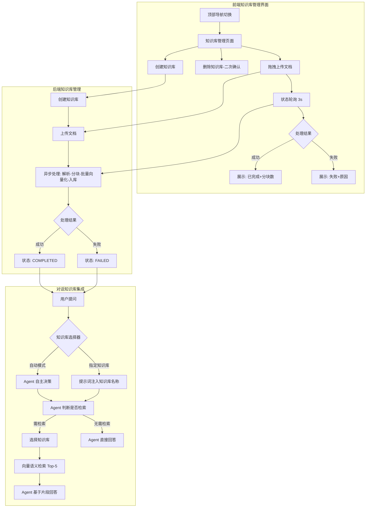

# RAG 知识库模块 业务说明书

## 1. 模块概述

RAG 知识库模块（agent-demo-rag）是 AI Agent 示例项目的知识库问答能力模块，负责文档管理、文档解析、向量化和语义检索。模块基于 LangChain4j EmbeddingStore 实现，支持多知识库分组管理、文档异步处理（解析-分块-向量化-入库）、纯向量语义检索（InMemoryEmbeddingStore 可切换 MilvusEmbeddingStore），并通过 @Tool 注解将检索能力集成为 Agent 工具，Agent 在 ReAct 循环中自主选择知识库进行检索。

## 2. 用户角色与权限

| 角色 | 权限范围 | 典型操作 |
|------|---------|---------|
| **API 调用方** | 管理知识库和文档 | 创建知识库、上传文档、查询状态、删除文档 |
| **前端用户** | 通过可视化页面管理知识库 | 创建/删除知识库、拖拽上传文档、查看处理进度、对话中选择知识库 |
| **对话用户** | 间接受益 | 通过 Agent 对话获得基于知识库的回答，可指定检索知识库 |
| **Agent** | 自主检索 | 判断是否检索、选择知识库、调用检索工具 |
| **开发者** | 扩展检索能力 | 切换向量存储、调整分块参数、新增文档格式 |

## 3. 业务功能点

### 3.1 知识库创建

- **触发场景**：API 调用方通过 REST API 创建知识库。
- **操作步骤**：`POST /api/rag/knowledges`，传入名称和描述。
- **系统行为**：校验名称唯一性和格式，生成 UUID 作为 ID，存入 KnowledgeBaseStore。
- **业务规则**：名称 1-50 字符（中英文/数字/下划线/连字符），全局唯一，描述最长 200 字符。

### 3.2 知识库列表查询

- **触发场景**：API 调用方查看已有知识库。
- **操作步骤**：`GET /api/rag/knowledges`。
- **系统行为**：返回所有知识库信息（ID/名称/描述/文档数/创建时间）。

### 3.3 知识库删除（级联）

- **触发场景**：API 调用方删除知识库。
- **操作步骤**：`DELETE /api/rag/knowledges/{knowledgeBaseId}`。
- **系统行为**：级联删除知识库下所有文档记录和向量数据。
- **业务规则**：删除前校验知识库存在性，不存在返回 5305 错误码。

### 3.4 文档上传（异步处理）

- **触发场景**：API 调用方上传文档到知识库。
- **操作步骤**：`POST /api/rag/knowledges/{knowledgeBaseId}/documents`，上传文件。
- **系统行为**：校验格式和大小 -> 创建 DocumentInfo(PENDING) -> 保存临时文件 -> @Async 触发异步处理 -> 返回文档 ID。
- **业务规则**：支持 txt/md/pdf，单文件 <= 10MB，允许同名文档（以 ID 区分）。

### 3.5 文档异步处理

- **触发场景**：文档上传后自动触发。
- **操作步骤**：`@Async processDocument(documentId)`。
- **系统行为**：状态流转 PENDING -> PROCESSING -> COMPLETED/FAILED。
- **处理流水线**：解析文档 -> 递归分块 -> 向量化（Embedding）-> 存入 EmbeddingStore（带 metadata）。
- **向量化批处理机制**：Embeddings API 单次输入上限为 10 个文本片段，当文档分块数超过 10 时，通过 `batchEmbed` 方法分批调用（每批 10 条），避免 `InvalidParameter: Embeddings API input limit exceeded` 错误。
- **异常处理**：解析失败标记 "文档解析失败"，向量化失败标记 "向量化失败"。

### 3.6 文档状态查询

- **触发场景**：API 调用方轮询文档处理进度。
- **操作步骤**：`GET /api/rag/documents/{documentId}/status`。
- **系统行为**：返回当前状态（PENDING/PROCESSING/COMPLETED/FAILED）、分块数、失败原因。

### 3.7 文档列表查询

- **触发场景**：API 调用方查看知识库下所有文档。
- **操作步骤**：`GET /api/rag/knowledges/{knowledgeBaseId}/documents`。
- **系统行为**：返回该知识库下所有文档信息。

### 3.8 文档删除

- **触发场景**：API 调用方删除文档。
- **操作步骤**：`DELETE /api/rag/documents/{documentId}`。
- **系统行为**：删除文档记录和对应的向量数据，更新知识库文档计数。

### 3.9 知识库检索（Agent 工具）

- **触发场景**：Agent 在 ReAct 循环中判断需要检索知识库。
- **操作步骤**：Agent 调用 `KnowledgeRetrieverTool.searchKnowledge(knowledgeBaseName, query)`。
- **系统行为**：查找知识库 -> 向量化查询 -> metadata 过滤检索 Top-5 -> 返回文档片段文本。
- **异常降级**：知识库不存在/为空/无结果/服务不可用时返回提示文本，不中断对话。

### 3.10 对话知识库集成（提示词注入）

- **触发场景**：用户在对话页面通过知识库选择器选择知识库后发送消息。
- **操作步骤**：前端 `streamChat` 携带 `knowledgeBases` 参数 -> `AgentController` 在调用 Agent 前将知识库名称注入用户消息末尾。
- **注入格式**：`[系统提示：请优先使用以下知识库检索相关信息：知识库A、知识库B]`
- **系统行为**：LLM 在 ReAct 循环中遵循注入提示，调用 `searchKnowledge` 工具时使用指定知识库。
- **兼容性**：`knowledgeBases` 为 null 或空数组时走原有路径（Agent 自主决策），零回归。
- **记忆隔离**：`memoryManager.addUserMessage` 仍存入原始消息（不含注入内容），避免记忆污染。

### 3.11 前端知识库管理界面

- **触发场景**：用户通过顶部导航栏切换到"知识库"页面。
- **页面布局**：左右分栏（左侧知识库列表，右侧文档列表）。
- **知识库管理**：创建（弹窗表单 + 实时校验）、查看列表（名称/文档数/创建时间）、删除（二次确认 + 级联提示）。
- **文档管理**：拖拽/点击批量上传、前端校验（格式 txt/md/pdf、大小 10MB）、状态自动轮询（3 秒间隔，终态停止）、删除。
- **对话集成**：对话输入框旁的知识库选择器，默认"自动"模式，支持多选，按会话维度保持状态。
- **设计风格**：遵循 Refined Dark Tech 设计系统，与对话页一致。

## 4. 业务流程串联

## 5. 安全合规

| 安全场景 | 机制 | 实现类 |
|----------|------|--------|
| 文档格式白名单 | 仅允许 txt/md/pdf | DocumentLoader |
| 文档大小限制 | 10MB 上限 | DocumentLoader |
| 临时文件清理 | 处理完成后删除临时文件 | DocumentService |
| 异常降级 | 检索工具异常返回文本提示，不泄露堆栈 | KnowledgeRetrieverTool |
| 文档内容脱敏 | 文档内容不打印到日志 | DocumentService |

## 6. 数据实体

### 6.1 内存数据结构

| 数据结构 | 类型 | 存储方式 | 用途 |
|---------|------|---------|------|
| KnowledgeBase | 实体 | ConcurrentHashMap | 知识库元数据（ID/名称/描述/文档数/创建时间） |
| DocumentInfo | 实体 | ConcurrentHashMap | 文档元数据（ID/知识库ID/文件名/大小/格式/状态/分块数/失败原因/上传时间） |
| TextSegment | 向量数据 | EmbeddingStore | 文档分块向量（含 metadata: knowledgeBaseId, documentId） |

### 6.2 向量存储

| 存储类型 | 实现类 | 部署方式 | 适用场景 |
|---------|--------|---------|---------|
| InMemoryEmbeddingStore | LangChain4j 核心 | 零部署 | 开发/学习（默认） |
| MilvusEmbeddingStore | langchain4j-milvus | Docker 部署 Milvus | 生产/大规模 |

## 7. 依赖关系

### 7.1 内部模块依赖

| 依赖模块 | 用途 |
|---------|------|
| agent-demo-common | ErrorCode 错误码、Result 返回结构、BusinessException |
| agent-demo-llm | ModelFactory.getEmbeddingModel() 向量化模型 |

### 7.2 外部依赖

| 依赖 | 版本 | 用途 |
|------|------|------|
| langchain4j | 1.17.2 | EmbeddingStore/TextSegment/DocumentSplitter |
| langchain4j-milvus | 1.17.2-beta27 | MilvusEmbeddingStore（可切换） |
| milvus-sdk-java | 2.4.3 | Milvus 向量数据库 SDK |
| pdfbox | 3.0.3 | PDF 文档解析 |

### 7.3 被依赖模块

| 模块 | 依赖方式 |
|------|---------|
| agent-demo-web | Maven 依赖（RagController + DTO） |

## 8. 异常处理

| 异常场景 | 错误码 | 处理方式 |
|---------|--------|---------|
| 知识库不存在 | 5305 | 返回错误提示 |
| 文档不存在 | 5306 | 返回错误提示 |
| 知识库名称重复 | 5307 | 返回错误提示 |
| 文档大小超限 | 5308 | 返回错误提示 |
| 不支持的格式 | 5309 | 返回错误提示 |
| 文档解析失败 | 5303 | 异步标记 FAILED |
| 向量化失败 | 5301 | 异步标记 FAILED |
| 向量存储初始化失败 | 5304 | 检索工具降级返回提示 |
| 向量数据库不可用 | - | 检索工具返回 "知识库服务暂时不可用" |

## 9. 配置参数

| 配置项 | 默认值 | 说明 |
|--------|--------|------|
| rag.store-type | memory | 向量存储类型 |
| rag.document.max-size | 10MB | 文档大小上限 |
| rag.document.supported-formats | txt,md,pdf | 支持的格式 |
| rag.chunk.size | 1000 | 分块大小（token） |
| rag.chunk.overlap | 200 | 分块重叠（token） |
| rag.retrieval.max-results | 5 | 检索返回最大数 |
| rag.retrieval.min-score | 0.0 | 最小相似度 |
| rag.milvus.host | localhost | Milvus 地址 |
| rag.milvus.port | 19530 | Milvus 端口 |
