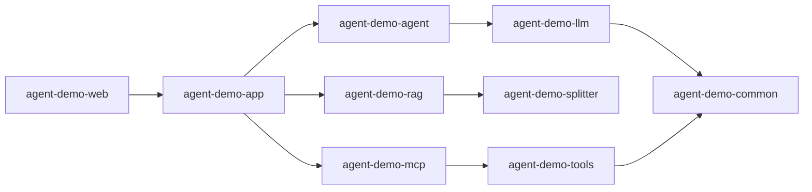

# specs/modules 模块业务说明书总目录

> 项目全部 Maven 模块的业务说明书索引。流程级详情由各说明书第 4 节「业务流程串联」承载。
> 新增模块时请在下方表格登记，并保持文件命名 `{模块名}模块-业务说明书.md`。

| # | 模块 | 工程模块 | 业务说明书 |
|---|------|---------|-----------|
| 1 | Agent 编排模块 | `agent-demo-agent` | [Agent编排模块-业务说明书.md](Agent编排模块-业务说明书.md) |
| 2 | LLM 接入模块 | `agent-demo-llm` | [LLM接入模块-业务说明书.md](LLM接入模块-业务说明书.md) |
| 3 | 工具调用模块 | `agent-demo-tools` | [工具调用模块-业务说明书.md](工具调用模块-业务说明书.md) |
| 4 | 记忆管理模块 | `agent-demo-memory` | [记忆管理模块-业务说明书.md](记忆管理模块-业务说明书.md) |
| 5 | 公共组件模块 | `agent-demo-common` | [公共组件模块-业务说明书.md](公共组件模块-业务说明书.md) |
| 6 | Web 接口模块 | `agent-demo-web` | [Web接口模块-业务说明书.md](Web接口模块-业务说明书.md) |
| 7 | RAG 知识库模块 | `agent-demo-rag` + `agent-demo-splitter` | [RAG模块-业务说明书.md](RAG模块-业务说明书.md) |
| 8 | MCP 协议模块 | `agent-demo-mcp` | [MCP协议模块-业务说明书.md](MCP协议模块-业务说明书.md) |
| 9 | 应用编排模块 | `agent-demo-app` | [应用编排模块-业务说明书.md](应用编排模块-业务说明书.md)（2026-08-17 新增，应用编排层 P1/P2/P3 交付；2026-08-25 更新，工作流 HITL 迭代） |

## 模块依赖全景

