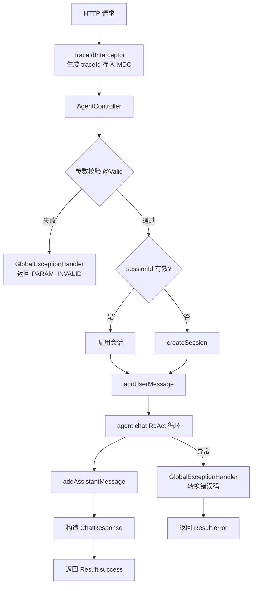

# Web 接口模块 业务说明书

## 1. 模块概述

Web 接口模块（agent-demo-web）是 AI Agent 示例项目的对外接入层，负责通过 REST API 暴露 Agent 对话能力与会话管理能力。模块基于 Spring Boot Web MVC 提供 RESTful 接口，支持同步对话、会话创建/查询/清空，集成 Springdoc OpenAPI 3 自动生成接口文档，通过 GlobalExceptionHandler 统一异常处理，TraceIdInterceptor 注入链路追踪 ID。

## 2. 用户角色与权限

| 角色 | 权限范围 | 典型操作 |
|------|---------|---------|
| **学习者** | 调用全部 API | 对话、会话管理、查看 Swagger |
| **API 调用方** | 调用全部 API | 集成 Agent 能力到外部应用 |
| **开发者** | 扩展接口 | 新增 Controller、调整 DTO |
| **运维者** | 管理接口文档 | 配置 Swagger 开关 |

## 3. 业务功能点

### 3.1 同步对话

- **触发场景**：用户发送消息给 Agent，期望获得同步回复。
- **操作步骤**：`POST /api/agent/chat`，请求体含 sessionId（可选）+ message（必填）。
- **系统行为**：
  1. 校验 sessionId，无效则新建
  2. 记录用户消息到 ChatMemory
  3. 调用 `BaseAgent.chat(sessionId, message)`
  4. 记录助手回复到 ChatMemory
  5. 返回 `Result<ChatResponse>`
- **前置条件**：message 不能为空（`@NotBlank`）。
- **后置结果**：返回含 sessionId/response/duration 的响应。

### 3.2 创建会话

- **触发场景**：用户主动创建新会话。
- **操作步骤**：`POST /api/agent/session`。
- **系统行为**：`SessionManager.createSession()` 生成 UUID，返回 `Result<String>`。
- **后置结果**：返回 sessionId。

### 3.3 查询会话

- **触发场景**：校验会话是否存在。
- **操作步骤**：`GET /api/agent/session/{sessionId}`。
- **系统行为**：`SessionManager.exists(sessionId)`，返回 `Result<Boolean>`。

### 3.4 清空会话记忆

- **触发场景**：用户主动清空对话历史，重新开始。
- **操作步骤**：`DELETE /api/agent/session/{sessionId}/memory`。
- **系统行为**：`ChatMemoryManager.clearMemory(sessionId)`，返回 `Result<Void>`。
- **业务规则**：清空记忆后会话本身保留，后续对话从头开始。

### 3.5 接口文档

- **触发场景**：开发者或调用方查看接口说明。
- **操作步骤**：访问 `http://localhost:8080/swagger-ui.html`。
- **系统行为**：Springdoc OpenAPI 3 自动生成接口文档，含 `@Operation` 描述。

### 3.6 全局异常处理

- **触发场景**：任何 Controller 抛出异常，或客户端访问不存在的静态资源/接口路径。
- **系统行为**：`GlobalExceptionHandler`（`@RestControllerAdvice`）拦截并转换为 `Result<T>`，按异常类型分类处理：
  - `BusinessException`：保留原错误码
  - `MethodArgumentNotValidException`：返回 PARAM_INVALID(400)
  - `NoResourceFoundException`：返回 NOT_FOUND(404)，日志降级为 1 行 WARN，避免堆栈污染
  - 其他异常：返回 SYSTEM_ERROR(5000)
- **业务规则**：
  - BusinessException 保留原错误码，其他异常返回 SYSTEM_ERROR(5000)。
  - `NoResourceFoundException` 必须专门处理返回 404，禁止落入兜底 `Exception` 处理器导致 500 + 40+ 行堆栈污染日志（如未引入 actuator 时访问 `/actuator/health`）。

### 3.7 链路追踪

- **触发场景**：每次 HTTP 请求。
- **系统行为**：`TraceIdInterceptor` 生成 traceId 存入 MDC，日志中通过 `%X{traceId}` 输出。
- **业务规则**：traceId 贯穿一次请求的所有日志，便于问题定位。

## 4. 业务流程串联



**流程说明**：
1. 请求到达，TraceIdInterceptor 注入 traceId 到 MDC
2. Controller 接收请求，`@Valid` 校验参数
3. 校验失败由 GlobalExceptionHandler 处理
4. 校验通过后处理 sessionId（复用或新建）
5. 记录用户消息，调用 Agent 推理
6. 记录助手回复，构造 ChatResponse 返回
7. 任何异常由 GlobalExceptionHandler 统一转换

## 5. 安全与合规

- **参数校验**：`@Valid` + Bean Validation（如 `@NotBlank`）。
- **全局异常**：`@RestControllerAdvice` 统一拦截，避免堆栈泄露给调用方。
- **traceId 追踪**：每次请求生成唯一 traceId，便于审计。
- **Swagger 开关**：生产环境建议关闭（`springdoc.swagger-ui.enabled=false`）。
- **CORS 配置**：WebConfig 可配置跨域策略。

## 6. 前端入口

- **Swagger UI**：`http://localhost:8080/swagger-ui.html`
- **OpenAPI JSON**：`http://localhost:8080/v3/api-docs`
- **API Base Path**：`http://localhost:8080/api/agent/`

## 7. 核心数据实体

- **AgentController**：Agent 对话 Controller，提供 chat/session 接口。
- **ChatRequest**：对话请求 DTO，含 sessionId/message/agentType/model/options。
- **ChatResponse**：对话响应 DTO，含 sessionId/response/toolCalls/duration/usage。
- **GlobalExceptionHandler**：全局异常处理器，统一异常转换。
- **TraceIdInterceptor**：链路追踪拦截器，注入 traceId 到 MDC。
- **WebConfig**：Web 配置，注册拦截器、CORS 等。
- **OpenApiConfig**：OpenAPI 文档配置。

## 8. API 接口清单

| 接口路径 | HTTP方法 | 功能说明 | 权限要求 | 请求参数 | 响应类型 |
|---------|---------|---------|---------|---------|---------|
| `/api/agent/chat` | POST | 同步对话 | 无 | ChatRequest | `Result<ChatResponse>` |
| `/api/agent/session` | POST | 创建会话 | 无 | 无 | `Result<String>` |
| `/api/agent/session/{sessionId}` | GET | 查询会话是否存在 | 无 | path: sessionId | `Result<Boolean>` |
| `/api/agent/session/{sessionId}/memory` | DELETE | 清空会话记忆 | 无 | path: sessionId | `Result<Void>` |

**ChatRequest 字段**：

| 字段 | 类型 | 必填 | 校验 | 说明 |
|------|------|------|------|------|
| sessionId | String | 否 | - | 为空则新建 |
| message | String | 是 | `@NotBlank` | 用户消息 |
| agentType | String | 否 | - | 默认 SINGLE |
| model | String | 否 | - | 指定模型 |
| options | Map | 否 | - | 扩展参数 |

**ChatResponse 字段**：

| 字段 | 类型 | 说明 |
|------|------|------|
| sessionId | String | 会话 ID |
| response | String | Agent 回复 |
| toolCalls | List<ToolCallInfo> | 工具调用信息 |
| duration | long | 耗时（毫秒） |
| usage | Object | Token 使用统计 |

## 9. 业务规则

| 规则编号 | 规则描述 | 级别 |
|---------|---------|------|
| BR-WEB-001 | Controller 返回值必须用 `Result<T>` 包装 | 🔴 强制 |
| BR-WEB-002 | API 路径前缀统一 `/api/agent/` | 🔴 强制 |
| BR-WEB-003 | Controller 方法必须添加 `@Operation` OpenAPI 注解 | 🟡 尽量 |
| BR-WEB-004 | 入参 DTO 必须使用 `@Valid` + Bean Validation 校验 | 🔴 强制 |
| BR-WEB-005 | 全局异常通过 `@RestControllerAdvice` 统一拦截 | 🔴 强制 |
| BR-WEB-006 | 每次请求必须生成 traceId 注入 MDC | 🔴 强制 |
| BR-WEB-007 | 生产环境应关闭 Swagger UI 访问 | 🟡 尽量 |
| BR-WEB-008 | 传入无效 sessionId 时自动新建，不抛错 | 🔴 强制 |
| BR-WEB-009 | `NoResourceFoundException` 必须专门处理返回 404，禁止落入兜底 `Exception` 处理器导致 500 + 堆栈污染 | 🔴 强制 |

## 10. 异常处理

| 异常场景 | 错误码 | 提示信息 | 处理方式 |
|---------|-------|---------|---------|
| 参数校验失败 | 400 | 参数无效 | GlobalExceptionHandler 拦截 |
| 消息为空 | 400 | 消息内容不能为空 | `@NotBlank` 校验 |
| 资源/接口不存在 | 404 | 资源不存在 | `NoResourceFoundException` 专门处理，WARN 日志 |
| LLM 调用失败 | 5001 | LLM 调用失败 | BusinessException 转换 |
| LLM 超时 | 5002 | LLM 调用超时 | BusinessException 转换 |
| API Key 无效 | 5004 | LLM API Key 无效 | BusinessException 转换 |
| 工具执行失败 | 5100 | 工具执行失败 | BusinessException 转换 |
| 会话不存在 | 5201 | 会话不存在 | 自动新建会话 |
| 系统未知异常 | 5000 | 系统异常 | GlobalExceptionHandler 兜底 |

## 11. 性能要求

| 指标 | 要求 | 说明 |
|------|------|------|
| 接口响应时间 | < 60s | 受 LLM 响应时间影响 |
| SSE 超时 | 300s | Tomcat connection-timeout 配置 |
| 并发支持 | 100 QPS | 受 LLM 限流约束 |
| Swagger 加载 | < 1s | OpenAPI 文档生成 |
| traceId 注入 | < 1ms | 拦截器开销 |

## 12. 接口调用示例

### 12.1 创建会话

```bash
curl -X POST http://localhost:8080/api/agent/session
```

响应：

```json
{
  "code": 200,
  "data": "a1b2c3d4e5f6...",
  "msg": ""
}
```

### 12.2 同步对话

```bash
curl -X POST http://localhost:8080/api/agent/chat \
  -H "Content-Type: application/json" \
  -d '{"sessionId":"","message":"现在几点？"}'
```

响应：

```json
{
  "code": 200,
  "data": {
    "sessionId": "a1b2c3d4e5f6...",
    "response": "现在是 2026年7月20日 14:30。",
    "toolCalls": [{"name": "TimeTool", "args": {}}],
    "duration": 2340,
    "usage": null
  },
  "msg": ""
}
```

### 12.3 清空会话记忆

```bash
curl -X DELETE http://localhost:8080/api/agent/session/a1b2c3d4e5f6/memory
```

---

**文档维护**：
- 新增接口时，补充到第 3 节业务功能点与第 8 节接口清单
- DTO 字段变更时，更新第 8 节字段说明
- 异常场景新增时，更新第 10 节异常处理
