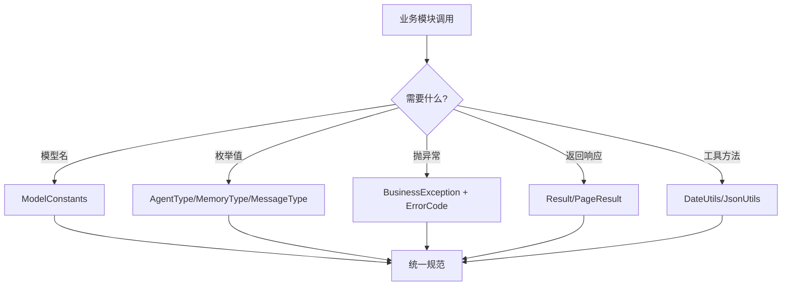

# 公共组件模块 业务说明书

## 1. 模块概述

公共组件模块（agent-demo-common）是 AI Agent 示例项目的基础设施模块，为所有业务模块提供统一的常量、枚举、异常体系、返回结果与工具类。模块不涉及具体业务逻辑，是项目内所有模块的共同依赖，确保跨模块协作时的命名规范、错误码规范、返回格式规范一致。

## 2. 用户角色与权限

| 角色 | 权限范围 | 典型操作 |
|------|---------|---------|
| **开发者** | 扩展公共组件 | 新增常量/枚举/错误码/工具类 |
| **AI Agent** | 遵循规范编码 | 引用常量、抛出 BusinessException、返回 Result |

## 3. 业务功能点

### 3.1 常量集中管理（ModelConstants）

- **触发场景**：任何模块需要使用模型名称、Base URL 等常量时。
- **操作步骤**：引用 `ModelConstants.MODEL_DOUBAO_SEED_2_CODE` 等常量。
- **系统行为**：提供火山引擎模型名称、场景 Key、Base URL 常量。
- **业务规则**：所有模型名必须通过 `ModelConstants` 引用，禁止在调用方硬编码。

### 3.2 枚举统一管理

- **触发场景**：需要使用 AgentType、MemoryType、MessageType 枚举时。
- **系统行为**：
  - `AgentType`：SINGLE/MULTI/WORKFLOW 三种 Agent 协作模式
  - `MemoryType`：记忆类型枚举
  - `MessageType`：消息类型枚举
- **业务规则**：枚举使用 `@Getter` + `@AllArgsConstructor`，含 code 与 desc 字段。

### 3.3 异常体系（ErrorCode + BusinessException）

- **触发场景**：业务逻辑异常、LLM 调用失败、工具执行失败等。
- **操作步骤**：`throw new BusinessException(ErrorCode.LLM_CALL_FAILED, "描述")`。
- **系统行为**：BusinessException 携带 ErrorCode 与自定义消息，由 GlobalExceptionHandler 统一拦截。
- **业务规则**：
  - 错误码按业务域划分区间（LLM 5001-5099、工具 5100-5199 等）
  - 禁止直接 `throw new RuntimeException`
  - 新增错误码必须在 `ErrorCode` 枚举中分配编号

### 3.4 统一返回结果（Result + PageResult）

- **触发场景**：Controller 返回响应时。
- **操作步骤**：`return Result.success(data)` 或 `Result.error(errorCode)`。
- **系统行为**：返回 `{ code, data, msg }` 结构。
- **业务规则**：所有 Controller 返回值必须用 `Result<T>` 包装。

### 3.5 工具类（DateUtils + JsonUtils）

- **触发场景**：需要日期处理或 JSON 序列化时。
- **系统行为**：提供通用工具方法。

## 4. 业务流程串联

## 5. 安全与合规

- **错误码规范**：禁止硬编码状态码，统一通过 ErrorCode 引用。
- **异常封装**：禁止 `throw new RuntimeException`，必须使用 BusinessException。
- **常量管理**：禁止硬编码模型名、URL 等，统一通过 ModelConstants 引用。

## 6. 前端入口

本模块为基础设施层，无前端入口。

## 7. 核心数据实体

- **ModelConstants**：模型相关常量（Base URL、模型名、场景 Key）。
- **AgentType**：Agent 类型枚举（SINGLE/MULTI/WORKFLOW）。
- **MemoryType**：记忆类型枚举。
- **MessageType**：消息类型枚举。
- **ErrorCode**：业务错误码枚举（200/4xx/5xxx 区间）。
- **BusinessException**：业务异常类，携带 ErrorCode。
- **Result**：统一返回结果 `{ code, data, msg }`。
- **PageResult**：分页返回结果。
- **DateUtils**：日期工具类。
- **JsonUtils**：JSON 工具类。

## 8. API 接口清单

本模块为基础设施层，无对外 API。提供以下内部能力：

| 能力 | 使用方式 | 调用方 |
|------|---------|--------|
| 模型常量 | `ModelConstants.MODEL_DOUBAO_SEED_2_CODE` | llm 层 |
| Agent 类型 | `AgentType.SINGLE` | agent 层 |
| 业务异常 | `throw new BusinessException(ErrorCode.XXX, "msg")` | 全部模块 |
| 统一返回 | `Result.success(data)` / `Result.error(errorCode)` | web 层 |
| 错误码查询 | `ErrorCode.LLM_CALL_FAILED.getCode()` | 全部模块 |

## 9. 业务规则

| 规则编号 | 规则描述 | 级别 |
|---------|---------|------|
| BR-COMMON-001 | 模型名称必须通过 `ModelConstants` 常量类引用 | 🔴 强制 |
| BR-COMMON-002 | 错误码必须通过 `ErrorCode` 枚举统一定义 | 🔴 强制 |
| BR-COMMON-003 | 业务异常必须使用 `BusinessException` + `ErrorCode` | 🔴 强制 |
| BR-COMMON-004 | Controller 返回值必须用 `Result<T>` 包装 | 🔴 强制 |
| BR-COMMON-005 | 错误码编号区间按业务域划分，不可重叠 | 🔴 强制 |
| BR-COMMON-006 | 新增错误码必须分配编号并补充注释 | 🔴 强制 |
| BR-COMMON-007 | 常量类构造函数必须私有化，禁止实例化 | 🟡 尽量 |

## 10. 异常处理

| 异常场景 | 错误码 | 提示信息 | 处理方式 |
|---------|-------|---------|---------|
| 参数无效 | 400 | 参数无效 | BusinessException |
| 未授权 | 401 | 未授权 | BusinessException |
| 禁止访问 | 403 | 禁止访问 | BusinessException |
| 资源不存在 | 404 | 资源不存在 | BusinessException |
| LLM 调用失败 | 5001 | LLM 调用失败 | BusinessException |
| 工具执行失败 | 5100 | 工具执行失败 | BusinessException |
| 会话不存在 | 5201 | 会话不存在 | BusinessException |
| 系统异常 | 5000 | 系统异常 | BusinessException |

## 11. 错误码区间速查

| 区间 | 业务域 | 数量 | 示例 |
|------|--------|------|------|
| 200 | 成功 | 1 | SUCCESS |
| 400-404 | 客户端错误 | 4 | PARAM_INVALID/UNAUTHORIZED/FORBIDDEN/NOT_FOUND |
| 5000 | 系统异常 | 1 | SYSTEM_ERROR |
| 5001-5099 | LLM 相关 | 4 | LLM_CALL_FAILED/TIMEOUT/RATE_LIMITED/API_KEY_INVALID |
| 5100-5199 | 工具相关 | 3 | TOOL_EXECUTION_FAILED/TOOL_NOT_FOUND/TOOL_PARAM_INVALID |
| 5200-5299 | 记忆/会话 | 3 | MEMORY_NOT_FOUND/SESSION_NOT_FOUND/SESSION_EXPIRED |
| 5300-5399 | RAG 相关 | 3 | RAG_RETRIEVE_FAILED/EMBEDDING_FAILED/DOCUMENT_LOAD_FAILED |
| 5400-5499 | MCP 相关 | 2 | MCP_CONNECTION_FAILED/MCP_TOOL_CALL_FAILED |

---

**文档维护**：
- 新增常量/枚举/错误码时，补充到对应章节
- 错误码区间调整时，更新第 11 节速查表
- 业务规则调整时，更新第 9 节业务规则
