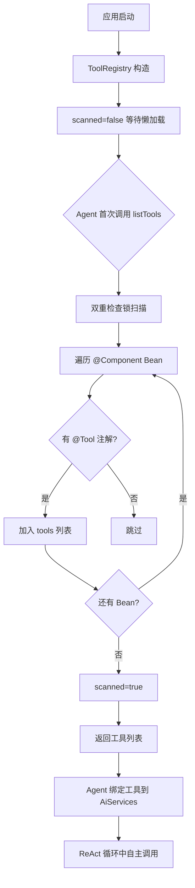

# 工具调用模块 业务说明书

## 1. 模块概述

工具调用模块（agent-demo-tools）是 AI Agent 示例项目的能力扩展模块，负责 Agent 可调用工具的定义、注册与执行。模块基于 LangChain4j `@Tool` 注解实现声明式工具注册，通过 ToolRegistry 集中管理所有工具，Agent 在 ReAct 循环中自主决策调用哪个工具。当前已实现 4 个内置工具（计算器/时间/HTTP/文件读取），支持运行时动态注册（MCP 外部工具）。

## 2. 用户角色与权限

| 角色 | 权限范围 | 典型操作 |
|------|---------|---------|
| **学习者** | 调用 Agent 间接受益 | Agent 自主调用工具 |
| **开发者** | 扩展工具集 | 新增 @Component + @Tool 工具类 |
| **API 调用方** | 间接受益 | Agent 通过工具完成复杂任务 |

## 3. 业务功能点

### 3.1 工具声明式注册

- **触发场景**：应用启动后，首次调用 `ToolRegistry.listTools()` 时。
- **操作步骤**：扫描所有 `@Component` Bean，检查方法是否有 `@Tool` 注解。
- **系统行为**：将带 `@Tool` 注解的 Bean 加入 CopyOnWriteArrayList。
- **业务规则**：懒加载扫描，避免构造时循环依赖。

### 3.2 计算器工具（CalculatorTool）

- **触发场景**：Agent 需要数学计算时调用。
- **系统行为**：执行数学运算并返回结果。
- **安全措施**：数值范围校验。

### 3.3 时间工具（TimeTool）

- **触发场景**：Agent 需要查询当前时间时调用。
- **系统行为**：返回当前系统时间。
- **安全措施**：无风险。

### 3.4 HTTP 工具（HttpTool）

- **触发场景**：Agent 需要获取网页内容或调用外部 API 时。
- **操作步骤**：`httpGet(url)` 或 `httpPost(url, body)`。
- **系统行为**：
  1. SSRF 防护校验（禁止内网地址）
  2. 执行 HTTP 请求
  3. 响应超 10KB 截断
- **安全措施**：
  - SSRF 防护：禁止访问 10./172.16-31./192.168./127./localhost
  - 响应截断：超过 10KB 自动截断并提示
  - 超时配置：连接 5s，读取 30s

### 3.5 文件读取工具（FileReadTool）

- **触发场景**：Agent 需要读取本地文件时调用。
- **操作步骤**：`readFile(path)`。
- **系统行为**：校验路径在白名单目录内，读取文件内容返回。
- **安全措施**：目录白名单（`agent.file-allowed-dir`，默认 `./data`）。

### 3.6 动态工具注册/注销

- **触发场景**：运行时新增/移除工具（如 RAG 知识库动态 Tool、MCP 加载的外部工具）。
- **注册操作**：`ToolRegistry.register(tool)` -> 校验工具类有 `@Tool` 注解 -> 加入 CopyOnWriteArrayList -> 立即可被 Agent 使用。
- **注销操作**：`ToolRegistry.unregisterTool(toolMethodName)` -> 通过 `Method.getName()` 匹配工具方法名 -> 使用 `removeIf` 移除（CR-003 新增）。
- **工具数量查询**：`ToolRegistry.getToolCount()` -> 返回当前已注册工具数量（CR-003 新增，供 SimpleAgent 检测 Tool 变化）。
- **业务规则**：动态注册/注销的工具与内置工具享有同等地位。CR-003 后 RAG 模块通过此机制实现每个知识库独立 Tool 的动态注册/注销。

### 3.7 工具查询

- **触发场景**：Agent 构建 AiServices 时获取工具列表。
- **操作步骤**：`ToolRegistry.listTools()` 或 `getTool(name)`。
- **系统行为**：返回当前所有已注册工具。

### 3.8 工具描述动态生成（深度思考 CR-001 新增）

- **触发场景**：深度思考 ReAct 模式组装系统提示词时。
- **操作步骤**：`ToolSchemaConverter.convertToDescriptionText()`。
- **系统行为**：反射扫描已注册的 @Tool 注解方法，提取方法名和 @Tool 描述值，生成人类可读的工具描述文本（格式："你可以调用以下工具来获取信息：\n- {方法名}: {描述}\n...当问题需要实时信息或计算时，请主动调用工具。"）。
- **业务规则**：工具描述与实际注册工具动态一致，新增/移除 @Tool 工具后自动同步，无需修改提示词配置（BR-THINK-002）。

## 4. 业务流程串联

**流程说明**：
1. ToolRegistry 构造时不扫描，仅设置 scanned=false
2. Agent 首次调用 listTools() 时触发懒加载扫描
3. 双重检查锁保证线程安全
4. 扫描所有 @Component Bean，检查是否有 @Tool 注解方法
5. 将符合条件的 Bean 加入 CopyOnWriteArrayList
6. 返回工具列表供 AiServices 绑定

## 5. 安全与合规

- **SSRF 防护**：HTTP 工具禁止访问内网地址（10./172.16-31./192.168./127./localhost）。
- **目录白名单**：文件读取工具限定在 `agent.file-allowed-dir` 目录内。
- **响应截断**：HTTP 响应超过 10KB 自动截断，防止 Token 消耗过大。
- **异常封装**：工具执行失败必须抛出 `BusinessException` + 对应 ErrorCode。
- **超时控制**：HTTP 工具连接超时 5s，读取超时 30s。

## 6. 前端入口

本模块为内部能力层，不直接对外暴露 API。通过 Agent 模块间接受益。

## 7. 核心数据实体

- **ToolRegistry**：工具注册中心，管理工具列表（CopyOnWriteArrayList），懒加载扫描，支持动态注册（`register`）、注销（`unregisterTool`，CR-003 新增）、工具数量查询（`getToolCount`，CR-003 新增）。
- **ToolSchemaConverter**：工具 Schema/描述转换器，提供 `convertToJson()`（转 OpenAI 兼容 JSON Schema 供 function calling）和 `convertToDescriptionText()`（转人类可读工具描述文本注入系统提示词，深度思考 CR-001 新增）两个方法。
- **CalculatorTool**：计算器工具，提供数学计算能力。
- **TimeTool**：时间工具，提供当前时间查询。
- **HttpTool**：HTTP 工具，提供 GET/POST 请求能力，含 SSRF 防护与响应截断。
- **FileReadTool**：文件读取工具，提供本地文件读取能力，限定白名单目录。

## 8. API 接口清单

本模块为内部能力层，无直接对外 API。提供以下内部方法：

| 方法 | 功能说明 | 调用方 |
|------|---------|--------|
| `ToolRegistry.listTools()` | 获取所有已注册工具 | agent 层 |
| `ToolRegistry.getTool(name)` | 按类名获取工具 | agent 层 |
| `ToolRegistry.register(tool)` | 动态注册工具 | rag 层（CR-003 知识库动态 Tool）、mcp 层（规划中） |
| `ToolRegistry.unregisterTool(toolMethodName)` | 按工具方法名注销工具（CR-003 新增） | rag 层（知识库删除联动） |
| `ToolRegistry.getToolCount()` | 获取当前已注册工具数量（CR-003 新增） | agent 层（delegate 重建检测） |
| `ToolRegistry.size()` | 获取工具数量 | agent 层 |
| `ToolSchemaConverter.convertToJson()` | 转换工具为 OpenAI 兼容 JSON Schema | agent 层 |
| `ToolSchemaConverter.convertToDescriptionText()` | 生成人类可读工具描述文本（深度思考 CR-001 新增） | agent 层（深度思考 ReAct 模式） |
| `CalculatorTool.calculate(...)` | 数学计算 | Agent 自主调用 |
| `TimeTool.getCurrentTime()` | 查询时间 | Agent 自主调用 |
| `HttpTool.httpGet(url)` | HTTP GET 请求 | Agent 自主调用 |
| `HttpTool.httpPost(url, body)` | HTTP POST 请求 | Agent 自主调用 |
| `FileReadTool.readFile(path)` | 读取文件 | Agent 自主调用 |

## 9. 业务规则

| 规则编号 | 规则描述 | 级别 |
|---------|---------|------|
| BR-TOOL-001 | 工具类必须加 `@Component`，工具方法必须加 `@Tool` 注解并描述功能 | 🔴 强制 |
| BR-TOOL-002 | 工具注册采用懒加载，首次调用 `listTools()` 时扫描 | 🔴 强制 |
| BR-TOOL-003 | HTTP 工具必须执行 SSRF 防护，禁止访问内网地址 | 🔴 强制 |
| BR-TOOL-004 | HTTP 工具响应超过 10KB 必须截断 | 🔴 强制 |
| BR-TOOL-005 | 文件读取工具必须限定在 `agent.file-allowed-dir` 目录白名单内 | 🔴 强制 |
| BR-TOOL-006 | 工具执行失败必须抛出 `BusinessException` + 对应 ErrorCode | 🔴 强制 |
| BR-TOOL-007 | 动态注册工具应通过 `ToolRegistry.register()` 注册 | 🟡 尽量 |

## 10. 异常处理

| 异常场景 | 错误码 | 提示信息 | 处理方式 |
|---------|-------|---------|---------|
| HTTP 工具 SSRF 拦截 | 5102 | SSRF 防护：禁止访问内网地址 | 抛出 BusinessException |
| HTTP 请求失败 | 5100 | HTTP GET/POST 请求失败 | 抛出 BusinessException |
| 工具参数无效 | 5102 | URL 不能为空 / 参数无效 | 抛出 BusinessException |
| 工具不存在 | 5101 | 工具不存在 | 抛出 BusinessException |
| 文件读取越权 | 5102 | 文件不在白名单目录 | 抛出 BusinessException |
| 工具执行失败 | 5100 | 工具执行失败 | 抛出 BusinessException |

## 11. 性能要求

| 指标 | 要求 | 说明 |
|------|------|------|
| 工具扫描耗时 | < 500ms | 首次调用 listTools() 时 |
| 工具查询耗时 | < 1ms | CopyOnWriteArrayList 读性能 |
| HTTP 请求超时 | 连接 5s / 读取 30s | 防止长时间阻塞 |
| HTTP 响应上限 | 10KB | 超出截断 |
| 动态注册耗时 | < 1ms | CopyOnWriteArrayList 写性能 |

## 12. 内置工具安全矩阵

| 工具 | 风险等级 | 安全措施 | 配置项 |
|------|---------|---------|--------|
| CalculatorTool | 低 | 数值范围校验 | - |
| TimeTool | 极低 | 无需防护 | - |
| HttpTool | 高 | SSRF 防护 + 响应截断 + 超时控制 | - |
| FileReadTool | 中 | 目录白名单 | `agent.file-allowed-dir` |

---

**文档维护**：
- 新增工具时，补充到第 3 节业务功能点
- 安全措施调整时，更新第 5 节与第 12 节安全矩阵
- 业务规则调整时，更新第 9 节业务规则
