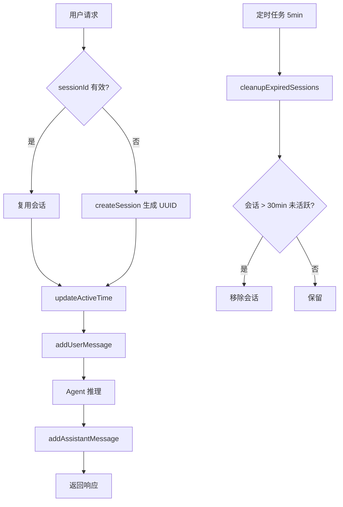
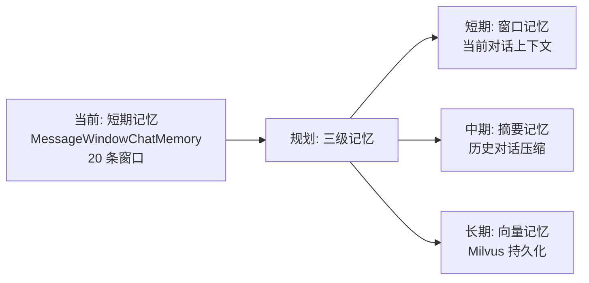

# 记忆管理模块 业务说明书

## 1. 模块概述

记忆管理模块（agent-demo-memory）是 AI Agent 示例项目的上下文保持模块，负责会话级短期记忆管理与多会话隔离。模块基于 LangChain4j MessageWindowChatMemory 实现短期窗口记忆，保留最近 N 条消息作为上下文，支持多会话并发隔离、超时自动清理。当前已实现短期记忆与会话管理，规划扩展长期向量记忆（Milvus）。

## 2. 用户角色与权限

| 角色 | 权限范围 | 典型操作 |
|------|---------|---------|
| **学习者** | 调用 API 间接受益 | 多轮对话保持上下文 |
| **开发者** | 扩展记忆能力 | 实现 LongTermMemory、调整窗口大小 |
| **API 调用方** | 管理会话 | 创建/查询/清空会话记忆 |
| **运维者** | 调优超时参数 | 修改 `session.timeout-minutes` |

## 3. 业务功能点

### 3.1 会话创建

- **触发场景**：用户首次对话或传入无效 sessionId。
- **操作步骤**：`SessionManager.createSession()` 或 `createSession(userId)`。
- **系统行为**：生成 UUID 去横线作为 sessionId，创建 SessionMetadata，存入 ConcurrentHashMap。
- **后置结果**：返回 sessionId 供后续对话使用。

### 3.2 会话查询

- **触发场景**：每次对话请求校验 sessionId 有效性。
- **操作步骤**：`SessionManager.exists(sessionId)` 或 `getSession(sessionId)`。
- **系统行为**：查询会话是否存在，`getSession` 同时更新活跃时间。
- **业务规则**：传入无效 sessionId 时应自动新建会话，不抛错。

### 3.3 会话关闭

- **触发场景**：主动结束会话。
- **操作步骤**：`SessionManager.closeSession(sessionId)`。
- **系统行为**：从 sessionMap 移除会话记录。

### 3.4 超时会话清理

- **触发场景**：`@Scheduled(fixedRate=5min)` 定时触发。
- **操作步骤**：`cleanupExpiredSessions(timeoutMillis)`。
- **系统行为**：遍历 sessionMap，移除超过 30 分钟未活跃的会话。
- **业务规则**：默认 30 分钟超时，每 5 分钟扫描一次。

### 3.5 短期记忆获取

- **触发场景**：Agent 构建 AiServices 时提供 chatMemoryProvider。
- **操作步骤**：`ChatMemoryManager.getMemory(sessionId)`。
- **系统行为**：computeIfAbsent 获取或创建 MessageWindowChatMemory。
- **业务规则**：默认窗口 20 条消息，超出自动淘汰（FIFO）。

### 3.6 消息记录

- **触发场景**：每次对话请求前后。
- **操作步骤**：
  - 请求前：`addUserMessage(sessionId, message)`
  - 响应后：`addAssistantMessage(sessionId, response)`
- **系统行为**：将消息追加到 ChatMemory，超出窗口自动淘汰最旧消息。

### 3.7 记忆清空

- **触发场景**：用户主动清空对话历史。
- **操作步骤**：`DELETE /api/agent/session/{sessionId}/memory`。
- **系统行为**：`ChatMemoryManager.clearMemory(sessionId)` 移除会话记忆。

### 3.8 活跃会话数查询

- **触发场景**：监控会话堆积。
- **操作步骤**：`SessionManager.activeSessionCount()`。
- **系统行为**：返回当前内存中的会话数量。

## 4. 业务流程串联

**流程说明**：
1. 用户请求到达，校验 sessionId 有效性
2. 无效则新建会话（UUID 去横线），有效则复用并更新活跃时间
3. 请求前记录用户消息到 ChatMemory
4. Agent 推理后记录助手回复到 ChatMemory
5. 定时任务每 5 分钟扫描，清理超过 30 分钟未活跃的会话

## 5. 安全与合规

- **会话隔离**：按 sessionId 隔离 ChatMemory，不同用户互不干扰。
- **UUID 唯一性**：sessionId 使用 UUID 去横线生成，保证全局唯一。
- **内存控制**：窗口大小限制 20 条消息，超时会话自动清理，防止内存溢出。
- **并发安全**：ConcurrentHashMap 保证多线程访问安全。

## 6. 前端入口

通过 REST API 间接操作：

- **创建会话**：`POST /api/agent/session`
- **查询会话**：`GET /api/agent/session/{sessionId}`
- **清空记忆**：`DELETE /api/agent/session/{sessionId}/memory`

## 7. 核心数据实体

- **SessionManager**：会话管理器，管理会话生命周期（创建/查询/关闭/超时清理）。
- **SessionMetadata**：会话元信息，含 sessionId/userId/createTime/lastActiveTime。
- **ChatMemoryManager**：短期记忆管理器，基于 MessageWindowChatMemory 封装。
- **ChatMemory**：LangChain4j 会话记忆，保留最近 N 条消息。
- **LongTermMemory**：长期记忆接口（EmptyLongTermMemory 占位实现，规划接入 Milvus）。
- **MemoryRepository**：记忆持久化接口（InMemoryMemoryRepository 占位实现）。

## 8. API 接口清单

本模块通过 web 层对外暴露：

| 接口路径 | HTTP方法 | 功能说明 | 权限要求 |
|---------|---------|---------|---------|
| `/api/agent/session` | POST | 创建会话 | 无 |
| `/api/agent/session/{sessionId}` | GET | 查询会话是否存在 | 无 |
| `/api/agent/session/{sessionId}/memory` | DELETE | 清空会话记忆 | 无 |

内部方法：

| 方法 | 功能说明 | 调用方 |
|------|---------|--------|
| `SessionManager.createSession(userId)` | 创建会话 | web 层 |
| `SessionManager.exists(sessionId)` | 查询会话 | web 层 |
| `SessionManager.getSession(sessionId)` | 获取会话元信息 | web 层 |
| `SessionManager.closeSession(sessionId)` | 关闭会话 | 内部 |
| `SessionManager.activeSessionCount()` | 活跃会话数 | 监控 |
| `ChatMemoryManager.getMemory(sessionId)` | 获取记忆 | agent 层 |
| `ChatMemoryManager.addUserMessage(sessionId, msg)` | 记录用户消息 | web 层 |
| `ChatMemoryManager.addAssistantMessage(sessionId, msg)` | 记录助手回复 | web 层 |
| `ChatMemoryManager.clearMemory(sessionId)` | 清空记忆 | web 层 |

## 9. 业务规则

| 规则编号 | 规则描述 | 级别 |
|---------|---------|------|
| BR-MEM-001 | 会话 ID 必须使用 UUID 去横线生成，保证全局唯一 | 🔴 强制 |
| BR-MEM-002 | 会话超时默认 30 分钟，每 5 分钟扫描清理一次 | ⚪ 可覆盖 |
| BR-MEM-003 | 短期记忆窗口默认 20 条消息，超出自动淘汰旧消息 | ⚪ 可覆盖 |
| BR-MEM-004 | `ChatMemoryManager.getMemory()` 使用 `computeIfAbsent`，回调内禁止修改同一 map | 🔴 强制 |
| BR-MEM-005 | 传入无效 sessionId 时应自动新建会话，不应抛出错误 | 🔴 强制 |

## 10. 异常处理

| 异常场景 | 错误码 | 提示信息 | 处理方式 |
|---------|-------|---------|---------|
| 会话不存在 | 5201 | 会话不存在 | 自动新建会话 |
| 会话已过期 | 5202 | 会话已过期 | 自动新建会话 |
| 会话记忆不存在 | 5200 | 会话记忆不存在 | 自动创建记忆 |

## 11. 性能要求

| 指标 | 要求 | 说明 |
|------|------|------|
| 会话创建耗时 | < 1ms | UUID 生成 + Map put |
| 会话查询耗时 | < 1ms | ConcurrentHashMap get |
| 记忆获取耗时 | < 1ms | computeIfAbsent |
| 消息追加耗时 | < 1ms | List add |
| 超时清理耗时 | < 100ms | 遍历移除 |
| 单会话内存占用 | ~20 条消息 | 窗口限制 |
| 活跃会话上限 | 10000 | 建议值，受 JVM 内存约束 |

## 12. 记忆架构演进

| 记忆类型 | 实现状态 | 存储方式 | 用途 |
|---------|---------|---------|------|
| 短期记忆 | ✅ 已实现 | 内存 MessageWindowChatMemory | 当前对话上下文（20 条） |
| 中期记忆 | 🚧 规划中 | 内存/Redis | 历史对话摘要 |
| 长期记忆 | 🚧 规划中 | Milvus 向量 | 跨会话记忆检索 |

---

**文档维护**：
- 新增记忆类型时，补充到第 3 节业务功能点
- 演进规划变更时，更新第 12 节记忆架构
- 业务规则调整时，更新第 9 节业务规则
