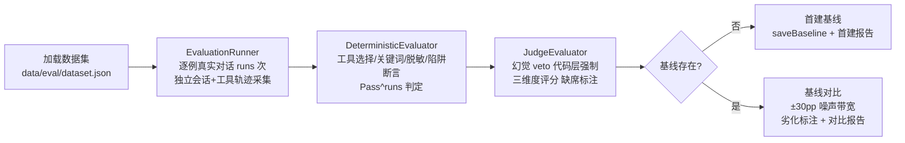

# 评估模块 业务说明书

> **文档版本**: v1.0 | **基线日期**: 2026-08-31
> **覆盖范围**: CR-002 完整评估体系（20260829 langsmith-observability，Task-26~34）+ 代码审查修复（ai-agent-code-review 2026-08-31）
> **返回模块索引**: [specs/modules/README.md](README.md)

## 1. 模块概述

* **工程模块**: `agent-demo-evaluation`（本地评估 harness，独立 CLI 上下文，非对话主链路组件）
* **定位**: 为 Agent（模型 + Harness 整体）提供本地「真实模型行为评估」能力——本地数据集逐例执行 + LLM-as-judge 语义评分 + 回归基线管理 + A/B 对比实验，填补项目 EDD（真实模型行为评估）方法论缺口，后续所有 Agent/Prompt 演进可经同一数据集 + 基线对比验证无回归。
* **接入方式**: 独立 CLI 触发（`mvn -pl agent-demo-evaluation spring-boot:run`），`eval.enabled=true` 时装配评估组件；默认 `eval.enabled=false` 零装配零影响，不随构建/正常启动执行（按需手动触发）。
* **评估对象**: agent-demo Agent 整体（模型 + Harness），而非 LangSmith 集成本身；trace 是证据来源，本地 harness 是执行平台，与 LangSmith 平台侧评估路径并存。
* **风险归类**: 安全边界变更要素（评估数据出境新通道 + 评估产物落盘面）——judge 调用复用既有 LLM 出站链路，评估出境与落盘纳入统一脱敏出口（AC-S07），按 CR-001 先例从严执行全量对抗回归。

## 2. 用户角色与权限

| 角色 | 职责 | 权限 |
|------|------|------|
| 开发者 | 设计评估数据集、执行评估、解读基线对比 | CLI 触发（eval.enabled=true） |
| 演进者 | Prompt/模型变更后重跑评估验证无回归 | CLI 触发 + 基线显式重建 |
| 运维者 | 配置评估 CLI 模型（ARK/BAILIAN Key） | 环境变量注入（评估 Key 仅经 env，禁止硬编码） |

* **Key 管理**: 评估 CLI 独立上下文（无 web 配置面）经 `LlmConfigSeed` 从 `eval.api-key`（默认 `${ARK_API_KEY:}`）与 `eval.judge-api-key`（默认 `${BAILIAN_API_KEY:}`）注入，禁止硬编码；无 Key/无模型启动即 fail-fast。
* **身份模型**: 应用级 Key，演示项目单租户无用户鉴权体系。

## 3. 业务功能点

### 3.1 数据集执行（AC-N10）
`EvalDatasetLoader` 解析 `data/eval/dataset.json`（非法 JSON 明确异常不静默空集）；`EvaluationRunner` 逐例真实发起对话（每用例独立会话 UUID），采集执行记录（请求/回复/工具轨迹，`ExecutionRecord` 含 `toolTrace` 名序列 + `toolTraceDetail` 含结果），支持 Pass^runs 多次运行，单例失败标注后继续不中断整体评估。

### 3.2 确定性评分层（AC-N10/S07）
`DeterministicEvaluator` 断言：工具选择（含禁用工具陷阱）、关键词命中、脱敏拦截（AC-S07 单一出口守卫：payload 经 maskSafe 后仍含密钥明文即判泄漏）、失败运行标注；整体判定 Pass^runs（全部运行通过才算过）；veto 项（脱敏/陷阱）始终确定性断言不走 judge。

### 3.3 LLM-as-judge 评分层（AC-N11/E06）
`JudgeEvaluator` 渲染 judge Prompt（input/response/toolTrace 三要素统一经脱敏出口）→ 调用 judge 模型 → 结构化 JSON 契约解析；任何失败（未配置/调用异常/解析失败）一律缺席标注不误计 0 分；幻觉判定 `detected` 时代码层强制 `overall=fail`（一票否决，v2）；同源模型启动 WARN（决策 13）。

### 3.4 judge Prompt 制品（EDD 轨）
`resources/prompts/judge.md`（v2）：三维度评分（回答完整性 essential / 幻觉复核 veto / 风格 optional）+ camelCase JSON 输出契约 + 反偏差指令（与长度无关/仅依据证据/脱敏占位符视为正常）；幻觉判定要点强化（点名工具/引用具体结果值但轨迹无对应或结果不一致 → detected，仅泛化确认表述不属编造）。真实模型 EDD 闭环：EVALUATE→TUNE→RE-EVALUATE（judge=deepseek-v4-flash 多源，解析率 100%，反偏差抽检通过）。

### 3.5 基线管理与对比（AC-N12）
`BaselineManager` 生成/持久化/加载基线（JSON 含运行元数据：日期/模型/配置版本），常规运行只读不覆盖（更新须显式重建），对比按 ±30pp 噪声带宽判定 IMPROVED/DEGRADED/UNCHANGED/WITHIN_NOISE，带内标"不可决策"。

### 3.6 A/B 对比实验（AC-N13）
`ABComparisonRunner` 同一数据集双配置分别执行（Pass^3 强制下限取均值），逐指标对比 + 噪声带宽内判平局 + 统计显著性声明。

### 3.7 CLI 模型配置注入（多源 judge）
`LlmConfigSeed` 在 eval.enabled 且 `LlmConfigStore` 为空时注入合成厂商：Agent 厂商（默认 ARK `doubao-seed-2.0-lite`）+ 独立 judge 厂商（默认百炼 `deepseek-v4-flash`，多源异构对冲同源偏差）；模型经 ModelFactory id-or-name 兜底解析；已有配置不覆盖。

### 3.8 报告输出（AC-S07）
`ReportWriter` 渲染 Markdown 报告（首建/对比两形态），judge 缺席逐条标注可辨；所有衍生自运行数据的内容（回复预览/失败原因/judge 单元格）统一经脱敏出口落盘，零明文。

## 4. 核心业务流程（评估流水线）

**入口判断**：评估 CLI（`EvaluationCli`）在 `eval.enabled=true` 且 `eval.run-on-startup=true` 时执行一次完整评估后退出；默认关闭零影响（AC-E05 生态）。

## 5. 与其他模块的关系

| 关系模块 | 依赖方向 | 说明 |
|---------|---------|------|
| agent-demo-agent | evaluation → agent | 复用 SimpleAgent 发起真实对话（工具轨迹经 afterToolExecution 采集） |
| agent-demo-llm | evaluation → llm | ModelFactory/LlmConfigStore 解析 agent 与 judge 模型 |
| agent-demo-observability | evaluation → observability | 复用 SensitiveDataMasker 脱敏单一出口（AC-S07）+ RecordingTraceCollector 作 TraceCollector 替身 |
| agent-demo-tools | evaluation → tools | 工具集提供（评估 Agent 的工具选择行为）；ToolExecutor 补 AiServices 工具采集 |
| agent-demo-common | evaluation → common | JsonUtils 等公共工具 |

> 依赖方向无环；evaluation 为叶子评估模块，不参与对话主链路装配。

## 6. 接口清单

* **REST API**: 无（本地 CLI harness，不暴露 HTTP 端点）。
* **CLI 入口**: `mvn -pl agent-demo-evaluation spring-boot:run -Dspring-boot.run.arguments="--eval.enabled=true --eval.run-on-startup=true ..."`（主类 `com.agentdemo.evaluation.cli.EvaluationCli`）。
* **配置项**（application.yml `eval.*`）:

| 配置 | 默认值 | 说明 |
|------|--------|------|
| `eval.enabled` | false | 总开关（默认关，零装配零影响） |
| `eval.dataset-path` | `data/eval/dataset.json` | 评估数据集路径 |
| `eval.baseline-path` | `data/eval/baseline.json` | 基线路径（显式重建覆盖） |
| `eval.report-path` | `data/eval/report.md` | 报告输出路径 |
| `eval.runs` | 3 | 每用例运行次数（Pass^runs，A/B 强制下限 3） |
| `eval.judge-model-id` | "" | judge 模型（空则缺席标注） |
| `eval.agent-model-id` | "" | 被评 Agent 模型（空回退默认） |
| `eval.mask-max-chars` | 4000 | 脱敏字段上限 |
| `eval.config-version` | unknown | 配置/Prompt 版本（基线追溯） |
| `eval.run-on-startup` | false | 启动即执行一次评估 |
| `eval.vendor-name` / `base-url` / `api-key` | eval-cli / ARK coding v3 / `${ARK_API_KEY:}` | Agent 合成厂商（种子注入） |
| `eval.judge-vendor-name` / `judge-base-url` / `judge-api-key` | eval-judge-cli / 百炼 / `${BAILIAN_API_KEY:}` | judge 独立厂商（多源 judge） |

## 7. 评估产物

| 产物 | 路径 | 说明 |
|------|------|------|
| 评估数据集 | `data/eval/dataset.json` | 10 用例（直答×2/单工具×3/ReAct/失败恢复/密钥/注入陷阱/越界陷阱，陷阱≥2 + 密钥正例≥1） |
| 回归基线 | `data/eval/baseline.json` | 首建基线（judge-v2：Pass^runs=70%、工具选择率 100%、脱敏拦截率 100%） |
| 评估报告 | `data/eval/report.md` | Markdown 报告（首建/对比两形态） |

> 产物均经脱敏出口（AC-S07）；数据集仅含合成测试密钥夹具，无真实密钥明文。
