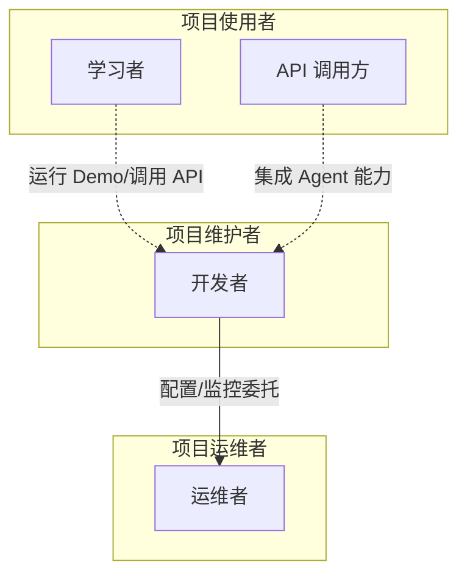
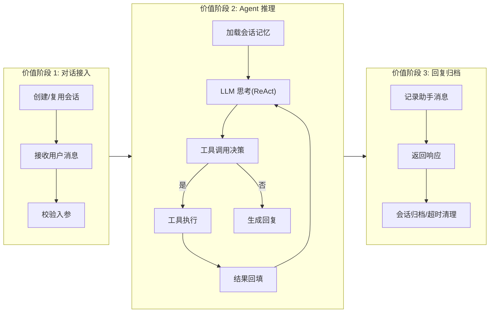
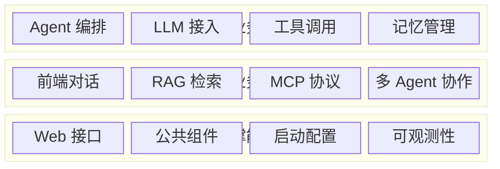
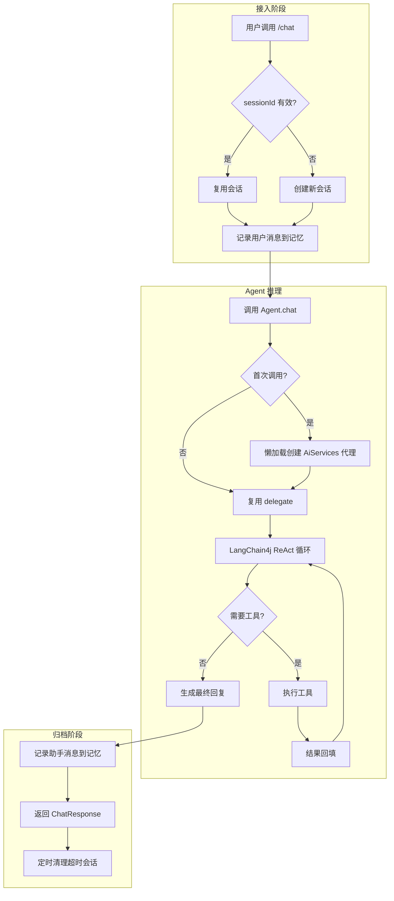
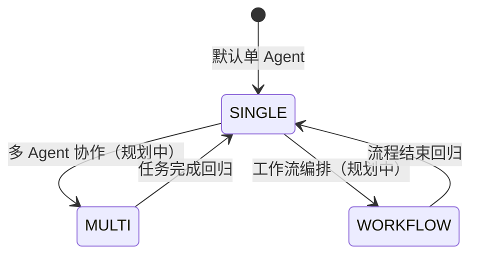
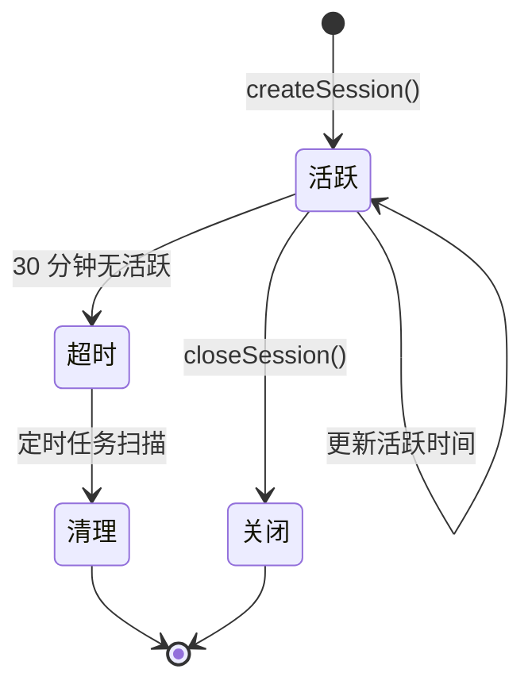
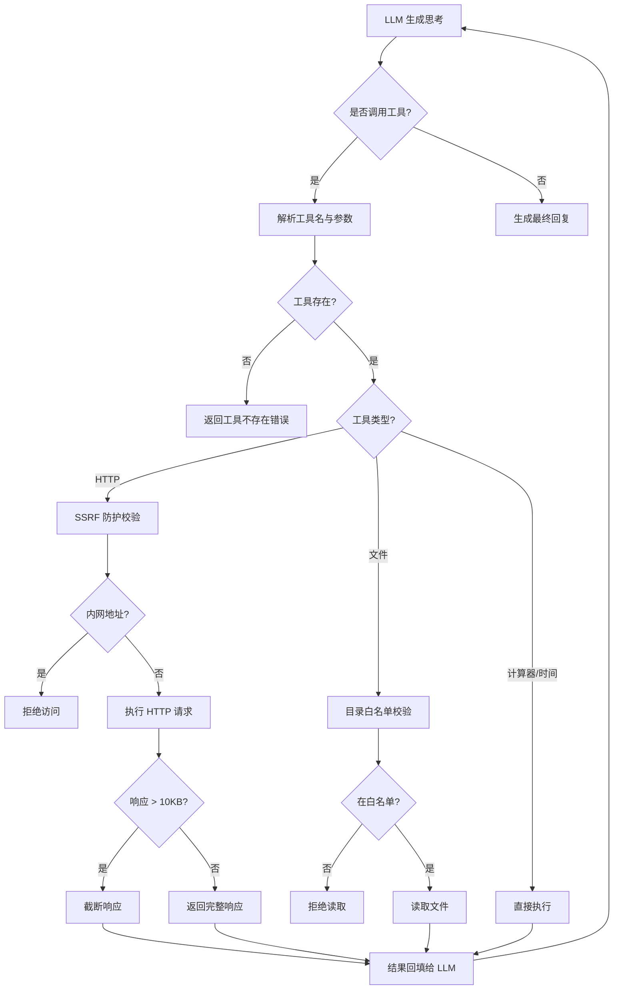
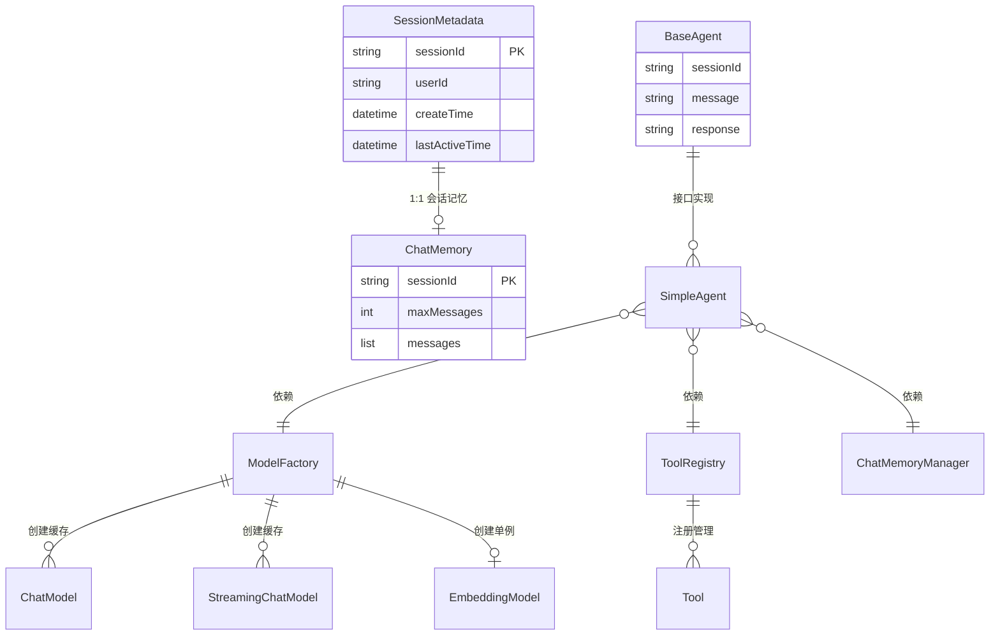
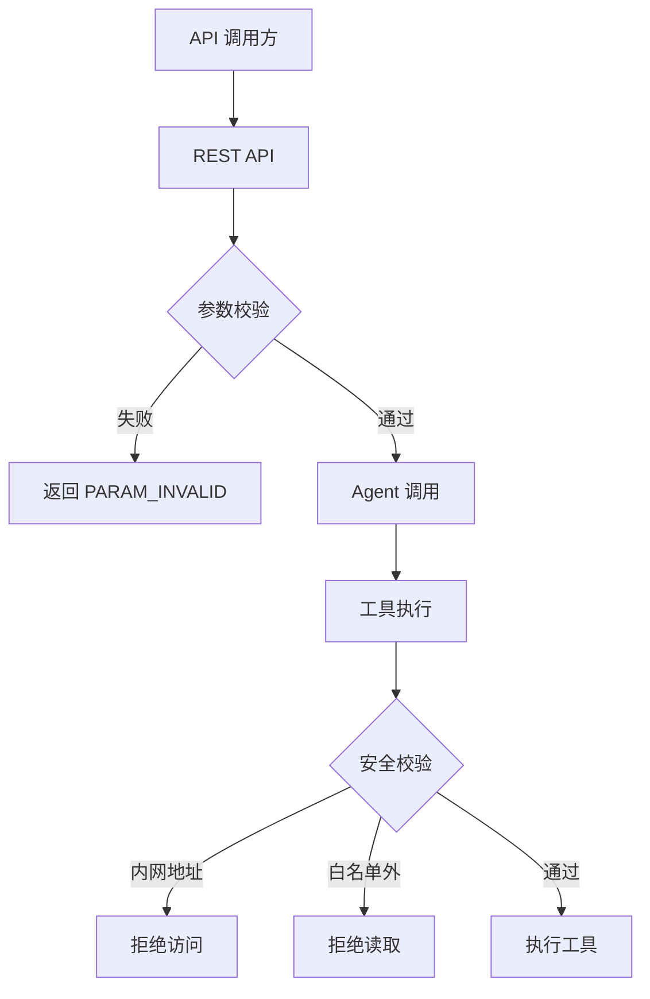
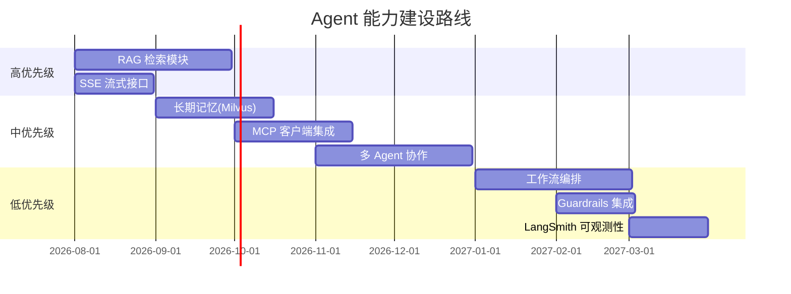

# AI Agent 示例项目 - 业务架构文档（TOGAF Phase B）

> **版本**：v1.0 | **基线日期**：2026-07-20 | **适用范围**：agent-demo
> **定位**：TOGAF Phase B 业务架构，涵盖愿景、组织架构、价值流、能力图谱、服务目录、核心流程、领域模型、业务规则、安全合规、RACI 矩阵、差距分析和术语表。
> **关联文档**：[技术架构文档-TOGAF](./技术架构文档-TOGAF.md) | [数据架构文档-TOGAF](./数据架构文档-TOGAF.md) | [SDD-工程业务背景文档](./SDD-工程业务背景文档.md)

---

## 目录

- [1. 业务架构愿景](#1-业务架构愿景)
- [2. 组织架构与参与者](#2-组织架构与参与者)
- [3. 价值流](#3-价值流)
- [4. 业务能力图谱](#4-业务能力图谱)
- [5. 业务服务目录](#5-业务服务目录)
- [6. 核心业务流程](#6-核心业务流程)
- [7. 领域模型与信息映射](#7-领域模型与信息映射)
- [8. 业务规则目录](#8-业务规则目录)
- [9. 数据安全与合规](#9-数据安全与合规)
- [10. RACI 矩阵](#10-raci-矩阵)
- [11. 差距分析](#11-差距分析)
- [12. 术语表](#12-术语表)

---

## 1. 业务架构愿景

### 1.1 系统定位

**AI Agent 示例项目 (agent-demo)** 是一套面向 AI 应用开发学习者的**企业级 Agent 能力演练平台**。系统覆盖从用户提问到 Agent 回复的端到端对话生命周期。

系统基于 Java 17 + Spring Boot 3.2.5 + LangChain4j 1.17.2 构建，在火山引擎方舟 Coding Plan 基座之上，深度定制 **单 Agent ReAct 循环、工具调用、记忆管理** 以适配 Agent 学习场景。

### 1.2 业务目标与驱动力

| # | 业务目标 | 驱动力 | 衡量指标 |
|---|---------|--------|---------|
| BG-1 | 覆盖主流 Agent 能力域 | LangChain4j 1.17.2 GA | 能力域覆盖率（当前 5/9） |
| BG-2 | 提供可运行的最小 Demo | 学习者快速上手 | 启动到首次对话成功率 |
| BG-3 | 强类型呈现 Agent 契约 | Java 企业级实践 | 编译期类型检查覆盖率 |
| BG-4 | 低成本 LLM 接入 | Coding Plan 按次计费 | 单次对话成本 |
| BG-5 | 安全的工具调用能力 | SSRF/越权风险防护 | 安全事件次数（0 为目标） |

### 1.3 业务架构原则

| 原则 | 说明 |
|------|------|
| **声明式优先** | Agent 通过 `@AiService` + `@Tool` 注解声明，框架自动处理 ReAct 循环 |
| **懒加载隔离** | 延迟初始化避免循环依赖，会话记忆按 sessionId 隔离 |
| **场景路由** | 按业务场景路由到不同 LLM 模型（编程/通用/轻量） |
| **安全沙箱** | 工具调用受 SSRF 防护、目录白名单、响应截断三重约束 |
| **渐进式演进** | 已实现核心 5 能力，RAG/MCP/多 Agent/工作流分阶段补充 |

---

## 2. 组织架构与参与者

### 2.1 组织角色模型

### 2.2 角色职责矩阵

| 角色 | 职责范围 | 主要操作系统模块 |
|------|---------|----------------|
| **学习者** | 运行 Demo、调用 API、观察 Agent 行为、阅读源码理解原理 | bootstrap、web、agent |
| **API 调用方** | 通过 REST API 集成 Agent 能力到外部应用 | web |
| **开发者** | 扩展工具、新增 Agent 实现、接入新 LLM、编写场景化 pipeline | tools、agent、llm、memory |
| **运维者** | 配置 API Key、监控 Token 消耗、管理会话超时 | bootstrap、application.yml |

---

## 3. 价值流

### 3.1 端到端价值流

### 3.2 各价值阶段详述

| 阶段 | 业务价值 | 输入 | 输出 | 参与角色 | KPI |
|------|---------|------|------|---------|-----|
| **对话接入** | 提供统一对话入口 | sessionId + message | 校验通过的请求 | API 调用方 | 入参校验通过率 |
| **Agent 推理** | 核心 AI 能力执行 | 消息 + 记忆上下文 | Agent 回复 | Agent | 平均响应时间、工具调用成功率 |
| **回复归档** | 保持会话连续性 | 回复内容 | 记忆更新 + 响应 | 系统 | 记忆一致性 |

---

## 4. 业务能力图谱

### 4.1 一级业务能力

### 4.2 二级业务能力分解

| 一级能力 | 二级能力 | 说明 | 状态 |
|---------|---------|------|------|
| Agent 编排 | 单 Agent ReAct | 基于 AiServices 的 ReAct 循环 | ✅ |
| Agent 编排 | 多 Agent 协作 | Sequential/Hierarchical 模式 | 🚧 |
| Agent 编排 | 工作流编排 | 状态机 + HITL | 🚧 |
| LLM 接入 | 同步对话模型 | ChatModel（doubao-seed-2.0） | ✅ |
| LLM 接入 | 流式对话模型 | StreamingChatModel（SSE） | ✅ |
| LLM 接入 | Embedding 模型 | 豆包 Embedding（RAG 用） | ✅ |
| LLM 接入 | 场景路由 | chat/code/lite 按需切换 | ✅ |
| 工具调用 | 内置工具 | 计算器/时间/HTTP/文件读取 | ✅ |
| 工具调用 | 动态注册 | 运行时新增（MCP 外部工具） | ✅ |
| 工具调用 | 安全防护 | SSRF 防护/目录白名单/响应截断 | ✅ |
| 记忆管理 | 短期记忆 | MessageWindowChatMemory（20 条窗口） | ✅ |
| 记忆管理 | 会话管理 | 创建/查询/超时清理 | ✅ |
| 记忆管理 | 长期记忆 | 向量存储（规划中） | 🚧 |
| RAG 检索 | 文档加载 | PDF/MD/TXT 加载（agent-demo-splitter） | ✅ |
| RAG 检索 | 文本分块 | 专属分割策略（MD按标题/PDF按页/TXT递归）+ 过短块合并（ChunkMerger） | ✅ |
| RAG 检索 | 向量检索 | 相似度/MMR/元数据过滤 | ✅ |
| RAG 检索 | 动态 Tool 注册 | 每个知识库独立 @Tool（ByteBuddy 运行时生成），Agent 通过 Function Calling 选择（CR-003） | ✅ |
| RAG 检索 | 对话知识库集成 | 提示词注入 + 选择器 | ✅ |
| MCP 协议 | MCP 客户端 | 加载外部 MCP 工具服务 | 🚧 |
| MCP 协议 | MCP 服务端 | 暴露自有工具给其他 Agent | 🚧 |
| Web 接口 | 同步对话 API | POST /api/agent/chat | ✅ |
| Web 接口 | 会话管理 API | 创建/查询/清空记忆 | ✅ |
| Web 接口 | 接口文档 | Swagger UI | ✅ |
| Web 接口 | RAG 管理 API | /api/rag/* 知识库/文档 CRUD | ✅ |
| 前端对话 | 流式对话界面 | Vue 3 对话框 + SSE 逐字显示 | ✅ |
| 前端对话 | 会话管理 UI | 列表/切换/重命名/删除/清空 | ✅ |
| 前端对话 | 会话持久化 | localStorage 缓存（50 会话 FIFO 淘汰） | ✅ |
| 前端对话 | 透明续聊 | 后端会话超时自动新建，前端无感 | ✅ |
| 前端对话 | 流式中断 | AbortController 停止生成，保留已接收内容 | ✅ |
| 前端对话 | 深度思考推理展示 | 可折叠推理区块 + 逐字流式展示（CR-001） | ✅ |
| 前端对话 | Markdown 渲染 | 助手消息 marked + DOMPurify 渲染（CR-001） | ✅ |
| 前端对话 | 顶部导航切换 | NavBar 对话/知识库页面切换 | ✅ |
| 前端知识库管理 | 知识库管理页面 | 左右分栏布局 + 知识库列表 + 文档列表 | ✅ |
| 前端知识库管理 | 知识库 CRUD | 创建（弹窗+校验）/查看/删除（二次确认+级联提示） | ✅ |
| 前端知识库管理 | 文档上传管理 | 拖拽/点击批量上传 + 格式/大小校验 | ✅ |
| 前端知识库管理 | 文档状态轮询 | setInterval 3s + 终态自动停止 + 组件卸载清理 | ✅ |
| 前端知识库管理 | 对话知识库选择器 | 下拉多选 + 会话级保持 + 流式时禁用 | ✅ |
| Agent 编排 | 思考流式对话 | SimpleAgent.chatThinkingStream + ThinkingTokenStream（CR-001） | ✅ |
| LLM 接入 | 思考流式模型 | ArkThinkingStreamingChatModel 直连方舟 API（CR-001） | ✅ |

---

## 5. 业务服务目录

### 5.1 核心业务域服务

| 业务域 | 工程子包 | 核心实体 | API 路由 | 服务描述 |
|--------|---------|---------|---------|---------|
| **Agent 编排** | `agent.core` / `agent.single` | BaseAgent、SimpleAgent | `/api/agent/chat` | Agent 对话入口与 ReAct 循环执行 |
| **LLM 接入** | `llm.factory` / `llm.config` | ModelFactory、ArkProperties | - | 火山引擎模型统一接入与场景路由 |
| **工具调用** | `tools.builtin` / `tools.registry` | ToolRegistry、HttpTool 等 | - | Agent 可调用的能力集，声明式注册 |
| **记忆管理** | `memory.shortterm` / `memory.session` | ChatMemoryManager、SessionManager | - | 会话级短期记忆与多会话隔离 |
| **对话接入** | `web.controller` / `web.dto` | AgentController、ChatRequest | `/api/agent/*` | REST API 对外暴露 Agent 能力 |

### 5.2 支撑域服务

| 业务域 | 工程模块 | 服务描述 |
|--------|---------|---------|
| **公共组件** | `agent-demo-common` | 常量/枚举/异常/统一返回/工具类 |
| **启动配置** | `agent-demo-bootstrap` | Spring Boot 主启动、多环境配置、提示词模板 |
| **RAG 检索** | `agent-demo-rag` | 向量化/检索/动态 Tool 注册（CR-003）/对话知识库集成 |
| **文档分割** | `agent-demo-splitter` | 文档解析/专属分割（MD/PDF/TXT）/多级级联切分/过短块合并 |
| **MCP 协议** | `agent-demo-mcp` | MCP 客户端/服务端（规划中） |
| **应用编排** | `agent-demo-app` | 场景化 Agent/端到端 pipeline（规划中） |

---

## 6. 核心业务流程

### 6.1 端到端对话流程

### 6.2 各阶段流程详述

| # | 阶段 | 业务动作 | 参与角色 | 输入 | 输出 |
|---|------|---------|---------|------|------|
| 1 | 接入 | 校验 sessionId，无效则新建 | AgentController | ChatRequest | 有效 sessionId |
| 2 | 接入 | 记录用户消息到 ChatMemory | ChatMemoryManager | message | 记忆更新 |
| 3 | 推理 | 懒加载创建 AiServices 代理（首次） | SimpleAgent | ModelFactory + ToolRegistry | delegate |
| 4 | 推理 | LangChain4j 执行 ReAct 循环 | AiServices | message + memory | 中间步骤/最终回复 |
| 5 | 推理 | 工具调用决策与执行 | ToolRegistry + Tool | tool args | tool result |
| 6 | 归档 | 记录助手回复到 ChatMemory | ChatMemoryManager | response | 记忆更新 |
| 7 | 归档 | 返回 ChatResponse | AgentController | response + duration | Result<ChatResponse> |
| 8 | 归档 | 定时清理超时会话（5 分钟扫描） | SessionManager | timeout | 释放内存 |

### 6.3 Agent 类型状态机

#### 6.3.1 Agent 协作模式状态流转

### 6.4 会话生命周期状态机

### 6.5 工具调用决策流程

### 6.6 业务监控与预警

#### 6.6.1 会话监控统计

| 指标 | 说明 | 获取方式 |
|------|------|---------|
| 活跃会话数 | 当前内存中的会话数量 | `SessionManager.activeSessionCount()` |
| 累计创建会话数 | 启动至今创建的会话总数 | 日志统计 |
| 超时清理数 | 定时任务清理的会话数 | 日志统计 |

#### 6.6.2 调用统计能力

| 维度 | 功能 | 说明 |
|------|------|------|
| LLM 调用 | 次数/耗时/失败率 | 日志聚合 |
| 工具调用 | 各工具调用次数/成功率 | 日志聚合 |
| Token 消耗 | 套餐额度消耗进度 | 火山引擎控制台 |

#### 6.6.3 预警监控

| 预警类型 | 触发规则 |
|----------|---------|
| API Key 失效 | LLM 调用返回 401/403 |
| LLM 限流 | LLM 调用返回 429 |
| 会话堆积 | 活跃会话数 > 阈值 |
| 工具失败率 | 工具调用失败率 > 10% |

---

## 7. 领域模型与信息映射

### 7.1 核心实体关系 (ER)

### 7.2 业务域 -> 工程模块 -> 数据实体映射

| 业务域 | 工程子包 | 数据实体 |
|--------|---------|---------|
| Agent 编排 | `agent.core` / `agent.single` | BaseAgent、SimpleAgent、AgentConfig |
| LLM 接入 | `llm.factory` / `llm.config` | ModelFactory、ArkProperties、LlmConfig |
| 工具调用 | `tools.builtin` / `tools.registry` | ToolRegistry、CalculatorTool、TimeTool、HttpTool、FileReadTool |
| 记忆管理 | `memory.shortterm` / `memory.session` / `memory.store` | ChatMemoryManager、SessionManager、SessionMetadata、MemoryRepository |
| 对话接入 | `web.controller` / `web.dto` | AgentController、ChatRequest、ChatResponse |
| 公共组件 | `common.*` | Result、PageResult、ErrorCode、BusinessException、AgentType、ModelConstants |

---

## 8. 业务规则目录

| # | 规则编号 | 业务规则 | 生效范围 | 级别 |
|---|---------|---------|---------|------|
| 1 | BR-LLM-001 | API Key 必须通过环境变量 `ARK_API_KEY` 注入 | LLM 接入 | 强制 |
| 2 | BR-LLM-002 | 必须使用 Coding Plan 专用地址 `/api/coding/v3` | LLM 接入 | 强制 |
| 3 | BR-LLM-003 | 模型名称必须通过 `ModelConstants` 常量类引用 | LLM 接入 | 强制 |
| 4 | BR-LLM-004 | 模型实例必须通过 `ModelFactory` 获取并缓存复用 | LLM 接入 | 强制 |
| 5 | BR-AGT-001 | 所有 Agent 实现必须实现 `BaseAgent` 接口 | Agent 编排 | 强制 |
| 6 | BR-AGT-002 | ReAct 循环最大迭代次数默认 10 | Agent 编排 | 强制 |
| 7 | BR-AGT-003 | Agent delegate 必须懒加载 | Agent 编排 | 强制 |
| 8 | BR-AGT-004 | 会话记忆按 sessionId 隔离 | Agent 编排 | 强制 |
| 9 | BR-TOOL-001 | 工具类必须加 `@Component`，方法加 `@Tool` 注解 | 工具调用 | 强制 |
| 10 | BR-TOOL-002 | 工具注册采用懒加载 | 工具调用 | 强制 |
| 11 | BR-TOOL-003 | HTTP 工具必须执行 SSRF 防护 | 工具调用 | 强制 |
| 12 | BR-TOOL-004 | HTTP 工具响应超过 10KB 必须截断 | 工具调用 | 强制 |
| 13 | BR-TOOL-005 | 文件读取工具必须限定目录白名单 | 工具调用 | 强制 |
| 14 | BR-MEM-001 | 会话 ID 必须使用 UUID 去横线生成 | 记忆管理 | 强制 |
| 15 | BR-MEM-004 | `computeIfAbsent` 回调内禁止修改同一 map | 记忆管理 | 强制 |
| 16 | BR-MEM-005 | 传入无效 sessionId 时应自动新建会话 | 记忆管理 | 强制 |
| 17 | BR-SEC-001 | API Key 禁止明文打印到日志 | 安全合规 | 强制 |
| 18 | BR-ERR-001 | 错误码必须通过 `ErrorCode` 枚举统一定义 | 公共组件 | 强制 |
| 19 | BR-ERR-002 | 业务异常必须使用 `BusinessException` | 公共组件 | 强制 |

> 详细约束清单见 [SDD-工程业务背景文档](./SDD-工程业务背景文档.md) 第 5 节。

---

## 9. 数据安全与合规

### 9.1 安全措施矩阵

| 安全场景 | 机制 | TOGAF 安全分类 |
|----------|------|---------------|
| API Key 保护 | 环境变量注入，禁止入库/日志 | 访问控制 |
| HTTP 工具 SSRF 防护 | 禁止访问内网地址（10./172.16-31./192.168./127./localhost） | 网络安全 |
| 文件读取目录限制 | `agent.file-allowed-dir` 白名单 | 访问控制 |
| HTTP 响应截断 | 超过 10KB 截断，防止 Token 消耗过大 | 资源保护 |
| 会话隔离 | 按 sessionId 隔离 ChatMemory，互不干扰 | 租户隔离 |
| 全局异常处理 | `@RestControllerAdvice` 统一拦截，避免堆栈泄露 | 信息安全 |
| traceId 链路追踪 | `TraceIdInterceptor` 自动注入 MDC | 审计追踪 |

### 9.2 权限体系

---

## 10. RACI 矩阵

> **R**=执行 | **A**=审批 | **C**=咨询 | **I**=知会

| 业务活动 | 学习者 | 开发者 | API 调用方 | 运维者 |
|---------|---------|---------|---------|---------|
| 运行 Demo | **R** | **R** | I | I |
| 调用对话 API | **R** | C | **R** | I |
| 创建/清空会话 | **R** | C | **R** | I |
| 新增工具 | - | **R/A** | - | I |
| 新增 Agent 实现 | - | **R/A** | - | I |
| 接入新 LLM 模型 | - | **R** | I | **A** |
| 配置 API Key | - | C | - | **R/A** |
| 切换 LLM 场景路由 | - | **R** | I | **A** |
| 会话超时调优 | - | C | I | **R/A** |
| 安全约束调整 | - | **R** | I | **A** |

---

## 11. 差距分析

### 11.1 基线架构(AS-IS) vs 目标架构(TO-BE)

| 能力 | 当前状态 (AS-IS) | 目标状态 (TO-BE) | 差距 | 优先级 |
|------|-----------------|-----------------|------|-------|
| Agent 编排 | 单 Agent ReAct | 单/多/工作流三种模式 | 多 Agent 协作、工作流编排未实现 | 中 |
| 记忆系统 | 短期窗口记忆 | 短期+长期向量记忆 | 长期记忆（Milvus）未实现 | 中 |
| RAG 检索 | 已实现（后端+前端） | 向量化/检索/前端管理界面（解析分割已抽取为 splitter 模块） | 已解决 | 已解决 |
| MCP 协议 | 未实现 | 客户端+服务端 | 全部未实现 | 中 |
| 可观测性 | 日志基础 | 链路追踪+Token 统计+成本监控 | LangSmith/Langfuse 集成未实现 | 低 |
| 流式输出 | 模型已支持 | SSE 接口暴露 | 已实现（SseEmitter + StreamingChatModel） | 已解决 |
| Guardrails | 未实现 | 输入/输出守护 | langchain4j-guardrails 未集成 | 低 |

### 11.2 建设优先级路线

---

## 12. 术语表

| 术语 | 英文 | 含义 |
|------|------|------|
| Agent | Agent | 智能体，具备感知、决策、行动能力的 AI 程序 |
| ReAct | Reasoning + Acting | 推理-行动循环，Agent 思考后调用工具，工具返回结果后继续思考 |
| Function Calling | Function Calling | LLM 自主决定调用哪个函数（工具）的能力 |
| AiServices | AiServices | LangChain4j 提供的声明式 Agent 构建器，通过动态代理实现接口 |
| 火山引擎方舟 | Volcengine Ark | 字节跳动旗下 LLM 服务平台，提供豆包等模型 |
| Coding Plan | Coding Plan | 火山引擎方舟按次计费套餐，专用 `/api/coding/v3` 地址 |
| 豆包 | Doubao | 火山引擎自研的 LLM 系列，含 Pro/Code/Lite 等版本 |
| ChatMemory | Chat Memory | 会话级对话记忆，保留最近 N 条消息作为上下文 |
| sessionId | Session ID | 会话唯一标识，用于隔离不同用户的对话记忆 |
| Token | Token | LLM 处理文本的最小单位，计费依据 |
| Embedding | Embedding | 文本向量化，将文本转换为向量用于相似度检索 |
| RAG | Retrieval-Augmented Generation | 检索增强生成，先检索知识库再生成回答 |
| MCP | Model Context Protocol | 模型上下文协议，Agent 间工具共享标准 |
| HITL | Human-in-the-Loop | 人工介入循环，工作流中需人工确认的环节 |
| Guardrails | Guardrails | 输入/输出守护，防止 Prompt 注入、内容过滤 |
| SSRF | Server-Side Request Forgery | 服务端请求伪造，HTTP 工具需防护的安全风险 |
| traceId | Trace ID | 链路追踪 ID，串联一次请求的所有日志 |

---

**文档维护**：
- 新增业务流程时，同步更新价值流和流程图
- 业务规则变更时，更新第 8 节规则目录
- 定期审查差距分析，更新建设路线
