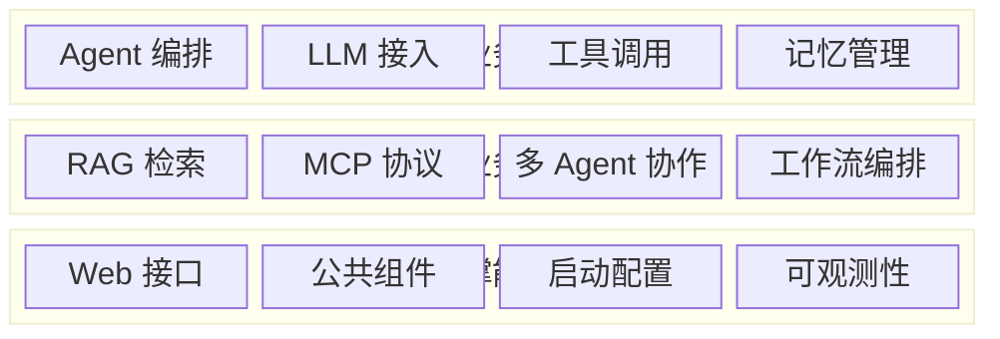
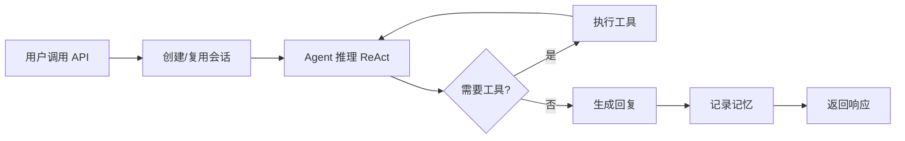
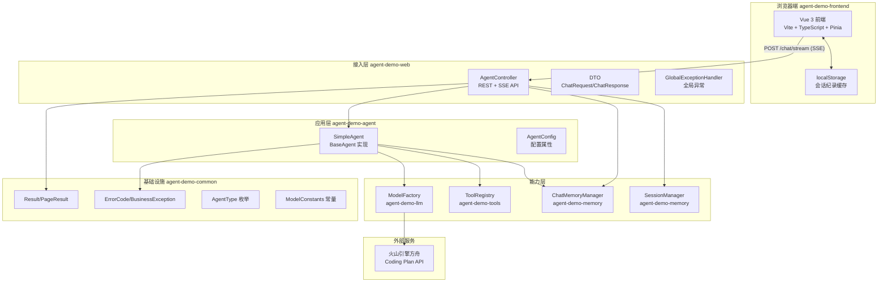
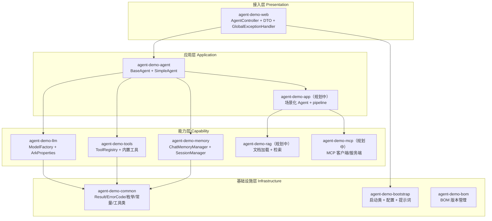
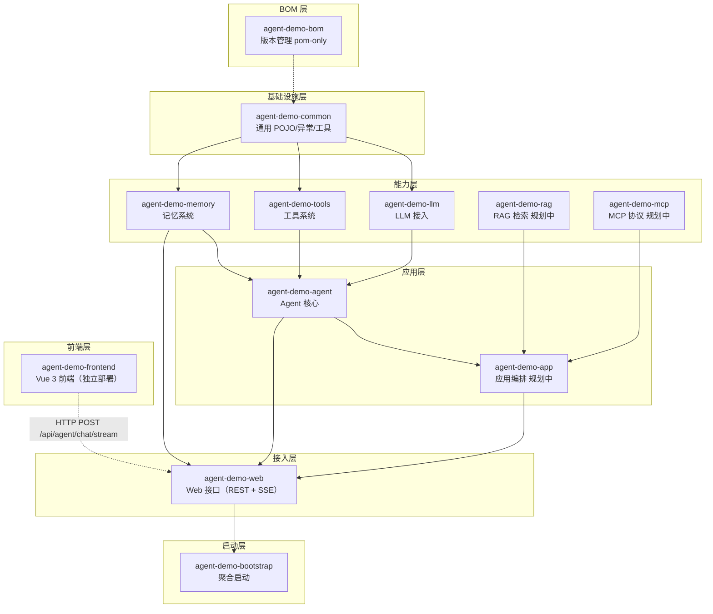
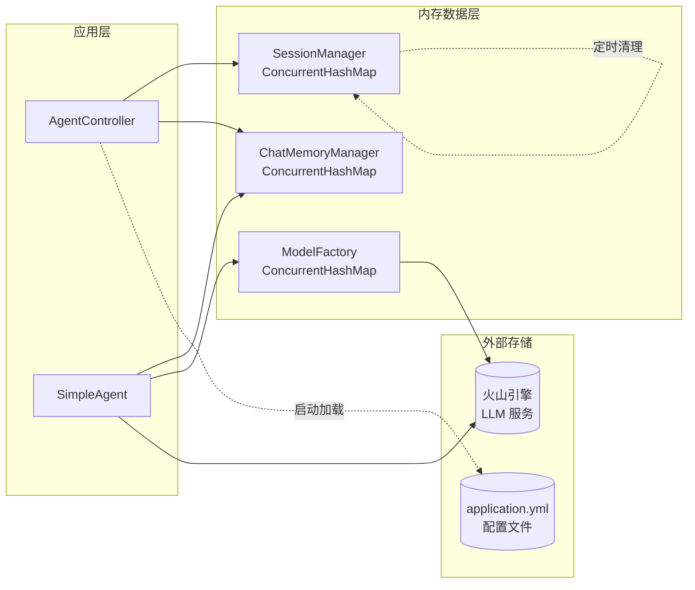
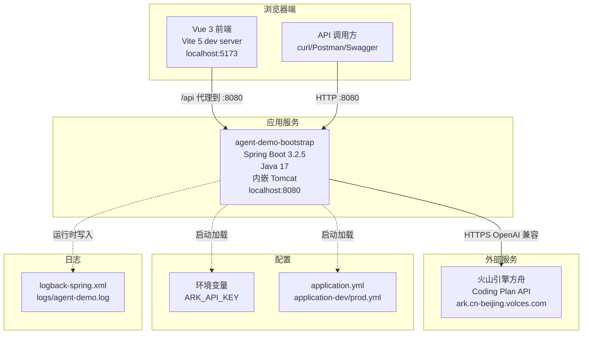
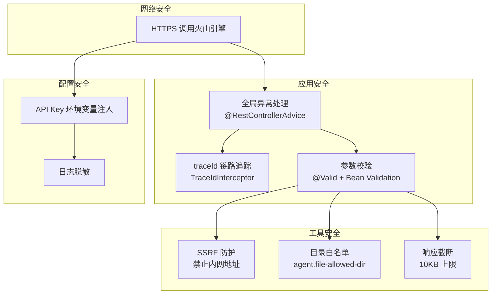
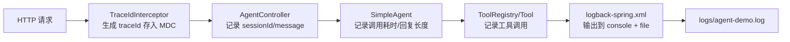
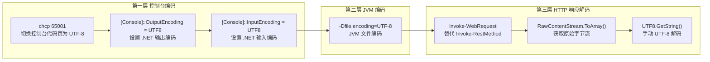

# AI Agent 示例项目 - 技术架构文档 (TOGAF)

> **文档版本**：v1.1
> **基线日期**：2026-07-21
> **适用范围**：agent-demo（Java 后端 + Vue 3 前端工程）
> **TOGAF 版本**：The Open Group Architecture Framework 10.0
> **关联文档**：[业务架构文档 (Phase B)](./业务架构文档.md) | [数据架构文档 (Phase C-Data)](./数据架构文档-TOGAF.md) | [SDD-项目技术指南文档](./SDD-项目技术指南文档.md)

---

## 目录

- [1. 架构愿景](#1-架构愿景)
- [2. 业务架构](#2-业务架构)
- [3. 信息系统架构 - 应用架构](#3-信息系统架构---应用架构)
- [4. 信息系统架构 - 数据架构](#4-信息系统架构---数据架构)
- [5. 技术架构](#5-技术架构)
- [6. 解决方案与机会](#6-解决方案与机会)
- [7. 架构治理](#7-架构治理)
- [附录 A：技术栈清单](#附录-a技术栈清单)
- [附录 B：模块依赖矩阵](#附录-b模块依赖矩阵)

---

## 1. 架构愿景

### 1.1 项目背景

**AI Agent 示例项目（agent-demo）** 是一套面向 AI 应用开发学习者的企业级 Agent 能力演练平台。系统覆盖从用户提问到 Agent 回复的端到端对话闭环，服务于学习者、开发者、API 调用方、运维者等多角色协同场景。

系统基于 Java 17 + Spring Boot 3.2.5 + LangChain4j 1.17.2 构建，包名统一为 `com.agentdemo`。在火山引擎方舟 Coding Plan 基座之上，深度定制 Agent 编排、工具调用、记忆管理 以适配 Agent 学习场景。

> **版本线说明**：LangChain4j 自 1.0 GA 起核心模块与集成模块版本线独立。本项目核心模块（langchain4j / langchain4j-open-ai）使用 GA 稳定版 `1.17.2`，集成模块（langchain4j-milvus / langchain4j-mcp）使用 beta 版 `1.17.2-beta27`。

### 1.2 架构愿景目标

| 目标维度 | 描述 |
|---------|------|
| **能力全面性** | 覆盖单 Agent、多 Agent、RAG、MCP、工作流全部主流 Agent 能力域 |
| **可扩展性** | 模块化设计，新增工具/Agent/LLM 只需遵循约定，不改核心框架 |
| **安全合规** | SSRF 防护、目录白名单、响应截断三重工具安全机制 |
| **学习友好** | 强类型 Java 直观呈现 Agent 接口契约，声明式开发降低理解门槛 |
| **低成本运行** | Coding Plan 按次计费，模型实例缓存复用，记忆窗口控制 Token 消耗 |

### 1.3 利益相关者矩阵

| 利益相关者 | 关注点 |
|-----------|--------|
| 学习者 | Demo 可一键运行、源码可读性强、原理直观 |
| 开发者 | 模块边界清晰、扩展点明确、约束规范化 |
| API 调用方 | 接口稳定、文档完整、错误码规范 |
| 运维者 | 配置外部化、日志可观测、会话可清理 |

### 1.4 架构原则

| 原则 | 说明 |
|------|------|
| **声明式优先** | `@AiService` + `@Tool` + `@SystemMessage` 注解式编程，Controller 层零样板 |
| **懒加载隔离** | 延迟初始化避免循环依赖，会话记忆按 sessionId 隔离 |
| **单一职责** | 11 个模块中等粒度拆分，每个模块职责清晰 |
| **BOM 统一版本** | 第三方依赖通过 `agent-demo-bom` 集中管理，禁止子模块声明版本 |
| **安全沙箱** | 工具调用受 SSRF 防护、目录白名单、响应截断三重约束 |
| **配置外部化** | API Key 等敏感信息通过环境变量注入，禁止入库 |

---

## 2. 业务架构

> 详细业务架构见 [业务架构文档](./业务架构文档.md)，本节仅提供技术视角的摘要。

### 2.1 业务能力图谱



### 2.2 端到端业务流程



---

## 3. 信息系统架构 - 应用架构

### 3.1 系统总体架构



### 3.2 分层架构



### 3.3 后端模块拓扑

#### 3.3.1 模块列表



#### 3.3.2 agent-demo-agent 内部分层

```
agent-demo-agent/
├── config/                # AgentConfig（配置属性绑定）
├── core/                  # BaseAgent（Agent 抽象接口）
└── single/                # SimpleAgent（单 Agent 实现）
```

#### 3.3.3 agent-demo-llm 内部分层

```
agent-demo-llm/
├── config/                # ArkProperties / LlmConfig
└── factory/               # ModelFactory（模型工厂）
```

#### 3.3.4 agent-demo-tools 内部分层

```
agent-demo-tools/
├── builtin/               # 内置工具（Calculator/Time/Http/FileRead）
└── registry/              # ToolRegistry（注册中心）
```

#### 3.3.5 agent-demo-memory 内部分层

```
agent-demo-memory/
├── longterm/              # 长期记忆（EmptyLongTermMemory 占位）
├── session/               # 会话管理（SessionManager/Metadata）
├── shortterm/             # 短期记忆（ChatMemoryManager）
└── store/                 # 记忆存储（MemoryRepository + InMemory 实现）
```

### 3.4 前后端集成

| 层面 | 机制 |
|------|------|
| 通信协议 | HTTP + RESTful JSON |
| API 前缀 | `/api/agent/` |
| 认证方式 | 无（学习示例工程，未接入认证） |
| 响应格式 | `{ code: 200, data: T, msg: "" }` (`Result<T>`) |
| 错误处理 | 全局异常拦截 -> 统一错误码 |
| 接口文档 | Springdoc OpenAPI 3 + Swagger UI |
| SSE 流式 | ✅ 已实现（SseEmitter + StreamingChatModel） |

---

## 4. 信息系统架构 - 数据架构

> 详细数据架构见 [数据架构文档-TOGAF](./数据架构文档-TOGAF.md)，本节仅提供摘要。

### 4.1 数据域全景

| 数据域 | 存储方式 | 数据量级 | 说明 |
|--------|---------|---------|------|
| 会话数据域 | 内存（ConcurrentHashMap） | 小 | SessionMetadata，超时清理 |
| 记忆数据域 | 内存（MessageWindowChatMemory） | 小 | 按 sessionId 隔离的对话历史 |
| 工具数据域 | 无状态 | - | 工具调用即执行，不持久化 |
| 模型缓存域 | 内存（ConcurrentHashMap） | 极小 | ChatModel/StreamingChatModel/EmbeddingModel |
| 配置数据域 | application.yml + 环境变量 | 极小 | 启动时加载 |
| RAG 向量域（规划中） | Milvus | 中 | 文档向量存储 |
| 关系数据域（规划中） | MySQL | 中 | 业务数据持久化 |

### 4.2 内存数据架构



### 4.3 数据安全分层

| 安全层 | 机制 |
|--------|------|
| API Key 保护 | 环境变量注入，禁止入库/日志 |
| 工具 SSRF 防护 | HTTP 工具禁止访问内网地址 |
| 文件读取限制 | 目录白名单（`agent.file-allowed-dir`） |
| 响应截断 | HTTP 响应超 10KB 截断 |
| 会话隔离 | 按 sessionId 隔离 ChatMemory |
| 全局异常 | `@RestControllerAdvice` 统一拦截 |
| 静态资源 404 | `NoResourceFoundException` 专门处理，返回 404 并降级为 WARN 日志，避免堆栈污染 |

### 4.4 数据存储规范

| 规范 | 说明 |
|------|------|
| 内存存储 | ConcurrentHashMap 保证线程安全，CopyOnWriteArrayList 用于工具列表 |
| 懒加载 | Agent delegate、ToolRegistry 扫描均懒加载，避免循环依赖 |
| 定时清理 | 会话超时 30 分钟，每 5 分钟扫描清理 |
| 配置外部化 | API Key 通过 `${ARK_API_KEY}` 注入 |

---

## 5. 技术架构

### 5.1 部署架构



### 5.2 基础设施组件

| 组件 | 版本 | 用途 | 部署方式 |
|------|------|------|---------|
| JDK | OpenJDK 17 | Java 运行时 | 本地安装 |
| Maven | 3.9+ | 后端构建工具 | 本地安装 |
| Node.js | 18+ | 前端运行时 | 本地安装 |
| npm | 9+ | 前端包管理器 | 本地安装 |
| Spring Boot | 3.2.5 | 应用框架 + 内嵌 Tomcat | 应用内嵌 |
| LangChain4j 核心模块 | 1.17.2 (GA) | AI Agent 框架 | Maven 依赖 |
| LangChain4j 集成模块 | 1.17.2-beta27 | 集成模块（规划中） | Maven 依赖 |
| Vue 3 | 3.4+ | 前端框架 | npm 依赖 |
| Vite | 5.4+ | 前端构建/HMR 开发服务器 | npm 依赖 |
| Vitest | 1.6+ | 前端单元测试 | npm 依赖 |
| Playwright | 1.58+ | 浏览器端 E2E 测试 | npm 依赖 |
| 火山引擎方舟 | Coding Plan | LLM 服务 | 云服务 |
| Milvus（规划中） | 2.4.3 | 向量数据库 | Docker 部署 |
| MySQL（规划中） | 8.x | 关系数据库 | 独立部署 |
| Swagger UI | 2.5.0 | 接口文档 | 应用内嵌 |

### 5.3 安全架构



### 5.4 可观测性架构

| 维度 | 工具/机制 | 功能 |
|------|---------|------|
| 日志 | Logback + `logback-spring.xml` | 结构化日志，含 sessionId/traceId/耗时 |
| 链路追踪 | `TraceIdInterceptor` + MDC | 每次请求生成 traceId，串联日志 |
| 调用监控 | SLF4J 日志 | LLM 调用次数/耗时/失败率 |
| 会话监控 | `SessionManager.activeSessionCount()` | 活跃会话数 |
| 接口文档 | Springdoc OpenAPI 3 | Swagger UI 自动生成 |
| LangSmith（规划中） | LangChain4j 集成 | 可视化 Agent 执行链路 |

### 5.5 日志架构



**日志格式**：

```
%d{yyyy-MM-dd HH:mm:ss} [%thread] [%X{traceId}] %-5level %logger{36} - %msg%n
```

### 5.6 中文编码方案

> **背景**：Windows PowerShell 5 默认使用 GBK（代码页 936）解码，而应用日志（Logback）与 HTTP 响应均为 UTF-8 字节流，不显式处理会导致中文乱码。本项目通过 `start.ps1` 启动脚本内置三层编码修复。



| 层次 | 问题 | 解决方案 | 实现位置 |
|------|------|---------|---------|
| 控制台编码 | PowerShell 5 默认 GBK 解码 UTF-8 字节流导致中文乱码 | `chcp 65001` + `[Console]::OutputEncoding/InputEncoding = UTF8` | `start.ps1` 第 64-67 行 |
| JVM 编码 | JVM 默认编码受操作系统影响，Windows 下为 GBK | JVM 启动参数 `-Dfile.encoding=UTF-8`（通过数组传递避免 PowerShell 5 拆分） | `start.ps1` 第 211-216 行 |
| HTTP 响应解码 | `Invoke-RestMethod` 用系统编码（GBK）解析响应体导致中文乱码 | 改用 `Invoke-WebRequest` + `RawContentStream` 获取原始字节流，`[System.Text.Encoding]::UTF8.GetString()` 手动解码 | `start.ps1` 第 83-88 行 |

**关键技术决策**：

| 决策点 | 原因 |
|--------|------|
| JVM 参数用数组 `@()` 传递 | PowerShell 5 会将 `-Dfile.encoding=UTF-8` 拆分为 `-Dfile` 和 `.encoding=UTF-8` 两个参数，导致 `ClassNotFoundException` |
| `java -version` 用 `cmd /c` 包装 | `java -version` 输出到 stderr，PowerShell 5 在 `ErrorActionPreference=Stop` 时将 stderr 当作异常 |
| `start.ps1` 保存为 UTF-8 with BOM | PowerShell 5 用 GBK 读取无 BOM 的 .ps1 文件，导致中文字符串未正确闭合引发语法错误 |

---

## 6. 解决方案与机会

### 6.1 现有架构优势

| 优势 | 说明 |
|------|------|
| 成熟框架基座 | Spring Boot 3.2.5 + LangChain4j 1.17.2 GA，企业级稳定 |
| 声明式开发 | `@AiService` + `@Tool` 注解式编程，零样板代码 |
| 模块化清晰 | 11 个模块中等粒度拆分，职责边界明确 |
| BOM 统一版本 | 第三方依赖集中管理，避免版本冲突 |
| 安全机制完备 | SSRF 防护 + 目录白名单 + 响应截断三重工具安全 |
| 低成本运行 | Coding Plan 按次计费 + 模型实例缓存复用 |
| 强类型契约 | Java 强类型直观呈现 Agent 接口，编译期检查 |

### 6.2 当前约束

| 约束 | 影响 | 缓解策略 |
|------|------|---------|
| 内存存储 | 重启后会话/记忆丢失 | 规划接入 MySQL 持久化 |
| 无认证机制 | 接口可被任意调用 | 学习示例可接受，生产需接入 Spring Security |
| 无长期记忆 | Agent 无法跨会话记忆 | 规划接入 Milvus 向量记忆 |
| 无前端可视化界面 | 过往仅通过 Swagger/curl 调用 | 前端对话模块已实现，Vue 3 对话框 + SSE 流式显示 |
| 无 RAG 能力 | 无法基于知识库回答 | 规划 agent-demo-rag 模块 |

### 6.3 演进路线

| 阶段 | 重点 | 时间范围 |
|------|------|---------|
| 短期 | 前端对话模块、RAG 检索模块、长期记忆（Milvus） | 2026 Q3 |
| 中期 | MCP 客户端集成、多 Agent 协作、Spring Security 接入 | 2026 Q4 |
| 长期 | 工作流编排、Guardrails、LangSmith 可观测性、MySQL 持久化 | 2027 Q1 |

---

## 7. 架构治理

### 7.1 开发规范治理

| 治理项 | 机制 |
|--------|------|
| 技术约束 | `SDD-项目技术指南文档.md` 中定义的全部 TC-* 约束 |
| AI 编码规范 | TC-AI-* 约束面向 AI Agent 自动化编码行为 |
| API 规范 | RESTful + Result<T> 包装 + OpenAPI 注解 |
| 错误码 | `ErrorCode` 枚举统一管理，区间按业务域划分 |
| 命名规范 | Controller/Service/Manager/Factory/Registry/Config/Properties |
| 文档规范 | specs/ 目录下标准化文档体系 |

### 7.2 版本管理

| 管理项 | 机制 |
|--------|------|
| Java 依赖 | `agent-demo-bom` BOM 统一管控 |
| 项目版本 | 统一 `1.0.0`，BOM 与子模块使用 `${project.version}` |
| Spring Boot | 父 POM 继承 `spring-boot-starter-parent:3.2.5` |
| LangChain4j 核心模块 | BOM 中 `langchain4j.version=1.17.2`（GA 稳定版） |
| LangChain4j 集成模块 | BOM 中 `langchain4j.beta.version=1.17.2-beta27`（beta 版，独立版本线） |

### 7.3 部署策略

| 环境 | 部署方式 |
|------|---------|
| 本地开发 | IDE 直接启动 `AgentDemoApplication.main()` |
| 脚本启动（推荐） | `.\start.ps1` 一键打包启动（Windows PowerShell） |
| 测试 | `mvn clean install` + `java -jar` 启动 |
| 生产 | JAR 包部署，配置 `application-prod.yml` + 环境变量 |

**启动脚本 `start.ps1` 能力清单**：

| 参数 | 功能说明 |
|------|---------|
| `-ApiKey` | 指定火山引擎 API Key（默认读取 `$env:ARK_API_KEY`） |
| `-Profile` | 指定 Spring Profile（dev / prod，默认 dev） |
| `-JavaHome` | 指定 JDK 17 路径 |
| `-SkipBuild` | 跳过 Maven 打包，直接启动已有 jar |
| `-Test` | 测试模式：调用对话接口并正确显示中文响应 |
| `-TestMessage` | 自定义测试消息（配合 `-Test` 使用） |
| `-Help` | 显示帮助 |

> 启动脚本内置三层中文编码修复：控制台 `chcp 65001`、JVM `-Dfile.encoding=UTF-8`、接口响应 `Invoke-WebRequest` + `RawContentStream` 手动 UTF-8 解码。详见 5.6 节。

### 7.4 构件仓库

| 仓库类型 | 地址 |
|---------|------|
| Maven 中央仓库 | 默认 |
| Spring Milestones | `https://repo.spring.io/milestone` |
| 火山引擎 API | `https://ark.cn-beijing.volces.com/api/coding/v3` |

---

## 附录 A：技术栈清单

### 后端技术栈

| 技术 | 版本 | 用途 |
|------|------|------|
| Java (OpenJDK) | 17 | 运行时 |
| Spring Boot | 3.2.5 | 应用框架 |
| LangChain4j | 1.17.2 (GA) | AI Agent 框架（核心模块） |
| langchain4j-open-ai | 1.17.2 (GA) | 火山引擎接入适配器 |
| langchain4j-mcp | 1.17.2-beta27 | MCP 协议支持（规划中） |
| langchain4j-milvus | 1.17.2-beta27 | 向量数据库集成（规划中） |
| milvus-sdk-java | 2.4.3 | Milvus 客户端（规划中） |
| MyBatis-Plus | 3.5.7 | ORM（规划中） |
| springdoc-openapi | 2.5.0 | 接口文档 |
| Hutool | 5.8.27 | 通用工具库 |
| Jackson | Spring Boot 内置 | JSON 序列化 |
| Logback | Spring Boot 内置 | 日志框架 |
| Lombok | Spring Boot 内置 | 代码简化 |
| Maven | 3.9+ | 构建工具 |

### 外部服务

| 服务 | 用途 |
|------|------|
| 火山引擎方舟 Coding Plan | LLM 服务（doubao-seed-2.0 系列 + Embedding） |

---

## 附录 B：模块依赖矩阵

| 依赖方 -> 被依赖方 | common | llm | tools | memory | agent | rag | mcp | app | web | bootstrap |
|-------------------|--------|-----|-------|--------|-------|-----|-----|-----|-----|-----------|
| **agent-demo-common** | - | | | | | | | | | |
| **agent-demo-llm** | ✅ | - | | | | | | | | |
| **agent-demo-tools** | ✅ | | - | | | | | | | |
| **agent-demo-memory** | ✅ | ✅ | | - | | | | | | |
| **agent-demo-rag** | ✅ | ✅ | | | - | | | | | |
| **agent-demo-mcp** | ✅ | | ✅ | | | - | | | | |
| **agent-demo-agent** | ✅ | ✅ | ✅ | ✅ | - | | | | | |
| **agent-demo-app** | ✅ | | | | ✅ | ✅ | ✅ | - | | |
| **agent-demo-web** | ✅ | | | ✅ | ✅ | | | ✅ | - | |
| **agent-demo-bootstrap** | | | | | | | | | ✅ | - |

> 所有业务模块依赖 `agent-demo-common`，跨模块调用仅通过接口。`agent-demo-bom` 独立存在，不参与依赖矩阵（pom-only）。

---

**文档维护**：
- 技术栈升级时，同步更新版本号和架构图
- 新增模块时，更新模块拓扑和依赖矩阵
- 部署架构变更时，更新部署图
