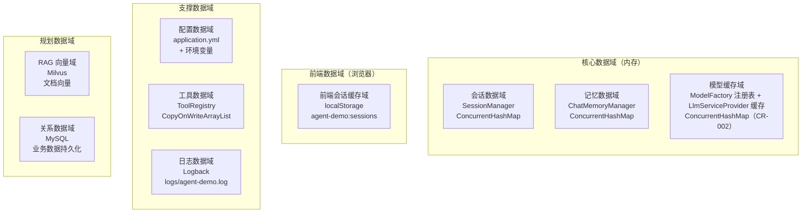
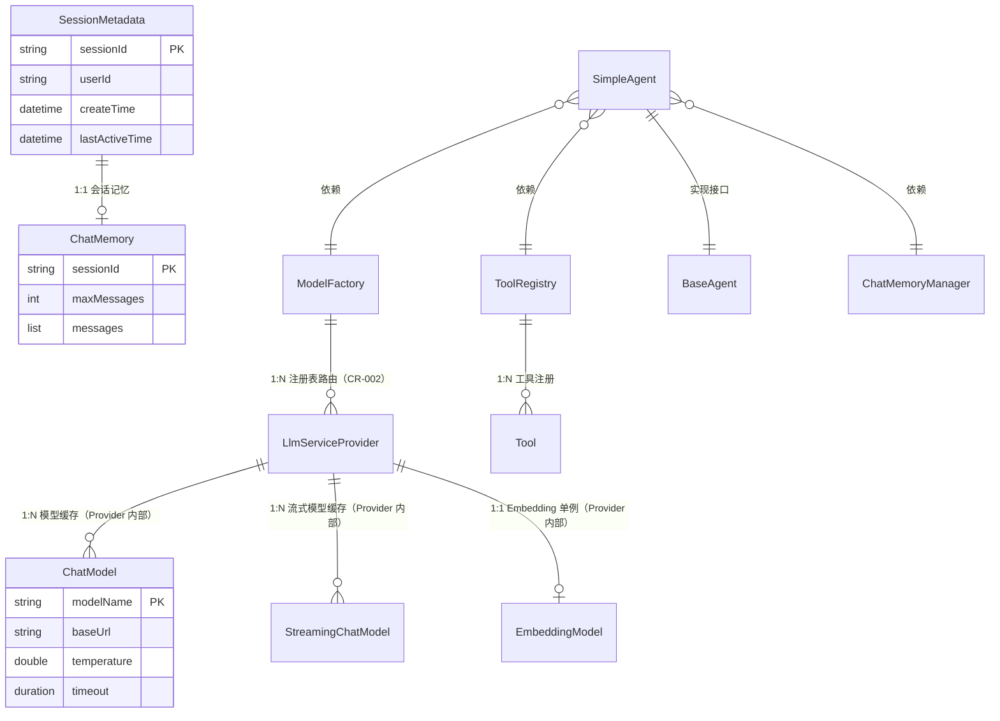
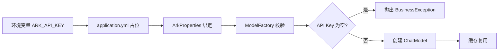
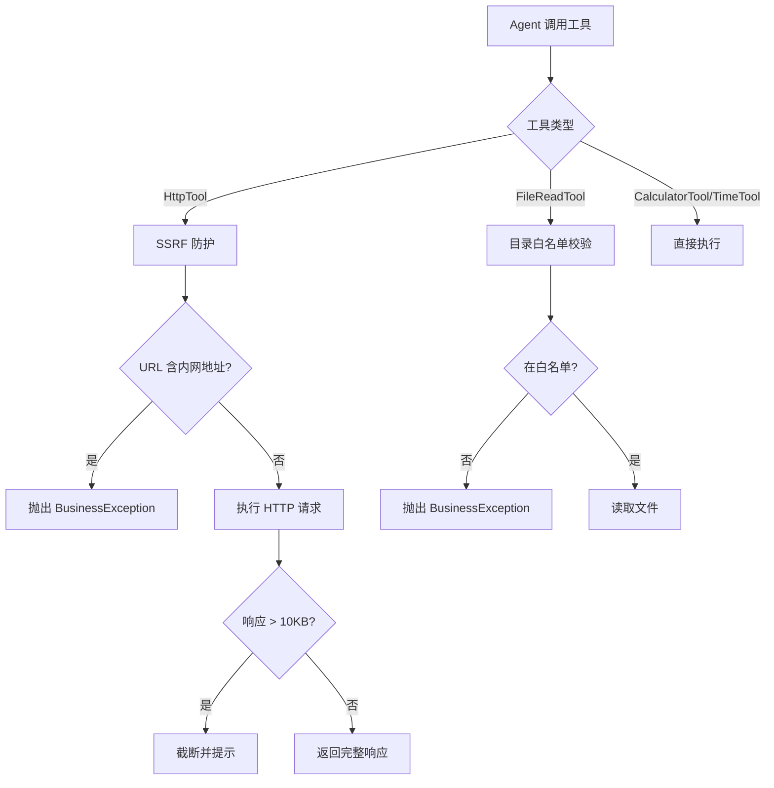
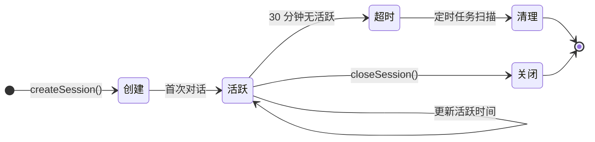
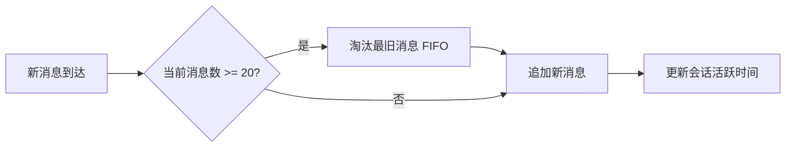

# AI Agent 示例项目 - 数据架构文档 (TOGAF Phase C-Data)

> **文档版本**：v1.1
> **基线日期**：2026-08-05
> **TOGAF 适配**：Phase C - Information Systems Architecture (Data Architecture)
> **适用范围**：agent-demo（后端，纯后端工程无前端）
> **存储形态**：当前为内存存储，规划接入 Milvus（向量）+ MySQL（关系）
> **关联文档**：[业务架构文档](./业务架构文档.md) | [技术架构文档-TOGAF](./技术架构文档-TOGAF.md)

---

## 目录

- [1. 数据架构愿景](#1-数据架构愿景)
- [2. 数据域划分](#2-数据域划分)
- [3. 数据存储总览](#3-数据存储总览)
- [4. 核心业务域数据模型](#4-核心业务域数据模型)
- [5. 支撑域数据模型](#5-支撑域数据模型)
- [6. 数据实体字典](#6-数据实体字典)
- [7. 数据关系与约束](#7-数据关系与约束)
- [8. 索引与并发策略](#8-索引与并发策略)
- [9. 数据安全架构](#9-数据安全架构)
- [10. 数据生命周期管理](#10-数据生命周期管理)
- [11. 数据治理规范](#11-数据治理规范)
- [12. 数据集成与迁移](#12-数据集成与迁移)
- [13. 差距分析与演进规划](#13-差距分析与演进规划)

---

## 1. 数据架构愿景

### 1.1 设计目标

| 目标 | 描述 |
|------|------|
| **会话隔离性** | 按 sessionId 隔离对话记忆，不同用户互不干扰 |
| **线程安全性** | 多线程并发访问下数据一致，使用 ConcurrentHashMap/CopyOnWriteArrayList |
| **资源可控性** | 记忆窗口限制 20 条消息，会话超时 30 分钟自动清理，防止内存溢出 |
| **模型复用性** | ChatModel/StreamingChatModel/EmbeddingModel 实例缓存复用，避免重复创建 |
| **配置外部化** | API Key 等敏感信息通过环境变量注入，禁止入库 |
| **演进可扩展** | 内存存储可平滑迁移至 Milvus（向量）+ MySQL（关系） |

### 1.2 数据架构原则

| 原则 | 说明 |
|------|------|
| **内存优先** | 学习示例工程，会话/记忆采用内存存储，简化部署 |
| **懒加载** | Agent delegate、ToolRegistry 扫描、EmbeddingModel 均懒加载，避免循环依赖 |
| **窗口限制** | 短期记忆保留最近 20 条消息，超出自动淘汰（FIFO），控制 Token 消耗 |
| **超时清理** | 会话 30 分钟无活跃自动清理，每 5 分钟扫描一次 |
| **无状态工具** | 工具调用即执行，不持久化中间结果 |
| **模型缓存** | 模型实例线程安全，ConcurrentHashMap 缓存按 modelName 复用 |

---

## 2. 数据域划分

### 2.1 数据域全景图



### 2.2 数据域统计

| 数据域 | 存储方式 | 数据量级 | 业务归属模块 | 状态 |
|--------|---------|---------|------------|------|
| **会话数据域** | 内存 ConcurrentHashMap | 小（活跃会话数） | agent-demo-memory | ✅ |
| **记忆数据域** | 内存 MessageWindowChatMemory | 小（20 条/会话） | agent-demo-memory | ✅ |
| **模型缓存域** | 内存 ConcurrentHashMap | 极小（按 modelName） | agent-demo-llm | ✅ |
| **前端会话缓存域** | 浏览器 localStorage | 小（50 会话，key=`agent-demo:sessions`） | agent-demo-frontend | ✅ |
| **配置数据域** | application.yml + 环境变量 | 极小 | agent-demo-bootstrap | ✅ |
| **工具数据域** | 内存 CopyOnWriteArrayList | 极小（工具数） | agent-demo-tools | ✅ |
| **日志数据域** | 文件 logs/agent-demo.log | 中 | 全局 | ✅ |
| **RAG 向量域** | Milvus | 中 | agent-demo-rag | 🚧 规划中 |
| **关系数据域** | MySQL | 中 | 业务模块 | 🚧 规划中 |

---

## 3. 数据存储总览

### 3.1 存储实例

| 属性 | 值 |
|------|---|
| **主存储** | JVM 内存（ConcurrentHashMap / CopyOnWriteArrayList） |
| **配置存储** | application.yml + 环境变量 |
| **日志存储** | 文件系统 `logs/agent-demo.log` |
| **外部服务** | 火山引擎方舟 Coding Plan API（LLM 调用，不持久化） |
| **规划向量库** | Milvus 2.4.3（Docker 部署） |
| **规划关系库** | MySQL 8.x |

### 3.2 内存数据结构配置

```yaml
# application.yml 中的关键配置
agent:
  max-iterations: 10                    # ReAct 循环最大迭代
  chat-memory-window-size: 20           # 短期记忆窗口大小
  enable-logging: true                  # 调用日志开关
  file-allowed-dir: ./data              # 文件读取白名单目录

session:
  timeout-minutes: 30                   # 会话超时时间

ark:
  coding-plan:
    base-url: https://ark.cn-beijing.volces.com/api/coding/v3
    api-key: ${ARK_API_KEY}             # 环境变量注入
    default-model: doubao-seed-2.0-code
    models:
      chat: doubao-seed-2.0-pro
      code: doubao-seed-2.0-code
      lite: doubao-seed-2.0-lite
    timeout: 60s
    max-retries: 3
    temperature: 0.7
```

### 3.3 多环境配置策略

| 环境 | Profile | 模型选择 | 日志级别 | 说明 |
|------|---------|---------|---------|------|
| 开发 | `application-dev.yml` | doubao-seed-2.0-lite | DEBUG | 轻量模型节省成本 |
| 生产 | `application-prod.yml` | doubao-seed-2.0-pro | INFO | 旗舰模型保证质量 |

---

## 4. 核心业务域数据模型

### 4.1 全局实体关系图



### 4.2 会话数据域

#### SessionMetadata（会话元信息）

| 字段 | 类型 | 可空 | 说明 |
|------|------|------|------|
| `sessionId` | String | NO | 主键，UUID 去横线生成 |
| `userId` | String | YES | 用户标识（可选） |
| `createTime` | DateTime | NO | 创建时间 |
| `lastActiveTime` | DateTime | NO | 最后活跃时间（用于超时判断） |

**存储位置**：`SessionManager.sessionMap`（ConcurrentHashMap<String, SessionMetadata>）

**关键方法**：
- `createSession(userId)`：创建新会话，生成 UUID
- `getSession(sessionId)`：获取会话并更新活跃时间
- `exists(sessionId)`：判断会话是否存在
- `closeSession(sessionId)`：关闭会话
- `cleanupExpiredSessions(timeoutMillis)`：清理超时会话（`@Scheduled` 每 5 分钟）

### 4.3 记忆数据域

#### ChatMemory（会话记忆）

| 字段 | 类型 | 可空 | 说明 |
|------|------|------|------|
| `sessionId` | String | NO | 主键，关联 SessionMetadata |
| `maxMessages` | int | NO | 窗口大小（默认 20） |
| `messages` | List<Message> | NO | 消息列表（UserMessage/AiMessage） |

**存储位置**：`ChatMemoryManager.memoryMap`（ConcurrentHashMap<String, ChatMemory>）

**关键方法**：
- `getMemory(sessionId)`：获取记忆，不存在则创建（computeIfAbsent）
- `addUserMessage(sessionId, message)`：添加用户消息
- `addAssistantMessage(sessionId, message)`：添加助手回复
- `clearMemory(sessionId)`：清空会话记忆

**淘汰策略**：基于 LangChain4j `MessageWindowChatMemory`，超出 maxMessages 后自动淘汰最旧消息（FIFO）。

### 4.4 模型缓存域

#### ChatModel（对话模型缓存）

| 字段 | 类型 | 可空 | 说明 |
|------|------|------|------|
| `modelName` | String | NO | 主键，模型名称（如 doubao-seed-2.0-pro） |
| `baseUrl` | String | NO | 火山引擎 Coding Plan 地址 |
| `apiKey` | String | NO | API Key（环境变量注入） |
| `temperature` | double | NO | 温度参数（0.0-1.0） |
| `timeout` | Duration | NO | 超时时间（默认 60s） |
| `maxRetries` | int | NO | 最大重试次数（默认 3） |

**存储位置**：`LlmServiceProvider` 实现类内部 `chatModelCache`（ConcurrentHashMap<String, ChatModel>，CR-002 重构后从 ModelFactory 迁移至 Provider 实例，按 providerCode 隔离）

#### StreamingChatModel（流式对话模型缓存）

| 字段 | 类型 | 可空 | 说明 |
|------|------|------|------|
| `modelName` | String | NO | 主键 |
| `baseUrl` | String | NO | 火山引擎地址 |
| `apiKey` | String | NO | API Key |
| `temperature` | double | NO | 温度参数 |
| `timeout` | Duration | NO | 超时时间 |

**存储位置**：`LlmServiceProvider` 实现类内部 `streamingModelCache`（ConcurrentHashMap<String, StreamingChatModel>，CR-002 重构后迁移至 Provider 实例）

#### EmbeddingModel（向量化模型，单例）

| 字段 | 类型 | 可空 | 说明 |
|------|------|------|------|
| `modelName` | String | NO | 固定 `doubao-embedding-large-text-240915` |
| `baseUrl` | String | NO | 火山引擎地址 |
| `apiKey` | String | NO | API Key |
| `timeout` | Duration | NO | 超时时间 |

**存储位置**：`LlmServiceProvider` 实现类内部 `embeddingModel`（volatile 单例，双重检查锁，CR-002 重构后迁移至 Provider 实例）

### 4.5 工具数据域

#### Tool（工具对象）

工具本身为 Spring Bean，存储在 `ToolRegistry.tools`（CopyOnWriteArrayList<Object>）。

| 属性 | 说明 |
|------|------|
| 工具类 | 加 `@Component` 注解 |
| 工具方法 | 加 `@Tool` 注解并描述功能 |
| 注册方式 | 懒加载扫描，首次调用 `listTools()` 时执行 |
| 动态注册 | `register(tool)` 方法支持运行时新增 |

**已注册工具**：

| 工具类 | 功能 | 安全措施 |
|--------|------|---------|
| CalculatorTool | 数学计算 | 数值范围校验 |
| TimeTool | 时间查询 | 无风险 |
| HttpTool | HTTP GET/POST | SSRF 防护 + 响应截断（10KB） |
| FileReadTool | 文件读取 | 目录白名单（`agent.file-allowed-dir`） |

---

## 5. 支撑域数据模型

### 5.1 配置数据域

#### ArkProperties（火山引擎配置）

| 字段 | 类型 | 默认值 | 说明 |
|------|------|--------|------|
| `baseUrl` | String | `https://ark.cn-beijing.volces.com/api/coding/v3` | Coding Plan 专用地址 |
| `apiKey` | String | - | 环境变量 `ARK_API_KEY` 注入 |
| `defaultModel` | String | `doubao-seed-2.0-code` | 默认模型 |
| `models` | Map<String,String> | - | 场景->模型映射（chat/code/lite） |
| `timeout` | Duration | 60s | 调用超时 |
| `maxRetries` | int | 3 | 最大重试次数 |
| `temperature` | double | 0.7 | 温度参数 |
| `thinkingDefaultEnabled` | boolean | false | 思考模式默认开关（CR-001 新增） |

#### BailianProperties（阿里百炼配置，CR-002 新增）

> 实现 `LlmProviderConfig` 接口，与 `ArkProperties` 共享统一配置访问契约。

| 字段 | 类型 | 默认值 | 说明 |
|------|------|--------|------|
| `baseUrl` | String | `https://dashscope.aliyuncs.com/compatible-mode/v1` | OpenAI 兼容协议地址 |
| `apiKey` | String | - | 环境变量 `BAILIAN_API_KEY` 注入 |
| `defaultModel` | String | `deepseek-v4-flash` | 默认模型 |
| `models` | Map<String,String> | - | 场景->模型映射 |
| `timeout` | Duration | 60s | 调用超时 |
| `maxRetries` | int | 3 | 最大重试次数 |
| `temperature` | double | 0.7 | 温度参数 |
| `embeddingModel` | String | `text-embedding-v4` | 向量化模型 |
| `visionModel` | String | - | 视觉对话模型（对称配置，CR-002） |

#### LlmProperties（提供商切换配置，CR-002 新增）

| 字段 | 类型 | 默认值 | 说明 |
|------|------|--------|------|
| `provider` | String | `ark` | LLM 提供商代码（`ark` / `bailian`），通过 `getProviderCode()` 派生 |

#### AgentConfig（Agent 配置）

| 字段 | 类型 | 默认值 | 说明 |
|------|------|--------|------|
| `maxIterations` | int | 10 | ReAct 循环最大迭代 |
| `chatMemoryWindowSize` | int | 20 | 记忆窗口大小 |
| `defaultSystemPrompt` | String | "你是一个有用的 AI 助手..." | 默认系统提示词 |
| `enableLogging` | boolean | true | 调用日志开关 |
| `fileAllowedDir` | String | `./data` | 文件读取白名单目录 |

### 5.2 日志数据域

| 属性 | 值 |
|------|---|
| 日志框架 | Logback |
| 配置文件 | `agent-demo-bootstrap/src/main/resources/logback-spring.xml` |
| 日志文件 | `logs/agent-demo.log` |
| 日志格式 | `%d{yyyy-MM-dd HH:mm:ss} [%thread] [%X{traceId}] %-5level %logger{36} - %msg%n` |
| 日志级别 | root: INFO, com.agentdemo: DEBUG |
| traceId | `TraceIdInterceptor` 自动注入 MDC |

### 5.3 提示词模板

| 文件 | 用途 |
|------|------|
| `prompts/default.txt` | 默认系统提示词 |
| `prompts/code-assistant.txt` | 编程助手提示词 |
| `prompts/general-assistant.txt` | 通用助手提示词 |

---

## 6. 数据实体字典

### 6.1 核心数据实体目录

| # | 数据实体 | 存储位置 | 业务域 | 聚合根 | 状态 |
|---|---------|---------|--------|--------|------|
| 1 | SessionMetadata | SessionManager.sessionMap | 会话域 | ✓ | ✅ |
| 2 | ChatMemory | ChatMemoryManager.memoryMap | 记忆域 | ✓ | ✅ |
| 3 | ChatModel | LlmServiceProvider.chatModelCache（CR-002 迁移） | 模型域 | ✓ | ✅ |
| 4 | StreamingChatModel | LlmServiceProvider.streamingModelCache（CR-002 迁移） | 模型域 | | ✅ |
| 5 | EmbeddingModel | LlmServiceProvider.embeddingModel（CR-002 迁移） | 模型域 | | ✅ |
| 6 | Tool | ToolRegistry.tools | 工具域 | | ✅ |
| 7 | ChatRequest | HTTP 请求体 | 接入域 | | ✅ |
| 8 | ChatResponse | HTTP 响应体 | 接入域 | | ✅ |
| 9 | SessionMetadata（持久化） | MySQL（规划中） | 会话域 | | 🚧 |
| 10 | DocumentChunk（向量） | Milvus（规划中） | RAG 域 | | 🚧 |

### 6.2 数据传输对象（DTO）

#### ChatRequest（对话请求）

| 字段 | 类型 | 可空 | 校验 | 说明 |
|------|------|------|------|------|
| `sessionId` | String | YES | - | 会话 ID，为空则新建 |
| `message` | String | NO | `@NotBlank` | 用户消息 |
| `agentType` | String | YES | - | Agent 类型，默认 SINGLE |
| `model` | String | YES | - | 指定模型，为空用默认 |
| `options` | Map<String,Object> | YES | - | 扩展参数 |

#### ChatResponse（对话响应）

| 字段 | 类型 | 可空 | 说明 |
|------|------|------|------|
| `sessionId` | String | NO | 会话 ID |
| `response` | String | NO | Agent 回复内容 |
| `toolCalls` | List<ToolCallInfo> | YES | 工具调用信息 |
| `duration` | long | NO | 耗时（毫秒） |
| `usage` | Object | YES | Token 使用统计 |

---

## 7. 数据关系与约束

### 7.1 关联关系矩阵

| 父实体 | 子实体 | 关联类型 | 关联字段 | 关联说明 |
|--------|--------|---------|---------|---------|
| SessionMetadata | ChatMemory | 1:1 | sessionId | 会话与记忆一一对应 |
| ModelFactory | LlmServiceProvider | 1:N | providerCode | 注册表路由，按厂商代码索引（CR-002） |
| LlmServiceProvider | ChatModel | 1:N | modelName | 按模型名缓存多个实例（Provider 内部） |
| LlmServiceProvider | StreamingChatModel | 1:N | modelName | 按模型名缓存流式实例（Provider 内部） |
| LlmServiceProvider | EmbeddingModel | 1:1 | - | 单例（Provider 内部） |
| ToolRegistry | Tool | 1:N | - | 注册多个工具 |
| SimpleAgent | BaseAgent(delegate) | 1:1 | - | 委托模式 |

### 7.2 数据一致性约束

| 约束 | 说明 |
|------|------|
| 会话-记忆一致 | sessionId 必须同时存在于 SessionManager 和 ChatMemoryManager |
| 无效 sessionId 自动新建 | 传入无效 sessionId 时自动创建新会话，不抛错 |
| 记忆窗口一致 | 所有会话共享默认窗口大小 20，可通过 `createMemory(sessionId, maxMessages)` 自定义 |
| 模型缓存一致性 | 同一 modelName 的 ChatModel 全局唯一，ConcurrentHashMap 保证 |
| 工具注册一致 | 工具列表全局唯一，CopyOnWriteArrayList 保证读多写少场景一致性 |

### 7.3 多态关联模式

Agent 类型通过 `AgentType` 枚举实现多态路由：

```
AgentType.SINGLE  -> SimpleAgent（已实现）
AgentType.MULTI   -> MultiAgent（规划中）
AgentType.WORKFLOW -> WorkflowAgent（规划中）
```

---

## 8. 索引与并发策略

### 8.1 并发策略统计

| 数据结构 | 类型 | 并发策略 | 适用场景 |
|---------|------|---------|---------|
| SessionManager.sessionMap | ConcurrentHashMap | 分段锁/CAS | 读多写多，会话管理 |
| ChatMemoryManager.memoryMap | ConcurrentHashMap | 分段锁/CAS | 读多写多，记忆管理 |
| ModelFactory.providerRegistry | ConcurrentHashMap(unmodifiable) | 不可变 Map | 注册表路由，启动时构建（CR-002） |
| LlmServiceProvider.chatModelCache | ConcurrentHashMap | computeIfAbsent | 读多写极少，模型缓存（CR-002 迁移） |
| LlmServiceProvider.streamingModelCache | ConcurrentHashMap | computeIfAbsent | 读多写极少，流式模型缓存（CR-002 迁移） |
| LlmServiceProvider.embeddingModel | volatile + synchronized | 双重检查锁 | 单例，懒加载（CR-002 迁移） |
| ToolRegistry.tools | CopyOnWriteArrayList | 写时复制 | 读多写极少，工具列表 |
| SimpleAgent.delegate | volatile + synchronized | 双重检查锁 | 单例，懒加载 |

### 8.2 并发安全约束

| 编号 | 约束描述 | 级别 |
|------|---------|------|
| TC-CONCURRENCY-001 | `ChatMemoryManager.getMemory()` 使用 `computeIfAbsent`，回调内禁止修改同一 map | 🔴 强制 |
| TC-CONCURRENCY-002 | `LlmServiceProvider.getEmbeddingModel()` 必须使用双重检查锁（CR-002 重构后从 ModelFactory 迁移至 Provider） | 🔴 强制 |
| TC-CONCURRENCY-003 | `SimpleAgent.getDelegate()` 必须使用双重检查锁 | 🔴 强制 |
| TC-CONCURRENCY-004 | `ToolRegistry.ensureScanned()` 必须使用双重检查锁 | 🔴 强制 |
| TC-CONCURRENCY-005 | 工具列表使用 CopyOnWriteArrayList，禁止使用 ArrayList | 🔴 强制 |

### 8.3 内存清理策略

| 对象 | 清理方式 | 触发条件 | 配置项 |
|------|---------|---------|--------|
| 超时会话 | `sessionMap.entrySet().removeIf(...)` | `@Scheduled(fixedRate=5min)` | `session.timeout-minutes=30` |
| 过期记忆 | 随会话清理一并移除 | 会话关闭/超时时 | - |
| 模型缓存 | 不清理（生命周期=JVM） | 应用关闭时 | - |
| 工具列表 | 不清理（生命周期=JVM） | 应用关闭时 | - |

---

## 9. 数据安全架构

### 9.1 敏感字段清单

| 实体 | 字段 | 数据类型 | 保护方式 | 说明 |
|------|------|---------|---------|------|
| ArkProperties | apiKey | String | 环境变量注入 | 禁止入库/日志 |
| ChatModel | apiKey | String | 环境变量注入 | 禁止入库/日志 |
| ChatRequest | message | String | 日志脱敏（截断） | 不打印完整明文 |
| SessionMetadata | userId | String | - | 用户标识 |

### 9.2 安全机制



**安全措施矩阵**：

| 安全场景 | 机制 | 说明 |
|----------|------|------|
| API Key 保护 | 环境变量 `${ARK_API_KEY}` 注入 | 禁止硬编码入库 |
| API Key 校验 | `ModelFactory.validateApiKey()` | 为空时抛 BusinessException |
| HTTP 工具 SSRF 防护 | `HttpTool.validateUrl()` | 禁止访问内网地址 |
| HTTP 响应截断 | `HttpTool.truncateResponse()` | 超 10KB 截断 |
| 文件读取限制 | `agent.file-allowed-dir` 白名单 | 限定 `./data` 目录 |
| 会话隔离 | sessionId 隔离 ChatMemory | 互不干扰 |
| 全局异常处理 | `GlobalExceptionHandler` | 避免堆栈泄露 |
| traceId 追踪 | `TraceIdInterceptor` + MDC | 串联请求日志 |

### 9.3 工具安全防护



---

## 10. 数据生命周期管理

### 10.1 数据状态转换



### 10.2 数据保留策略

| 数据类型 | 保留期限 | 处理方式 |
|---------|---------|---------|
| 活跃会话 | 30 分钟 | 超时自动清理 |
| 会话记忆 | 随会话生命周期 | 会话清理时一并移除 |
| 模型缓存 | JVM 生命周期 | 应用关闭时释放 |
| 工具列表 | JVM 生命周期 | 应用关闭时释放 |
| 日志文件 | 持久 | Logback 滚动策略 |
| 配置文件 | 持久 | Git 版本控制 |

### 10.3 记忆窗口淘汰策略



---

## 11. 数据治理规范

### 11.1 命名规范

| 对象类型 | 规范 | 示例 |
|---------|------|------|
| 包名 | `com.agentdemo.{模块}` | `com.agentdemo.agent.core` |
| 类名 | UpperCamelCase | `SimpleAgent`、`ChatMemoryManager` |
| 方法名 | lowerCamelCase | `createSession()`、`getMemory()` |
| 常量 | UPPER_SNAKE_CASE | `DEFAULT_WINDOW_SIZE`、`ARK_CODING_PLAN_BASE_URL` |
| 枚举值 | UPPER_SNAKE_CASE | `SINGLE`、`MULTI`、`WORKFLOW` |
| 配置项 | kebab-case | `agent.max-iterations`、`ark.coding-plan.base-url` |
| 错误码 | 业务域缩写 + 编号 | `LLM_CALL_FAILED(5001)`、`TOOL_NOT_FOUND(5101)` |

### 11.2 变更管理

| 变更类型 | 审批流程 | 执行方式 |
|---------|---------|---------|
| 新增配置项 | 开发者评审 | application.yml + @ConfigurationProperties |
| 新增工具 | 开发者评审 | @Component + @Tool 注解 |
| 新增 Agent | 开发者评审 | 实现 BaseAgent 接口 |
| 新增错误码 | 开发者评审 | ErrorCode 枚举追加 |
| 新增模型 | 开发者评审 | ModelConstants 常量 + ArkProperties.models 配置 |
| 配置项调整 | 运维者审批 | 修改 application.yml |

### 11.3 质量检查

| 检查项 | 工具 | 频率 |
|-------|------|-----|
| 编译检查 | `mvn compile` | 每次提交 |
| 约束检查 | 代码审查 | 每次提交 |
| 内存泄漏 | JVM 监控 | 运行时 |
| 会话堆积 | `activeSessionCount()` | 运行时 |
| 日志规范 | Logback 配置 | 启动时 |

---

## 12. 数据集成与迁移

### 12.1 当前数据集成

| 场景 | 方式 | 说明 |
|------|------|------|
| LLM 调用 | HTTPS OpenAI 兼容协议 | 火山引擎方舟 Coding Plan |
| 配置加载 | application.yml + 环境变量 | Spring Boot 启动时 |
| 提示词加载 | classpath:prompts/*.txt | 启动时加载 |

### 12.2 规划数据集成

| 场景 | 方式 | 说明 |
|------|------|------|
| RAG 文档加载 | PDF/Word/MD 解析 | langchain4j 文档加载器 |
| 向量化 | 豆包 Embedding API | 文本转向量 |
| 向量存储 | Milvus SDK | Docker 部署 Milvus 2.4.3 |
| 向量检索 | 相似度/MMR/元数据过滤 | Milvus 查询接口 |
| 业务数据持久化 | MyBatis-Plus + MySQL | 会话/记忆落库 |
| MCP 工具集成 | langchain4j-mcp | 外部 MCP 服务 |

### 12.3 迁移策略（内存 -> 持久化）

**迁移原则**：
- 接口不变，仅替换存储实现
- 通过 `MemoryRepository` 接口抽象，`InMemoryMemoryRepository` 切换为 MySQL 实现
- 先备份后迁移，小批量验证

**迁移步骤**：
1. 定义 `MemoryRepository` 接口（已存在）
2. 实现 `MySqlMemoryRepository`
3. 通过 `@Profile` 切换实现
4. 测试环境验证
5. 生产环境切换

---

## 13. 差距分析与演进规划

### 13.1 当前数据架构问题

| 问题 | 影响 | 优先级 |
|------|------|-------|
| 内存存储不持久 | 重启后会话/记忆丢失 | 中 |
| 无长期记忆 | Agent 无法跨会话记忆 | 中 |
| 无向量存储 | 无法支持 RAG 检索 | 高 |
| 无关系数据库 | 业务数据无法持久化 | 中 |
| 无数据备份 | 内存数据无法恢复 | 低 |

### 13.2 优化路线

| 阶段 | 优化内容 | 时间范围 |
|------|---------|---------|
| 短期 | 接入 Milvus 向量库，实现 RAG 检索 | 2026 Q3 |
| 短期 | 长期记忆向量存储（Milvus） | 2026 Q3 |
| 中期 | 接入 MySQL，会话/记忆持久化 | 2026 Q4 |
| 中期 | MemoryRepository 接口切换为 MySQL 实现 | 2026 Q4 |
| 长期 | 数据备份与恢复机制 | 2027 Q1 |
| 长期 | 数据归档策略（历史会话归档） | 2027 Q1 |

### 13.3 技术选型建议

| 场景 | 推荐方案 | 理由 |
|------|---------|-----|
| 向量存储 | Milvus 2.4.3 | LangChain4j 原生集成，Docker 部署简单 |
| 关系数据库 | MySQL 8.x | 企业级首选，MyBatis-Plus 支持 |
| 文档加载 | langchain4j-document-loader | 原生支持 PDF/Word/MD |
| 文本分块 | langchain4j TextSplitter | 递归/Token 分块策略 |
| 缓存（规划） | Redis | 会话/记忆缓存，减轻 DB 压力 |
| 全文检索（规划） | Elasticsearch | 知识库全文搜索（如需要） |

---

**文档维护**：
- 新增数据结构时，同步更新 ER 图和实体字典
- 存储方式变更时，更新存储总览和安全架构章节
- 定期审查数据治理规范的执行情况
